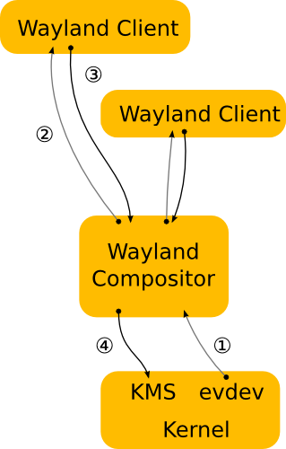

# Tutorat 0 <!--fit-->
### SSH und PuTTY <!--fit-->

<!--_class: lead-->
<!--big-->


---

# Organisatorisches

<!--_class: lead-->
<!--big-->


---

## Organisatorisches
### Studienleistung

- Anmeldezeitraum **18.10.2021 -12.02.2022**
- Anmelden zur **Studienleistung** in HISinOne
- Voraussetzung zur Anmeldung zur Studienleistung ist **Anmeldung zur Übung** in HISinOne
- **12** von **15** Übungsblättern sinnvoll bearbeitet
- Regelmäßige **aktive Teilnahme** an den Tutoraten
  - aber **keine** Anwesenheitspflicht!
  - **Vorrechnen** freiwillig

**➡** zeigt einfach, dass ihr bemüht seid :thumbsup:

<!--small-->


---

## Organisatorisches
### Tutorat und Materialien
- **Uhrzeit:** `8:15` bis `9:30` (`8:00` s.t geht auch, da ich sowieso da bin)
- **Materialien:** https://nc.informatik.uni-freiburg.de/index.php/s/eWsZk9C5ceGTT44

#### 
#### Folien downloaden

<!-- #### 
#### Folien und Aufzeichnungen downloaden -->

<!--small-->


---

## Organisatorisches
### Feedback
- https://forms.gle/2tGvF4ao5hAVNeRs5
#### 

<!--small-->


---

# SSH

<!--_class: lead-->
<!--big-->


---

## SSH
### Mit Server verbinden über PuTTY
- **Uni-Account:** `ssh ab123@login.uni-freiburg.de`
  - Passwort, dass man bei **HISinOne**, **Ilias** usw. eingibt
- **Poolaccount:** `ssh <poollogin>@login.informatik.uni-freiburg.de`
  - Passwort, dass man an den **PoolPC's** eingibt
  - Zugriff auf Daten von **Poolaccount** möglch

#### 
#### PuTTY

- zum **Verlassen** `exit`, `logout`, `ctrl + d` eingeben

<!--small-->


---

## SSH
### Es sich bequem machen
- `~/.ssh/config`:
  ```
  HostName login.uni-freiburg.de
      Host uni
      User ab123

  Host tf
      HostName login.informatik.uni-freiburg.de
      User <poollogin>
  ```
- `ssh uni` oder `ssh tf` und dann da enstprechende **Passwort** eingeben

<!--small-->


---

## SSH
### SSH-Key generieren
- `ssh-keygen -t rsa -b 4096 -C "username@servername.com"`: generate a new SSH key. When "Enter a file in which to save the key" is prompted press Enter. This accepts the default filename. The passphrase can also be ignored with enter, thus a pasphrase doesn't have to be typed in everytime the ssh key gets used
- existing SSH keys in `~/.ssh`
  - **private key:** `~/.ssh/id_rsa`
  - **public key:** `~/.ssh/id_rsa.pub`

### SSH-Key für eine Zeit merken
- `eval $(ssh-agent -s)`: ensure the ssh-agent is running
- `ssh-add ~/.ssh/id_rsa`: add SSH private key to the ssh-agent

<!--small-->


---

## SSH
### Keine Passwörter mehr bei SSH Verbindung (Public Key an Server weiterreichen)
  - **copy all:** `ssh-copy-id -i ~/.ssh/id_rsa.pub username@servername.com`
  - **copy single:** `scp ~/.ssh/id_rsa.pub username@servername.com:~/.ssh/authorized_keys`
  - **add single:** `cat ~/.ssh/id_rsa.pub | ssh username@servername "cat >> ~/.ssh/authorized_keys"`

### Keine Passwörter mehr für Git

- `xclip < ~/.ssh/id_rsa.pub`: copy the SSH key to clipboard and paste with middle mouse button (primary clipboard) to website field (e.g. Github)
- **Github:** `Account/Settings/SSH and GPG keys>New SSH key`

<!--small-->


---

## SSH
### Mehrere Github Keys
- **nicht möglich** zwei mal den gleichen Public Key für verschiedene Accounts
- `~/.ssh/config`:
  ```
  Host github.com
    Hostname github.com
    User git
    IdentityFile /home/<user>/.ssh/id_rsa

  Host github.com-2
    Hostname github.com
    User git
    IdentityFile /home/<user>/.ssh/id_rsa_2
  ```
  - **für zweiten Github Account:**
    - `git clone git@github.com-2:<username>/<repository-name>.git`
    - `git remote (add/set-url) origin git@github.com-2:<username>/<repository-name>.git`

<!--small-->


---

## SSH
### Transfer file to server
- `scp path/to/file.txt username@servername.com:~/folder`
  - wie beim normalen `cp` ein Verzeichnis angeben

### Print file from server
- `lpr path/to/file.txt -PhpXX`: print command
  - e.g. `hp14` / `hp15`
- `lpq -PhpXX`: queue

<!--small-->


---

# Vertiefungen

<!--_class: lead-->
<!--big-->


---

## Vertiefungen
### xclip
- `xclip < ~/.ssh/id_rsa.pub`, `xclip -i ~/.ssh/id_rsa.pub` oder `echo "asdf" | xclip`
- `xclip -selection clipboard /etc/lsb-release` (the usual clipboard)
  - `primary` (default) - die primäre Auswahl (Kopie der letzten Markierung)
    ](_resources/_2021-10-29-00-28-00.png)
  - `secondary` - anwendungsspezifische Auswahl
  - `clipboard` - die eigentliche Zwischenablage
- `xclip -o`: print out clipboard
- **copy image:** `xclip -selection clipboard -i /home/path/image.png -t image/png`

<!--small-->


---

## Vertiefungen
### Zugriffsrechte für `~/.ssh`
- **.ssh directory:** 700 (`drwx------`)
- **public key (.pub file):** 644 (`-rw-r--r--`)
- **private key (id_rsa):** 600 (`-rw-------`)
- **home directory:** at most 755 (`drwxr-xr-x`)
  - should not be writeable by the group or others
- and the home folder's user and group should be it's user and the user's group (`sudo chown <username>:users ./Documents -R`)
- (`config` and `know_hosts` are both `-r--------`)

<!--small-->


---

# Linux Überblick

<!--_class: lead-->
<!--big-->


---
## Linux Überblick
### Linux Facts
- **L**inus Torvalds + **Unix** **➡ Linux**, **Tux:** Maskottchen
  - **Unix** wurde August **1969** von **Bell Laboratories** (Forschungsabteilung der Telefongesellschaft **AT&T**) entwickelt
  - **1983** startete **Richard Stallman** das **GNU-Projekt**
  - **1991** begann **Linus Torvalds** mit der Entwicklung einer Terminal-Emulation, die sich zu einem Betriebssysteme entwickelte, welches er **1992** unter die **GNU GPL** stelle
- **Verwendung:** Server (Kubernetes), Android, "Year of the Linux Desktop"-Meme
#### 

<!--small-->


---

## Linux Überblick
### GNU+Linux 1 von 2
- "To be fair, I'd just like to interject for a moment. What you’re referring to as Linux, is in fact, GNU/Linux, or as I’ve recently taken to calling it, GNU plus Linux. Linux is not an operating system unto itself, but rather another free component of a fully functioning GNU system made useful by the GNU corelibs, shell utilities and vital system components comprising a full OS as defined by POSIX. Many computer users run a modified version of the GNU system every day, without realizing it. Through a peculiar turn of events, the version of GNU which is widely used today is often called “Linux”, and many of its users are not aware that it is basically the GNU system, developed by the GNU Project. There really is a Linux, and these people are using it, but it is just a part of the system they use. [...]


<!--small-->


---

## Linux Überblick
### GNU+Linux 2 von 2

- [...] Linux is the kernel: the program in the system that allocates the machine’s resources to the other programs that you run. The kernel is an essential part of an operating system, but useless by itself; it can only function in the context of a complete operating system. Linux is normally used in combination with the GNU operating system: the whole system is basically GNU with Linux added, or GNU/Linux. All the so-called “Linux” distributions are really distributions of GNU/Linux."

<!--small-->


---

## Linux Überblick
### Linux in Zahlen


#### https://netmarketshare.com/operating-system-market-share

<!--small-->


---

## Linux Überblick
### Begriffe 1 von 4

- **Distributionen:** Arch, Manjaro, Linux Mint, Ubuntu, NixOS, Debian, Gentoo, LFS
  - https://upload.wikimedia.org/wikipedia/commons/1/1b/Linux_Distribution_Timeline.svg

#### 
#### https://distrowatch.com/dwres.php?resource=family-tree

<!--small-->


---

## Linux Überblick
### Begriffe 2 von 4

- **Desktopenvironment:** KDE, Gnome, Cinnamon, XFCE, Deepin
  - **Window manager:** **➡** Fenster managen
    - i3, dwm, Bspwm, KWin (KDE), Qtile, awesome
    - **Stacking**, **Tiling**, **Dynamic** window manager
- **Package Manager:** `pacman`, `yay` (AUR), `apt`, `nix`, [...] `sudo make install`
- **Terminal** vs **Terminal Emulator** (`Alacritty`, `Kitty`, `urxvt` (rxvt-unicode), `Yakuake`, `Guake`)
  - Early user terminals connected to computers were electromechanical teleprinters/teletypewriters (**T**ele**TY**pewriter, **TTY**)
  - **change tty:** `ctrl + alt + fX`
    - if one is already in a tty one can just use `alt + left/right arrow`
  - **Shell:** Zsh, Bash, Fish, (Powershell, Batch **➡** Windows), später mehr dazu

<!--small-->


---

## Linux Überblick
### Begriffe 3 von 4

- **X11:** **➡** Netzwerkprotokoll
  - **Compositor** **➡** Eye-Candy's für Fenster, finaler Zeichenschritt
  - Picom (fork of Compton), Compiz
- **Wayland:** **➡** Display-Server-Protokoll

#### 
#### https://www.secjuice.com/wayland-vs-xorg/

<!--small-->


---

## Linux Überblick
### Begriffe 4 von 4
- **Displaymanager/Loginmanager:** LightDM, GDM (GNOME display manager)
  - displayed at the end of the boot process in place of the default shell
  - starts the **display server** and loads the **desktop environment** right after **username** and **password** were entered
  - `xorg-xinit`: xinit program allows a user to manually start an **Xorg display server**, `startx` (front-end for xinit)
  - `xinit-xsession` (AUR): provide an option to run `~/.xinitrc` as a session with `startx`
- **GTK** (`lxappereance`) vs **QT** (`qt5ct`, `kvantummanger`)
- **Pulseaudio:** `pavucontrol` (GTK and QT), `pulsemixer` (curses)
  - **Alsa:** `alsamixer` (`alsa-utils` package)
- **Initsystem:** systemd, OpenRC

<!--small-->


---

# Quellen

<!--_class: lead-->
<!--big-->


---

## Quellen
### Wissensquellen
- **Multiple Github Keys:** https://www.cluemediator.com/multiple-ssh-keys-for-different-github-accounts

### Bildquellen
- **Tux:** By Maxo based opoun the work File:Tux-G2.png - Own work based uppon the work File:Tux-G2.png, Public Domain, https://commons.wikimedia.org/w/index.php?curid=10524355
- **Fuck u Nvidea:** http://lininuxrookies.blogspot.com/2013/06/linus-torvalds-descarga-su-furia-contra.html

<!--small-->


---

# Vielen Dank für eure Aufmerksamkeit!
# :penguin:

<!--_class: lead-->
<!--big-->

