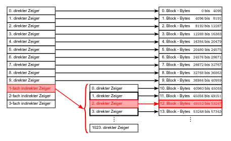
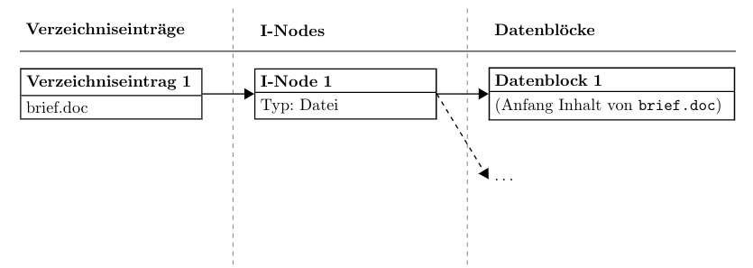
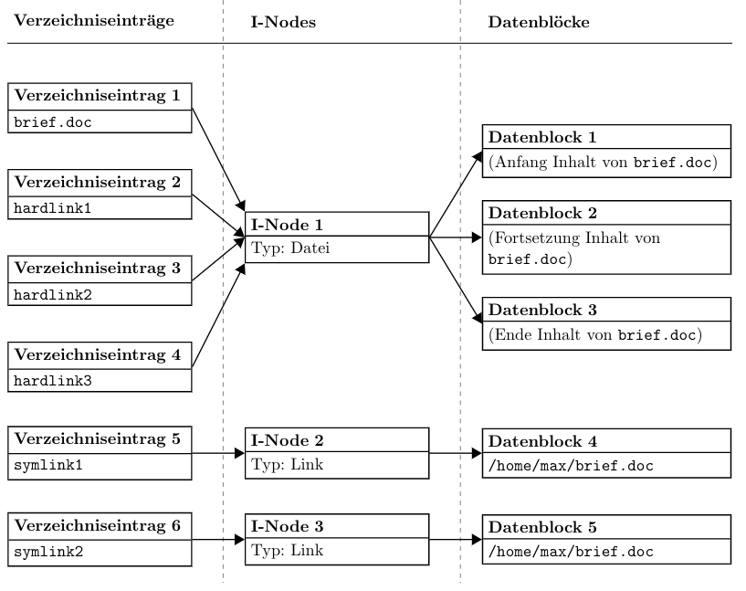
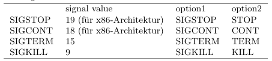
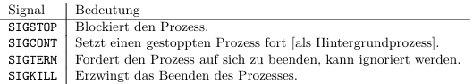
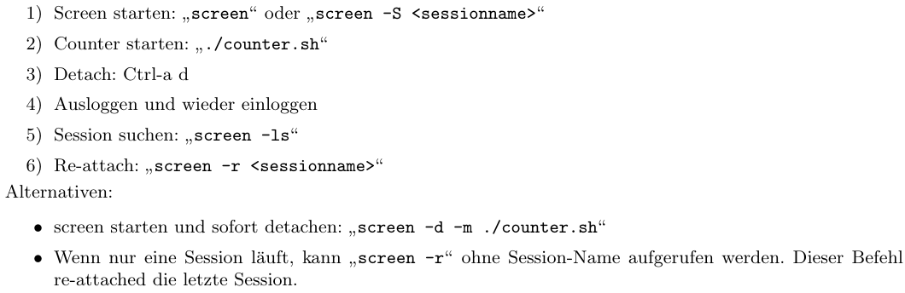
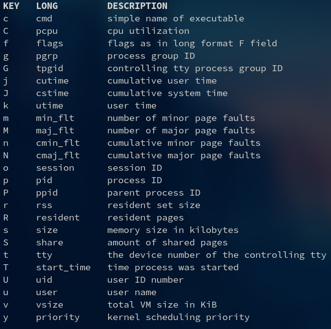

# Tutorat 9 <!--fit-->
### Wahlfreier Zugriff, Hardlinks und Softlinks, Terminal Multiplexer <!--fit-->

<!--_class: lead-->
<!--big-->


---

# Organisatorisches

<!--_class: lead-->
<!--big-->

<!-- _backgroundColor: #90bc9b; -->

---

## Organisatorisches
### Mindestanforderungen Studienleistung
- denkt an die Anmeldung der **Studienleistung**
- **12** von **15** Übungsblättern sinnvoll bearbeitet
  - **"sinnvoll bearbetet":** eine Aufgabe in anständiger Weise bearbeitet
  - **Assistent:** Wenn es **nicht ganz 12** sind, die Person aber ansonsten bemüht war, passt das auch
- Regelmäßige **aktive Teilnahme** an den Tutoraten
  - aber **keine** Anwesenheitspflicht!
  - **Kommentar vom Tutor:** Da gibt es einigen Interpretationsspielraum und Studienleistung wird auch vergeben, wenn die Person immer **schöne Abgaben** hatte (viel **grün** in Blättern) aber nie im Tutorat war. Und vice versa auch, wenn die Person immer gut in den **Tutoraten mitgearbeitet** hat, aber bei den **Abgaben geschwächelt** hat


<!--small-->


---

# Übungsblatt

<!--_class: lead-->
<!--big-->

<!-- _backgroundColor: #90bc9b; -->
---

## Übungsblatt
### Aufgabe 1 freier Zugriff bei I-Nodes und bei FAT
#### a) I-NodedColodColor

- **Zeiger 0 bis 9:** 0 bis 10 · 4096 − 1 = 40959

<!--small-->


---

## Übungsblatt
### Aufgabe 1 - Wahlfreier Zugriff bei I-Nodes und bei FAT
#### a) I-Node
- **einfach indirekter Block:** 10 · 4096 = 40960 bis 10 · 4096 + 1024 · 4096 − 1 = 4235263 (1 indirekter Block mit 1024 Zeigern auf 4KB Blöcke) ✅
- $\displaystyle\left\lfloor\frac{50001-40960}{4096}\right\rfloor= 2$ **🠒** **Zeiger Nr. 2 im einfach indirekten Block**, also der **Datenblock Nr. 12** (von 1 anfangend zu zählen 13)
  - **Datenblock 12:** 12 · 4096 = 49152 bis 13 · 4096 − 1 = 53247 ✅
- **Byte Nr. 50000:** 50001 − 12 · 4096 - 1 = 84

<!--small-->


---

## Übungsblatt
### Aufgabe 1 - Wahlfreier Zugriff bei I-Nodes und bei FAT
#### b) FAT32
- einfach verkette Liste der Datenblöcke der Datei wird **sequentiell** gelesen
- **Anzahl N der verfolgten Verweis:** $N=\left\lceil\frac{n}{b}\right\rceil-1$
  - danach dem gefundenen Verweis auf den Plattenblock folgen
- Zugriffszeit in Abhängigkeit von n asymptotisch **linear**: $O(n)$


<!--small-->


---

## Übungsbaltt
### Aufgabe 2 - Hardlinks und symbolische Links
#### a)


<!--small-->


---
## Übungsbaltt
### Aufgabe 2 - Hardlinks und symbolische Links
#### a)


<!--small-->


---

## Übungsblatt
### Aufgabe 2 - Hardlinks und symbolische Links
#### a)
- Pfad in Datenblöcken 3/4 kann **relativ** oder **absolut** angegeben werde
- Datenblöcke 3 und 4 auch dürfen auch fehlen und der Pfad stattdessen in den I-Nodes 2 bzw. 3 angegeben sein

<!--small-->


---

## Übungsblatt
### Aufgabe 2 - Hardlinks und symbolische Links
#### b)
- **Datei selbst:** 1 I-Node, 3 Datenblöcke, 1 Verzeichniseintrag (⇒ 3 KB)
- **Symlinks:** jeweils 1 I-Node, 1 Datenblock für die Linkdatei und 1 Verzeichniseintrag (⇒ 2 · 1 KB)
- **Hardlinks:** jeweils 1 Verzeichniseintrag, 0 I-Nodes und 0 Datenblöcke
- **Insgesamt:** 5 Datenblöcke = 5 KB Speicherplatz, 3 I-Nodes, 6 Verzeichniseinträge

> Die Verzeichniseinträge benötigen zusätzlich Speicherplatz in den Verzeichnistabellen der Elternverzeichnisse, in denen die Dateien liegen. Dieser Speicherplatz und der Speicherplatz für die I-Nodes selbst wird hier
vernachlässigt.

<!--small-->


---

## Übungsblatt
### Aufgabe 2 - Hardlinks und symbolische Links
#### c)
- die Zugriffsrechte aller **Hardlinks** ändern sich mit, da die Rechte im I-Node gespeichert werden und die Datei und alle Hardlinks auf das selbe I-Node zeigen
- die Zugriffsrechte aller **symbolischen Links** bleiben bei `lrwxrwxrwx`, da sie eigene I-Nodes haben

<!--small-->


---

## Übungsblatt
### Aufgabe 2 - Hardlinks und symbolische Links
#### d)
- Die **Zugriffsrechte** des **symbolischen Links** konnen **nicht** geändert werden.
- Stattdessen wird der chmod-Befehl auf das **Linkziel** angewandt, insofern die entsprechenden Rechte bestehen
- Die angezeigten **Rechte der symbolischen Links** haben **keine Bedeutung** für den eigentlichen Zugriff auf die Zieldatei.
- Wäre das nicht der Fall, so könnte man einen **symbolischen Link** auf eine **fremde Datei** anlegen
  - Da man **selbst der Besitzer** des Links ist, konnte man die Rechte des Links nach Belieben andern und sich somit **Zugriffsrechte verschaffen**.
  - Aus diesem Grund werden **symbolische Links** bei Benutzung immer **erst dereferenziert** und dann werden die **Rechte des Linkziels** ausgewertet um die **Zugriffsrechte zu bestimmen**

<!--small-->


---

## Übungsblatt
### Aufgabe 3 - Prozesse und Signale
#### a)

- Mehrere Möglichkeiten, z.B.
  - `ps aux` (BSD syntax)
  - `ps -ef` (standard syntax)
    - `e`: Select all processes
    - `f`: Do full-format listing

<!--small-->


---

## Übungsblatt
### Aufgabe 3 - Prozesse und Signale
#### b)
- Es existieren eine Reihe von möglichen Befehlen, z.B.
  - `kill -s <signal value> <pid>`
  - `kill -<signal value> <pid>`
  - `kill -<option1> <pid>`
  - `kill -<option2> <pid>`

#### 

<!--small-->


---

## Übungsblatt
### Aufgabe 3 - Prozesse und Signale
#### b)
- `$(pidof -x counter.sh)` anstelle von `<signal value>`
  - `-x`: Scripts  too - this causes the program to also return process id's of  shells  running the named scripts
    ```
    > $ pidof counter.sh

    > $ pidof -x counter.sh
    131047
    ```
- Um die Ermittlung der **PID** zu umgehen, kann statt `kill [...] <pid>` der Befehl `killall [...] counter.sh` mit der selben Syntax verwendet werden
  - If no signal name is specified, `SIGTERM` is sent

<!--small-->


---

## Übungsblatt
### Aufgabe 3 - Prozesse und Signale
#### c)
- `man 7 signal`
##### 

- **Unterschied `SIGTERM` und `SIGKILL`:** `SIGTERM` kann vom Prozess **ignoriert** werden oder der Prozess kann noch seine **Ressourcen aufräumen** und dann terminieren. Das Verhalten wird vom **Programmierer vorgegeben**. `SIGKILL` kann vom jeweiligen Prozess **nicht ignoriert** werden. Der Prozess wird mit `SIGKILL` beendet, **ohne** dass er auf das Signal **reagieren** kann.

<!--small-->


---

## Übungsblatt
### Aufgabe 3 - Prozesse und Signale
#### d)


<!--small-->


---

# Ergänzungen

<!--_class: lead-->
<!--big-->

<!-- _backgroundColor: #90bc9b; -->

---

## Ergänzungen
### Herausfinden, wer den Prozess aufgerufen hat
- `ps auxf`
  - `a`: list all processes with a terminal (tty), or to list all processes when used together with the `x` option
  - `x`: list all processes owned by you (same EUID as ps), or to list all processes when used together with the `a` option
  - `u`: Display user-oriented format
  - `f`: ASCII art process hierarchy (forest)
- `pstree`


<!--small-->


---

## Ergänzungen
### Weitere interessante command-line Argumente
- `ps`:
  - `T`: Select all processes associated with this terminal.  Identical to the t option without any argument
  - `r`: Restrict the selection to only running processes
  - `c`: Show the true command name. Command arguments and any modifications to them are thus not shown
  - `H`: Show threads as if they were processes

<!--small-->


---

## Ergänzungen
### Sort keys
- `ps -eo pid,ppid,user,priority,size,vsize,pcpu,cmd,start_time`



<!--small-->


---

## Ergänzungen
### Tmux
- **Überblick:**
  - **Gute config file:** https://github.com/gpakosz/.tmux
  - **Tutorials:** https://github.com/rothgar/awesome-tmux
  - **Cheatsheet:** https://gist.github.com/MohamedAlaa/2961058

#### Schnelle Lösung:
  ```
  export TERM=xterm
  echo $TERM
  ```

<!--small-->


---

## Ergänzungen
### Tmux
#### Langfristige Lösung:
- **Informationen über das verwendete Terminal rüberschicken:**
  ```
  infocmp > alacritty.terminfo
  # Pool-Account
  scp alacritty.terminfo XY123@login.uni-freiburg.de:~/
  # oder Uni-Account
  # scp alacritty.terminfo <pool-login>@login.informatik.uni-freiburg.de:~/
  ```
- **Informationen über das Terminal in Datenbank abspeichern:**
  ```
  tic -x alacritty.terminfo
  ```

<!--small-->


---

## Ergänzungen
### Tmux
- **oneliner:**
  - `infocmp | ssh "XY123.uni-freiburg.de" 'tic -x /dev/stdin'`
  - `infocmp | ssh "<pool-login>.informatik.uni-freiburg.de" 'tic -x /dev/stdin'`
#### Wichtige Commands
- `ctrl+a,?`
- `ctrl+a,e` zum öffnen von `~/.tmux.conf.local`
- `tmux new -As default`
- `tmux ls`
- `tmux kill-session -t default`
- `tmux kill-server` oder `killall "tmux: server"` oder `ctrl+a,:kill-server`

<!--small-->


---

## Ergänzungen
### Tmux
#### Nützliche Einstellungen
- `tmux source-file ~/.tmux.conf`
  - `set-option -g status-position top`
  - `bind-key < swap-window -t -1`, executed with `ctrl+a,<`
  - `bind-key > swap-window -t +1`, executed with `ctrl+a,>`
  - `default theme` kommentieren und `default theme (ansi)` auskommentieren
  - `tmux_conf_copy_to_os_clipboard=true` auskommentieren
  - `set -g status-keys vi` und `set -g mode-keys vi` auskommentieren

<!--small-->


---

## Ergänzungen
### Tmux
#### Plugin für Wiederherstellung über Neustart hinweg
- https://github.com/tmux-plugins/tmux-resurrect
- `set -g @plugin 'tmux-plugins/tmux-resurrect'` auskommentieren
```
# Prozesse wiederherstellen:
set -g @resurrect-processes '~mocp ~htop ~nvim ~emacs ~neomutt ~vifm ~man ~less'
# alle Prozesse: set -g @resurrect-processes ':all:'
# Zeichen in Panes speichern:
set -g @resurrect-capture-pane-contents 'on'
# Session.vim berücksichtigen:
set -g @resurrect-strategy-nvim 'session'
```

<!--small-->


---

## Ergänzungen
### Tmux
#### Plugin für Wiederherstellung über Neustart hinweg
- `->` to specify a command to be used when restoring a program
- `~` to restore a program whose process contains target name
- gesichert mit Datum unter: `~/.tmux/resurrect/`, `ln -sf <file_name> last`


<!--small-->


---

## Ergänzungen
### Tmux
#### Shh mit Tmux
```
Host uni-tmux
  HostName login.uni-freiburg.de
  # oder HostName login.informatik.uni-freiburg.de
  User XY123  # oder <pool-login>
  RequestTTY yes
  RemoteCommand tmux new -As default
```
- `ssh uni-tmux`

<!--small-->


---

## Ergänzungen
### Prozess suspenden
- `ctrl+z`, `bg`, `fg`, `jobs`
  - `bg/fg %<job-number>`
  - `bg/fg %<string-beginning>`
    - z.B. `fg ./co`
  - `bg/fg %?<some_string-somewhere>`

<!--small-->


---

## Ergänzungen
### Addition binär und dezimal
```text
  011011 (27)            17718
+ 011101 (29)          +  6524
  11111                  11 1
  ======                ======
  111000 (56)            24242
```
```
00 + 00 = 00               00 + 00 (+ 01) = 01
00 + 01 = 01               00 + 01 (+ 01) = 10
01 + 00 = 01               01 + 00 (+ 01) = 10
01 + 01 = 10               01 + 01 (+ 01) = 11
```

<!--small-->


---

## Ergänzungen
### Subtraktion binär und dezimal (nicht empfohlen, dient Vergleich mit nächster Folie)
```text
(1)
  0111000 (56)         24242
- 0011011 (27)       - 17718
   11111               11 1
  =======             ======
  0011101 (29)          6524
```
```
10 - 00 = 10                10 - 00 (- 01) = 01
10 - 01 = 01                10 - 01 (- 01) = 00
11 - 00 = 11                11 - 00 (- 01) = 10
11 - 01 = 10                11 - 01 (- 01) = 01
```

<!--small-->


---

## Ergänzungen
### Subtraktion  binär und dezimal (funktioniert immer, egal was für Vorzeichen Zahlen haben)
```text
(2)
   0111000 (56)
 + 1100101 (27) (0011011 negiert und +1)
  11
   =======
   0011101 (29)
```
- **Zweierkomplement Negation:** `11011 -> 011011 -> 100100 -> 100101`
  - `0`en hinzufügen bis **Minuend** und **Subtrahend** beide gleiche Länge haben und Platz für ihr **Vorzeichenbit** ist und dieses korrekt gesetzt ist
  - **1er Komplement Negation** und `+1` nicht vergessen für den **Subtrahenden**

<!--small-->


---

## Ergänzungen
### Multiplikation binär und dezimal
```text
1101 x 1001 (13 * 9)          1304 x 12
       1101                          48
      0000                       +   0
     0000                        + 36
    1101                         +12
   ========                      ======
    1110101 (117)                 15648
```
- **Verschiebung** ist aufgrund der `0`en, die hier ausgelassen sind

<!--small-->


---

## Ergänzungen
### Division binär
```text
  1110101 / 1011 (117 : 11) = 1010 (10) Rest: 111 (7)
- 1011|||
 =====|||
    111||
-     0||
   ====||
    1110|
-   1011|
   =====|
      111
-       0
     ====
      111
```

<!--small-->


---

## Ergänzungen
### Division dezimal
```text
15658 / 12 = 1304,833...
12|||
==|||
 36||
 36||
 ==||
  05|
   0|
  ==|
   58
   48
   ...
```

<!--small-->


---

## Ergänzungen
### Division dezimal
```text
   ==
   10|0  oder Rest: 10
    9 6
    ===
      40
      36
      ==
       40
       36
       ==
        4...
```

<!--small-->


---

## Ergänzungen
### Division binär
- bei **binärer Division** gibt es nur **2 Zustände** (`1` oder `0`), dementsprechend wird entweder die Zahl so übernommen (Zahl $\cdot$ `1`) oder die Zahl ist `0` (Zahl $\cdot$ `0`)

### Division allgemein
- nach jeder Addition ein Zahl runterholen, bis keine mehr runtergeholt werden kann $\to$ dann Ende (bei **ganzzahliger Division**). Was unten stehen bleibt ist der **Rest**
- bei Division mit Nachkommastellen, 0en runterbringen, bis einmal **kein Rest** mehr rauskommt oder Grenze setzen bis zu der man weiter macht $\to$ dann Ende
- ist der **Dividend** trotz runtergebrachter weiter Stelle (weil einmal kein Rest übrig blieb) immernoch kleiner als der **Divisor**, so ist der **Quotient** $0$, weil nur durch $\cdot 0$ rechnen kann der **Divisor** noch kleiner sein als der **Dividend**


<!--small-->


---

# Quellen

<!--_class: lead-->
<!--big-->

<!-- _backgroundColor: #90bc9b; -->

---

## Quellen
### Wissenquellen
- https://wiki.archlinux.org/title/Alacritty#Terminal_functionality_unavailable_in_remote_shells
- https://stackoverflow.com/questions/21523815/tmux-open-terminal-failed-missing-or-unsuitable-terminal-xterm-256color
- https://github.com/alacritty/alacritty/issues/2487
- https://linux.die.net/man/1/tic

<!--small-->


---

## Quellen
### Bildquellen
- :shrug:

<!--small-->


---

# Vielen Dank für eure Aufmerksamkeit!
# :penguin:

<!--_class: lead-->
<!--big-->

<!-- _backgroundColor: #90bc9b; -->
