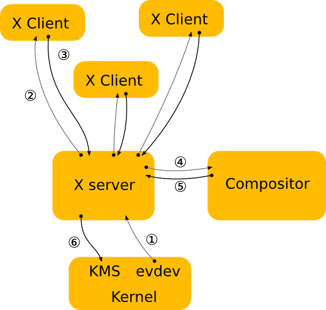

# Tutorat 0 <!--fit-->
### SSH und PuTTY <!--fit-->

<!--_class: lead-->
<!--big-->


---

# Organisatorisches

<!--_class: lead-->
<!--big-->


---

## Organisatorisches
### Studienleistung

- Anmeldezeitraum 18.10.2021 -12.02.2022
- Anmelden zur **Studienleistung** in HISinOne
- Voraussetzung zur Anmeldung zur Studienleistung ist **Anmeldung zur Übung** in HISinOne
- **12** von **15** Übungsblättern sinnvoll bearbeitet
- Regelmäßige **aktive Teilnahme** an den Tutoraten
  - aber **keine** Anwesenheitspflicht!
  - **Vorrechnen** freiwillig

**➡** zeigt einfach, dass ihr bemüht seid :thumbsup:

<!--small-->


---

## Organisatorisches
### Tutorat und Repository
- **Uhrzeit:** `8:15` bis `9:30` (`8:00` s.t geht auch, da ich sowieso da bin)
- **Repository:** https://github.com/matthejue/OpenWiki/tree/master/Betriebssysteme_Tutorate

#### 
#### Folien downloaden

<!--small-->


---

# SSH

<!--_class: lead-->
<!--big-->


---

## SSH
### Mit Server verbinden über PuTTY
- **Uni-Account:** `ssh ab123@login.uni-freiburg.de`
  - Passwort, dass man bei **HISinOne**, **Ilias** usw. eingibt
- **Poolaccount:** `ssh <poollogin>@login.informatik.uni-freiburg.de`
  - Passwort, dass man an den **PoolPC's** eingibt
  - Zugriff auf Daten von **Poolaccount** möglch

#### 
#### PuTTY

- zum **Verlassen** `exit` eingeben

<!--small-->


---

## SSH
### Es sich bequem machen (keine Domain angeben)
- `~/.ssh/config`:
  ```
  HostName login.uni-freiburg.de
      Host uni
      User ab123

  Host tf
      HostName login.informatik.uni-freiburg.de
      User <poollogin>
  ```
- `ssh uni` oder `ssh tf` und dann da enstprechende **Passwort** eingeben

---

## SSH
### Es sich bequem machen (kein Passwort durch SSH Keypair)
- Passwort generieren

---

# Linux Überblick

<!--_class: lead-->
<!--big-->


---
## Linux Überblick
### Linux Grunddaten
- **L**inus Torvalds + **Unix** **➡ Linux**
- Tux

<!--small-->


---

## Linux Überblick
### GNU+Linux 1 von 2
- "To be fair, I'd just like to interject for a moment. What you’re referring to as Linux, is in fact, GNU/Linux, or as I’ve recently taken to calling it, GNU plus Linux. Linux is not an operating system unto itself, but rather another free component of a fully functioning GNU system made useful by the GNU corelibs, shell utilities and vital system components comprising a full OS as defined by POSIX. Many computer users run a modified version of the GNU system every day, without realizing it. Through a peculiar turn of events, the version of GNU which is widely used today is often called “Linux”, and many of its users are not aware that it is basically the GNU system, developed by the GNU Project. There really is a Linux, and these people are using it, but it is just a part of the system they use. [...]


<!--small-->


---

## Linux Überblick
### GNU+Linux 2 von 2

- [...] Linux is the kernel: the program in the system that allocates the machine’s resources to the other programs that you run. The kernel is an essential part of an operating system, but useless by itself; it can only function in the context of a complete operating system. Linux is normally used in combination with the GNU operating system: the whole system is basically GNU with Linux added, or GNU/Linux. All the so-called “Linux” distributions are really distributions of GNU/Linux."

<!--small-->


---

## Linux Überblick
### Linux in Zahlen


#### https://netmarketshare.com/operating-system-market-share

<!--small-->


---

## Linux Überblick
### Begriffe 1 von 4

- **Distributionen:** Arch, Manjaro, Linux Mint, Ubuntu, NixOS, Debian, Gentoo, LFS
  - https://upload.wikimedia.org/wikipedia/commons/1/1b/Linux_Distribution_Timeline.svg

#### 
#### https://distrowatch.com/dwres.php?resource=family-tree

<!--small-->


---

## Linux Überblick
### Begriffe 2 von 4

- **Desktopenvironment:** KDE, Gnome, Cinnamon, XFCE, Deepin
  - **Window manager:** **➡** Fenster managen
    - i3, dwm, Bspwm, KWin (KDE), Qtile, awesome
    - Stacking, Tiling, Dynamic window manager
- **Terminal** vs **Terminal Emulator**
  - **Shell:** Zsh, Bash, Fish, (Powershell, Batch **➡** Windows)
- **Package Manager:** pacman, yay (AUR), apt, [...] sudo make install

<!--small-->


---

## Linux Überblick
### Begriffe 3 von 4

- **X11:** **➡** Netzwerkprotokoll
  - **Compositor** **➡** Eye-Candy's für Fenster, finaler Zeichenschritt
  - Picom (fork of Compton), Compiz xprop
- **Wayland:** **➡** Display-Server-Protokoll

#### 
#### https://www.secjuice.com/wayland-vs-xorg/

<!--small-->


---

## Linux Überblick
### Begriffe 4 von 4

- **Displaymanager:** asdf, xinit
- **GTK** (lxappereance) vs **QT** (qt5ct, kvantummanger)
- **Initsystem:** systemd, OpenRC
- **Sudo**, **Doas**
- **Pulseaudio:** pavucontrol (GTK and QT), pulsemixer (curses)
  - **Alsa:** alsamixer (alsa-utils package)

<!--small-->


---

# Vielen Dank für eure Aufmerksamkeit!
# :penguin:

<!--_class: lead-->
<!--big-->

