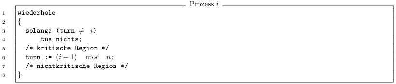
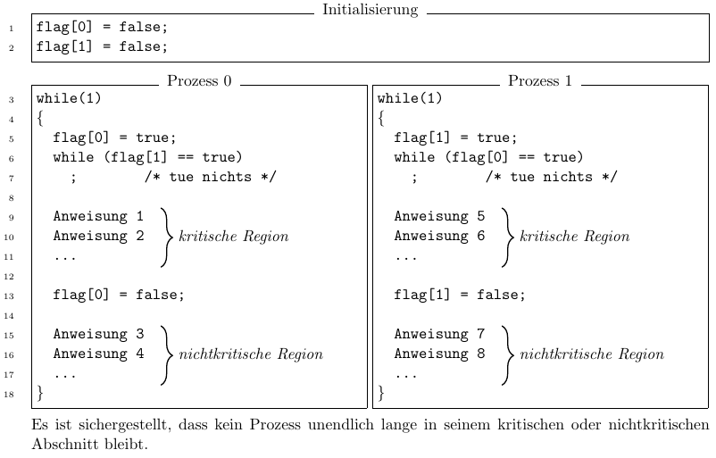
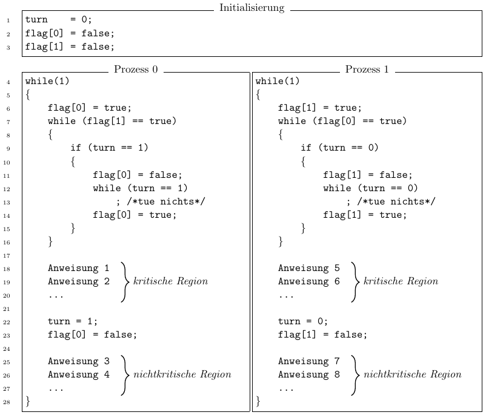
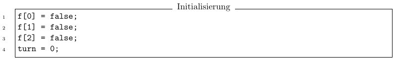
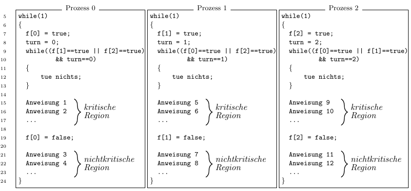
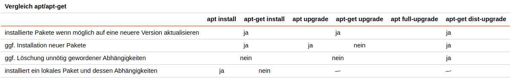

# Tutorat 10 <!--fit-->
### Wechselseitiger Ausschluss <!--fit-->

<!--_class: lead-->
<!--big-->


---

# Korrektur

<!--_class: lead-->
<!--big-->

<!-- _backgroundColor: #b17237; -->

---

## Korrektur
### Anmerkungen

- es hilft sich das ganze immer zuerstmal unter **Pseudo-Parellelität** vorzustellen

<!--small-->


---

# Übungsblatt

<!--_class: lead-->
<!--big-->

<!-- _backgroundColor: #b17237; -->

---

## Übungsblatt
### Aufgabe 1
```
/* Prozess 0 */                      /* Prozess 1 */
wiederhole                           wiederhole
{                                    {
  solange (turn != 0)                  solange (turn != 1)
    tue nichts;                          tue nichts;
  /* kritische Region */               /* kritische Region */
  turn := 1;                           turn := 0;
  /* nicht-kritische Region */         /* nicht-kritische Region */
}                                    }
```

<!--small-->


---

## Übungsblatt
### Aufgabe 1


<!--small-->


---

## Übungsblatt
### Aufgabe 2


<!--small-->


---

## Übungsblatt
### Aufgabe 2
#### a)
- **Voraussetzungen:**
  - Sei $t_i$ der Zeitpunkt, *nachdem* Prozess i die solange-Schleife verlassen hat. *O.B.d.A.* sei $t_0 < t_1$
- **Behauptung:** Der wechselseitige Ausschluss ist garantiert
#### Beweis Durch Widerspruch
- **Annahme:** Es gebe einen Zeitpunkt $t$, zu dem beide Prozesse im kritischen Abschnitt sind, für den *O.B.d.A.* gilt: $t_0 < t_1 < t$

<!--small-->


---

## Übungsblatt
### Aufgabe 2
  - Zum Zeitpunkt $t_0$ muss `flag[0] = true` gewesen sein, da Prozess $0$ das Flag vor der *solange-Schleife* auf `true` gesetzt hat und erst nach dem kritischen Abschnitt (also nach $t$) wieder auf `false` setzen wird. `flag[0]` wird sonst an keiner Stelle verändert **🠒** `flag[0] = true` im Zeitraum von $t_0$ bis $t$
  - Da $t_0 < t_1 < t$ angenommen wird, müsste zum Zeitpunkt $t_1$ das Flag `flag[0] = false` sein, um die *solange-Schleife* verlassen zu können
- **Widerspruch:**
  - Prozess $1$ kann die solange-Schleife zum Zeitpunkt $t_1$ nicht verlassen haben, da $t_0 < t_1 < t$ angenommen wird und das `flag[0]` zwischen $t_0$ und $t$ `true` sein muss, wie oben festgestellt wurde
- **Schlussfolgerung:** Daraus folgt, dass die Annahme falsch sein muss, also ist der wechselseitige Ausschluss garantiert

<!--small-->


---

## Übungsblatt
### Aufgabe 2
#### b)
- Die Prozesse prüfen ständig den Wert bestimmter Flags, was unnötig Rechen-
zeit verbraucht. Besser wäre es, die Prozesse durch das Betriebssystem schlafen zu legen und erst wieder auszuführen, wenn sie in die kritische Region eintreten dürfen **🠒** *Aktives Warten (busy waiting)*
- Softwarelösung ist abhängig von Code und Betriebssystem


<!--small-->


---

## Übungsblatt
### Aufgabe 3


<!--small-->


---

## Übungsblatt
### Aufgabe 3
#### Wenn ein Prozess in den kritischen Abschnitt will, so muss er nur
#### *endliche Zeit* darauf *warten* ✓
- **Flag wird nie unendlich lange auf true gelassen:**
  - Prozesse, die auf die *kritische Region warten* und nicht an der Reihe sind, müssen das Flag in Zeile 11 auf `false` setzen und warten, bis sie an der Reihe sind
- **`turn` kann sich nicht selbst zugewiesen werden:**
  - Ist das Flag des anderen Prozesses auf `false`, so hat der Prozess freien ungehinderten Zugang zur kritischen Region. Nach dem Durchlaufen der kritischen Region muss der Prozess seinen Vorrang abgeben und kann sich den Vorrang niemals selbst geben, sodass der andere Prozess auf jeden Fall zum Zug kommt

<!--small-->


---

## Übungsblatt
### Aufgabe 3
#### Nicht blockieren ⨯✓

- **Funktion des Flags:**
  - Will ein Prozess nicht in die kritische Region, so ist sein Flag `false` und der andere Prozess kann *ungehindert in die kritische Region*
- **Funktion von `turn`:**
  - Wollen beide Prozesse *gleichzeitig in die kritische Region*, so legt die Variable `turn` den Vorrang fest, sodass einer der Prozesse sein *Flag zurückziehen* muss und der andere Prozess *ohne Verzögerung in die kritische Region eintreten* kann
- **Resetten:**
  - Nach der kritischen Region wird der *Vorrang weitergegeben* und das *Flag gelöscht*, sodass der *andere Prozess ohne Verzögerung* in den kritischen Abschnitt eintreten kann

<!--small-->


---

## Übungsblatt
### Aufgabe 3
- **Blockieren in Ein- und Austrittsbereichen zur kritischen Region:**
  - **Bsp.:** *Prozess 0* setzt nach der kritischen Region `turn = 1`, aber kommt nicht dazu sein *Flag zu resetten*. In der Zeit kann ein *Kontextwechsel* stattfinden, wo Prozess 1 *nicht* in den *kritischen Abschnitt kann* obwohl *niemand anderes will*

<!--small-->


---

## Übungsblatt
### Aufgabe 3
#### Keine Annahmen über Geschwindigkeit und Anzahl CPUs ✓
- **keine Schreiben der gleichen Variablen zu selben Zeit möglich:**
  - Es gibt keine Konflikte beim Schreiben der Variablen, da jeder Prozess nur sein *eigenes Flag* schreibt und das *Setzen von turn* direkt nach der kritischen Region an einer Stelle stattfindet, an der sich nur *ein Prozess gleichzeitig* befinden kann

<!--small-->


---

## Übungsblatt
### Aufgabe 3
#### Nice to know:
- Der Algorithmus ist als *”Dekker-Algorithmus“* bekannt und war der erste veröffentlichte Algorithmus, der das *Problem des Wechselseitigen Ausschlusses für zwei Prozesse* korrekt löste. Er wurde 1965 von *Theodorus J. Dekker* entdeckt und von *Dijkstra* veröffentlicht.

<!--small-->


---

## Übungsblatt
### Aufgabe 4



<!--small-->


---

## Übungsblatt
### Aufgabe 4
#### a)
- Der wechselseitige Ausschluss **nicht garantiert**:
  - **Beweis durch Gegenbeispiel:**
    - **Prozess 0:**
      - Da die Flags `f[1]` und `f[2]` jeweils *nicht gesetzt* sind, kann Prozess 0 die *kritische Region betreten*
      - *Kontextwechsel*
    - **Prozess 1:**
      - Prozess bleibt zunächst in der *while-Schleife*
      - *Kontextwechsel*

<!--small-->


---

## Übungsblatt
### Aufgabe 4
- **Prozess 2:**
  - *turn = 2*
  - zunächst in seiner *while-Schleife* verbleiben
  - *Kontextwechsel*
- **Prozess 1:**
  - durch *turn = 2* *verlässt while-Schleife*
- **Prozess 0 und 1 im kritischen Bereich**


<!--small-->


---

## Übungsblatt
### Aufgabe 4
#### a)
- **Beweis durch Gegenbeispiel 2:**
  - **Prozess 1**
    - in *while-Schleife* verbleiben
    - *Kontextwechsel*
  - **Prozess 2**
    - in *while-Schleife* verbleiben
    - *Kontextwechsel*
  - **Prozess 0:**
    - `turn = 0`
    - *Kontextwechsel*

<!--small-->


---

## Übungsblatt
### Aufgabe 4
  - **Prozess 1 und 2**
    - beide *while-Schleife verlassen*
    - beide **im kritischen Bereich**


<!--small-->


---

## Übungsblatt
### Aufgabe 4
#### b)
- Der wechselseitige Ausschluss **nicht garantiert**:
  - **Beweis durch Gegenbeispiel:**
    - **Prozess 0:**
      - führt *nicht* die *while-Schleife aus*, weil die Bedingung `turn!=0` *nicht erfüllt* ist
      - geht in *kritischen Bereich*
      - *Kontextwechsel*
    - **Prozess 1:**
      - geht *nicht* in die *while-Schleife*
      - kommt gleich in den *kritischen Bereich*
    - **Prozess 0 und 1 im kritischen Bereich**

<!--small-->


---

## Übungsblatt
### Aufgabe 4
#### Feststellung
- **Wechselseitige Auschluss** kann *gewährleistet* werden, sobald ein *einzelner Prozess* in der Lage alle anderen zu *blockieren*
  - sonst gibt es, *Anomalien* die ausgenutzt werden können, um mehrere Prozesse im *Kritischen Bereich* zu bringen

<!--small-->


---

# Ergänzungen

<!--_class: lead-->
<!--big-->

<!-- _backgroundColor: #b17237; -->

---

## Ergänzungen
### Packages installieren mit `apt`
#### updating
- `sudo apt update`: update package lists
- `sudo apt update -y && sudo apt full-upgrade`:
#### ](_resources/_2021-11-11-00-32-09.png)
- `sudo apt update -y && sudo apt full-upgrade qutebrowser`: update a program
>- `full-upgrade` is the recommended way over `upgrade`

<!--small-->


---

## Ergänzungen
### Packages installieren mit `apt`
#### installing
- `sudo apt update -y && sudo apt install gcc -y`: install package from repo
- `sudo apt update -y && sudo apt install ./foo_1.0_all.deb -y`: install local package

#### removing
- `sudo apt update -y && sudo apt purge gcc -y`: uninstalls package, es werden alle Konfigurationsdateien gelöscht
- `sudo apt update -y && sudo apt autoremove -y` uninstalls all packages, that are not needed anymore and have no dependencies to other packages
>- `purge` is the recommended way over `remove`

<!--small-->


---

## Ergänzungen
### Packages installieren mit `apt`


#### searching
- autocomplete application name, e.g. `sudo apt install openjdk`, double tab
- `apt list gcc`: lists als packages with which fit the search term
- `apt list gcc --installed`: only list packages that are installed
- `apt show gcc`:  shows desciption of package matching the search term
- `apt search gcc`: lists alls packages which the search term in their discription or name
>- glob-pattern or regex as search pattern

<!--small-->


---

## Ergänzungen
### Packages installieren mit `apt`

#### other
- `sudo apt download emacs`: download `.deb`-package
- `sudo apt install alacritty -y`: no `y` each time
- `sudo do-release-upgrade`: upgrade **Distro** to a newer release
>- instead of confirming with y, once can also just spam enter
>- access packages over `/var/cache/apt/archives`

<!--small-->


---

## Ergänzungen
### Packages installieren mit `apt`

#### comparisson to apt-get


<!--small-->


---

## Ergänzungen
### Packages installieren mit `pacman`
#### Synchronising with the repositories
- `sudo pacman -Sy`: As new packages are added to the repositories you will need to regularly synchronise the package lists. This will only download the package lists if there has been a change (sudo apt update)
- `sudo pacman -Syy`: Occasionally you may want to force the package lists to be downloaded

#### Updating software
- `sudo pacman -Su`: perform an update of software already installed (sudo apt upgrade)
- `sudo pacman -Syu`: check whether the package lists are up-to-date at the same time

<!--small-->


---

## Ergänzungen
### Packages installieren mit `pacman`
#### Searching for software
- `pacman -Ss ^hunspell`: searching a package by name in repos. Supports Regex
- `pacman -Qs hunspell`: searching package locally
- `pacman -Q`: list all packages installed on computer
- `pacman -Qeq`: self installed programs (e), only the program names, not the version number (q)
- `pacman -Qen`: packages self installed from main repos (n)
- `pacman -Qem`: packages self installed from aur (m)
- `pacman -Qdt`: orphans, unneeded dependencies

#### Find out where package installed
- `pacman -Ql handbrake`: look up where application gets installed

<!--small-->


---

## Ergänzungen
### Packages installieren mit `pacman`
#### Installing software
- `sudo pacman -S gimagereader-gtk`: install package from repo
- `sudo pacman -U /var/cache/pacman/pkg/rofi-1.6.1-1-x86_64.pkg.tar.zst`: install local package

#### Removing software
- `sudo pacman -Rns dmenu`: remove a package (R), dependencies (s) and configuration files (n)
- `sudo pacman -Rns $(pacman -Qtdq)`: if at a later date you want to remove all orphan packages and configuration files for packages that you removed some time ago
- `sudo pacman -Sc`: remove unused packages and repos from cache

<!--small-->


---

## Ergänzungen
### Packages installieren mit `pacman`
#### Finding out version number of local and remote packages
- `pacman -Qi python`: for **local** packages
- `pacman -Si python`: for **remote** packages

<!--small-->


#### Misc
- If a package in the list is already installed on the system, it will be reinstalled even if it is already up to date. This behavior can be overridden with the `--needed` option.

---

## Ergänzungen
### Packages installieren mit `pacman`
#### Prinzip
- capital letter at beginning
- `S`: sync with repository in some way
- `Q`: search locally
- `R`: remove

#### Yay
- commands are the same as in `pacman`
- adds search in the **AUR (Arch User Repository)**: https://aur.archlinux.org/ (**Duckduckgo:** `!au`)
- `yay polybar` erlaubt auswahl an packages, die z.B. Discord im Namen haben

<!--small-->


---

## Ergänzungen
### Packages installieren mit `pacman`
#### Anmerkungen
- **PAC**kage **MAN**ager
- always make `sudo pacman -Syu` before installing new software

#### Edit configuration files
- `sudo nvim /etc/pacman.conf`

- `sudo nvim /etc/pacman.d/mirrorlist`

<!--small-->


---

# Quellen

<!--_class: lead-->
<!--big-->

<!-- _backgroundColor: #b17237; -->

---

## Quellen
### Wissenquellen

- :shrug:

<!--small-->


---

## Quellen
### Bildquellen

- :shrug:

<!--small-->


---

# Vielen Dank für eure Aufmerksamkeit!
# :penguin:

<!--_class: lead-->
<!--big-->

<!-- _backgroundColor: #b17237; -->
