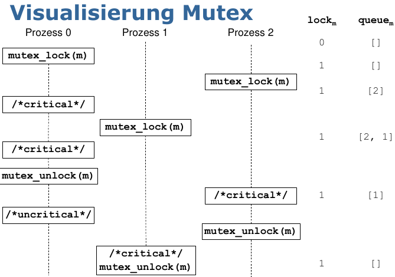
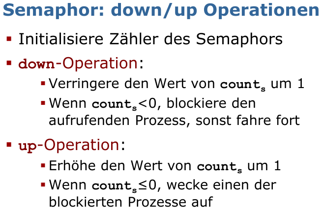
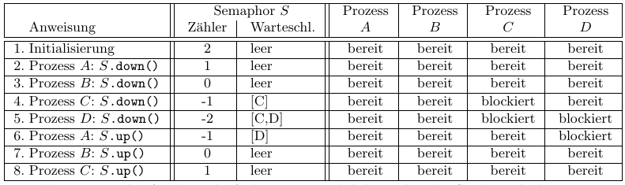
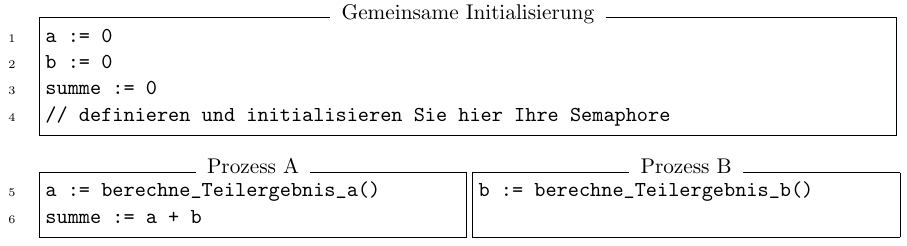
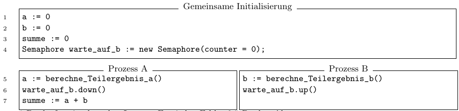
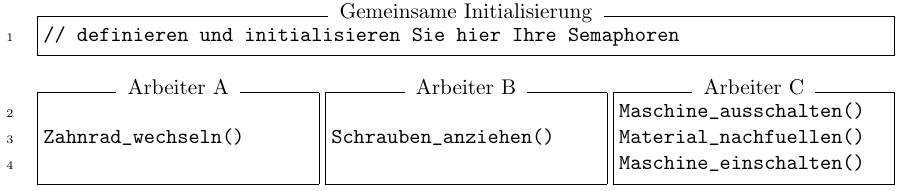
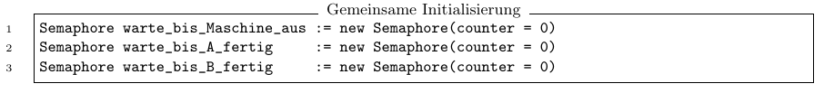
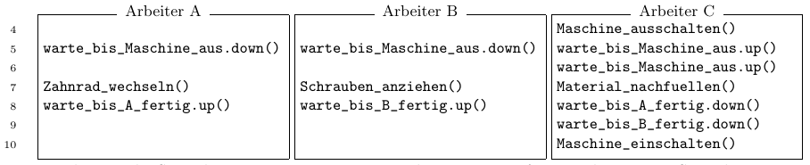

# Tutorat 11 <!--fit-->
### Mutexe und Semaphore <!--fit-->

<!--_class: lead-->
<!--big-->


---

# Vorbereitungen

<!--_class: lead-->
<!--big-->

<!-- _backgroundColor: #7293a6; -->

---

## Vorbereitungen
### Mutex


<!--small-->


---

## Vorbereitungen
### Semaphor


<!--small-->


---

# Übungsblatt

<!--_class: lead-->
<!--big-->

<!-- _backgroundColor: #7293a6; -->

---

## Übungsblatt
### Aufgabe 1a)
```
solange (i < n) {
  mein_i := i;
  i := i + 1;
  if (mein_i < n) {
    a := vektor_a[mein_i];
    b := vektor_b[mein_i];
    s := komplizierte_funktion(a, b);
    ergebnis[mein_i] := s;
  }
 }
```


<!--small-->


---

## Übungsblatt
### Aufgabe 1a)
- **Prozess p1** speichert das aktuelle `i` lokal in `mein_i`
- **Prozess p2** speichert das aktuelle `i` lokal in `mein_i`
- **beide** inkrementieren `i`
- jetzt speichert **p3** das aktuelle `i` lokal in `mein_i`
- **p1** und **p2** haben den gleichen Index `old_i`
- **p3** berechnet den Index `oldi + 2`
- `oldi + 1` ausgelassen

<!--small-->


---

## Übungsblatt
### Aufgabe 1 b)
```
solange (i < n) {
  mutex_lock(m);
  mein_i := i;
  i := i + 1;
  mutex_unlock(m);
  if (mein_i < n) {
    a := vektor_a[mein_i];
    b := vektor_b[mein_i];
    s := komplizierte_funktion(a, b);
    ergebnis[mein_i] := s;
  }
 }
```


<!--small-->


---

## Übungsblatt
### Aufgabe 2a)
- Prozess A wird **schlafen gelegt**, wenn
  - Prozess A die Methode `S.down()` aufruft
  - der Zähler **vor** dem Aufruf $\le 0$ bzw. $< 1$ war und der Zähler **nach** dem Aufruf $\le -1$ bzw. $< 0$ war
- Prozess A wird **aufgeweckt**, wenn
  - sich Prozess A (an erster Stelle) in der **Warteschlange** des Semaphors befindet **🠒** Zähler **vor** dem Aufruf $\le -1$ bzw. $< 0$ und **nach** dem Aufruf $\le 0$ bzw. $< 1$
  - Prozess B die Methode `S.up()` aufruft

<!--small-->


---

## Übungsblatt
### Aufgabe 2b)
- Ja, **Prozess C** wird aufgeweckt und kann fortfahren:
  - Wird `up()` aufgerufen und ist die Warteschlange **nicht leer**, dann wird immer ein **Prozess** aus der Warteschlange **geholt** und aufgeweckt
  - Der Betrag des Zählerstands vor dem Inkrementieren entspricht der **Länge der Warteschlange**. Wie in der Vorlesung:
    - "Wenn der Zählerstand nach dem Inkrementieren $\le 0$ ist, dann wird ein ”**Prozess** aus der Warteschlange **geholt** und aufgeweckt“

<!--small-->


---

## Übungsblatt
### Aufgabe 2c)


<!--small-->


---

## Übungsblatt
### Aufgabe 3a)


<!--small-->


---

## Übungsblatt
### Aufgabe 3a)


<!--small-->


---

## Übungsblatt
### Aufgabe 3b)


<!--small-->


---

## Übungsblatt
### Aufgabe 3b)



<!--small-->


---

# Quellen

<!--_class: lead-->
<!--big-->

<!-- _backgroundColor: #7293a6; -->

---

## Quellen
### Wissenquellen

- :shrug:
- source

<!--small-->


---

## Quellen
### Bildquellen

- :shrug:
- source

<!--small-->


---

# Vielen Dank für eure Aufmerksamkeit!
# :penguin:

<!--_class: lead-->
<!--big-->

<!-- _backgroundColor: #7293a6; -->
