# Tutorat 12 <!--fit-->
### Deadlocks und Bankier-Algorithmus <!--fit-->

<!--_class: lead-->
<!--big-->

---

# Vorbereitung

<!--_class: lead-->
<!--big-->

<!-- _backgroundColor: #000D0D; -->

---

## Vorbereitung
### Ressourcendiagramm
- **Ressourcenspur** gibt eine **Ausführungsreihenfolge** der beiden **Prozesse** auf einem **pseudoparallelen** Prozessor an
- Die **Ressourcenspur** darf vom Start zum Ende nur nach **rechts** und nach **oben** entlang des Gitters verlaufen
- Eine **Ressourcenspur** kann ein Rechteck nur am **linken** und **unteren** Rand berühren, da die Prozesse ihre jeweiligen **Operationen** erst beim **Überschreiten** eines Zeitpunktes **vollständig** ausführen
- Läuft die **Ressourcenspur** in eine **Ecke** hinein, von der die Spur **weder** nach **rechts** noch nach **oben** fortgesetzt werden kann, ohne ein Rechteck zu betreten, so befinden sich die Prozesse in einem **Deadlock**

<!--small-->

---

## Vorbereitung
### Belegungs-Anforderungs-Graph
- Wenn eine Ressource von einem Prozess **gesperrt** ist, zeichnet man den Pfeil von der **Ressource** zum **Prozess**
- Wenn ein Prozess eine Ressource anfordert und **blockiert**, weil die Ressource nicht verfügbar ist, dann zeichnet man den Pfeil vom **Prozess** zur **Ressource**.
  - dieser Pfeil wird verwendet, sobald von einer Resource **zwei** Pfeil ausgehen

<!--small-->

---

## Vorbereitung
### Bankier-Algorithmus
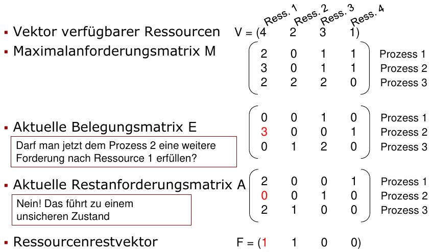

<!--small-->

---

# Übungsblatt

<!--_class: lead-->
<!--big-->

<!-- _backgroundColor: #000D0D; -->

---

## Übungsblatt
### Aufgabe 1 a)
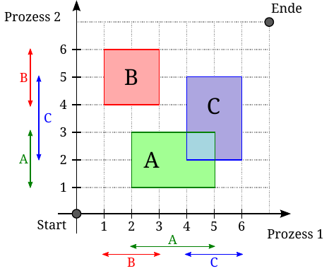

<!--small-->

---

## Übungsblatt
### Aufgabe 1 b)
- Es gibt keine **konkave** Ecke, in die die Ressourcenspur hineinlaufen kann und nicht mehr nach **rechts** oder **oben** fortgesetzt werden kann:
  - Ressourcenspur kann sich nur nach **oben** oder **rechts** bewegen, da wegen **Pseudoparallelität** immer einer der beiden Prozesse, der gerade die CPU zugewiesen bekommen hat, Instructions ausführt, sich also **vorwärts** in der Zeit bewegt
  - Da es hier zu keinem Zeitpunkt **konkaven** Ecken oder **Sackgassen** gibt, gibt es immer einen Weg, den man nach **oben** oder **rechts** ausweichen kann **🠒** es ist zu jedem erreichbaren **Zeitpunkt** einer der beiden **Prozesse ausführbar**
    - Falls die **Instruction** des einen Prozesses **blockiert** ist, kann dafür immer der **andere Prozess** eine **Instruction** ausführen. Es gibt immer einen **Ausweg**, wie sich die beiden Prozesse **nicht** gegenseitig **blockieren**

<!--small-->

---

## Übungsblatt
### Aufgabe 1 c)
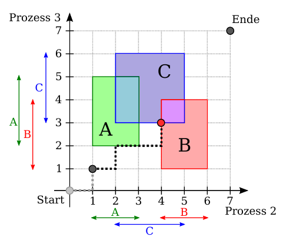

<!--small-->

---

## Übungsblatt
### Aufgabe 1 d)
- **Befehlsfolge, die zum Deadlock führt:**
  - **1:** *Prozess 2* Zeile 1: Belegt A
  - **2:** **Prozess 3** Zeile 1: Belegt B
  - **3:** **Prozess 3** Zeile 2: Fordert A an und blockiert, da belegt von *Prozess 2*
  - **4:** *Prozess 2* Zeile 2: Belegt C
  - **5:** *Prozess 2* Zeile 3: Gibt A frei
  - **6:** *Prozess 2* Zeile 4: Fordert B an und blockiert, da belegt von **Prozess 3**
  - **7:** **Prozess 3** Zeile 2: bekommt A nun zugeteilt
  - **8:** **Prozess 3** Zeile 3: Fordert C an und blockiert, da belegt von *Prozess 2*

<!--small-->

---

## Übungsblatt
### Aufgabe 1 e)
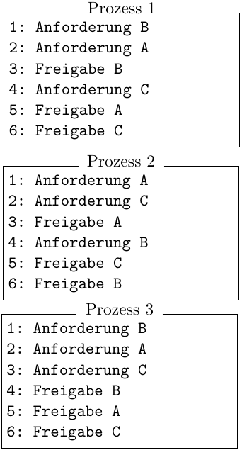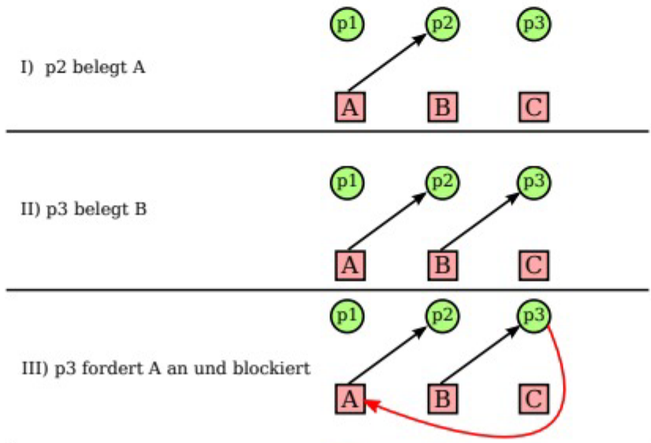

<!--small-->

---

## Übungsblatt
### Aufgabe 1 e)
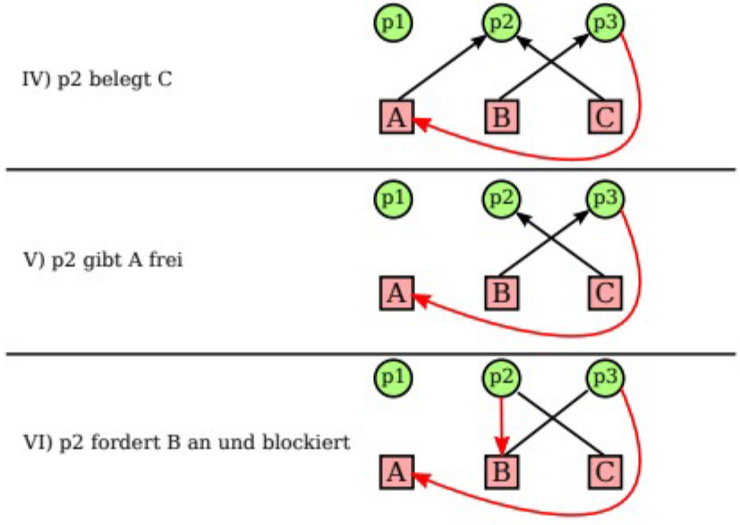

<!--small-->

---

## Übungsblatt
### Aufgabe 1 e)
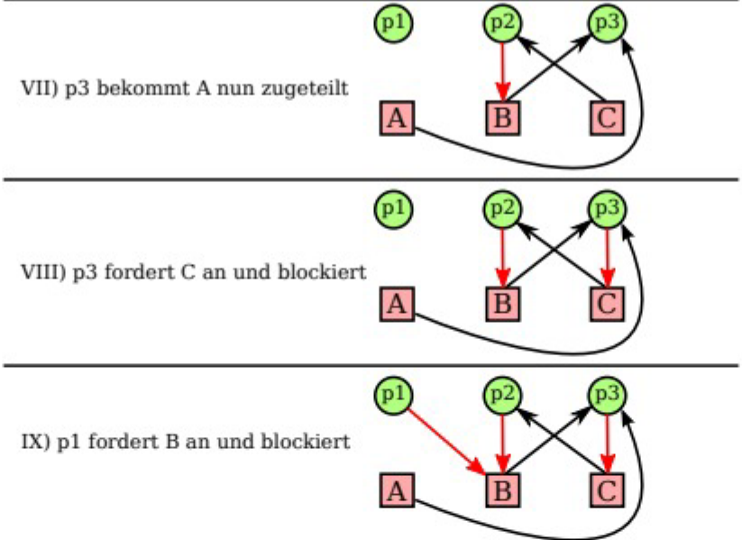

<!--small-->

---

## Übungsblatt
### Aufgabe 2 a)
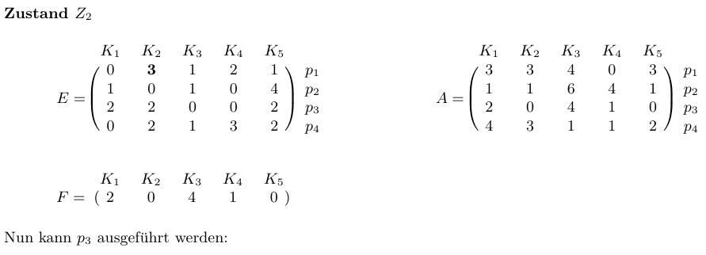

<!--small-->

---

## Übungsblatt
### Aufgabe 2 a)
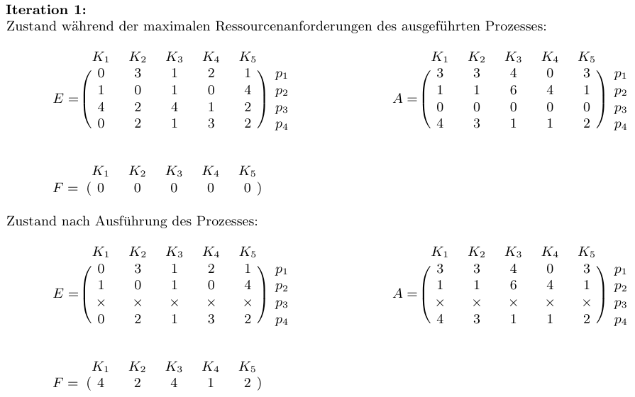

<!--small-->

---

## Übungsblatt
### Aufgabe 2 a)
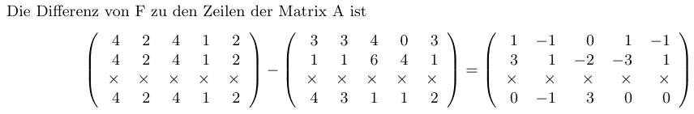

- Da in jeder der drei verbleibenden relevanten Zeilen **mindestens** **ein** Eintrag **negativ** ist, kann **kein** weiterer Prozess mehr mit seinen **Maximalanforderungen** ausgeführt werden kann
- **in kurz:** da in jeder Zeile **mindestens** **ein** Eintrag von $A$ **größer** als der entsprechende Eintrag von $F$ ist **🠒** **unsicherer Zustand**

<!--small-->

---

## Übungsblatt
### Aufgabe 2 b)
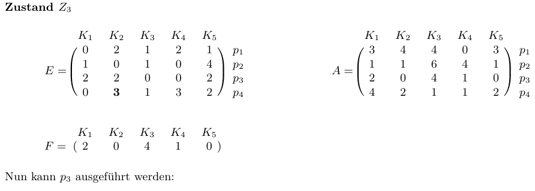

<!--small-->

---

## Übungsblatt
### Aufgabe 2 b)
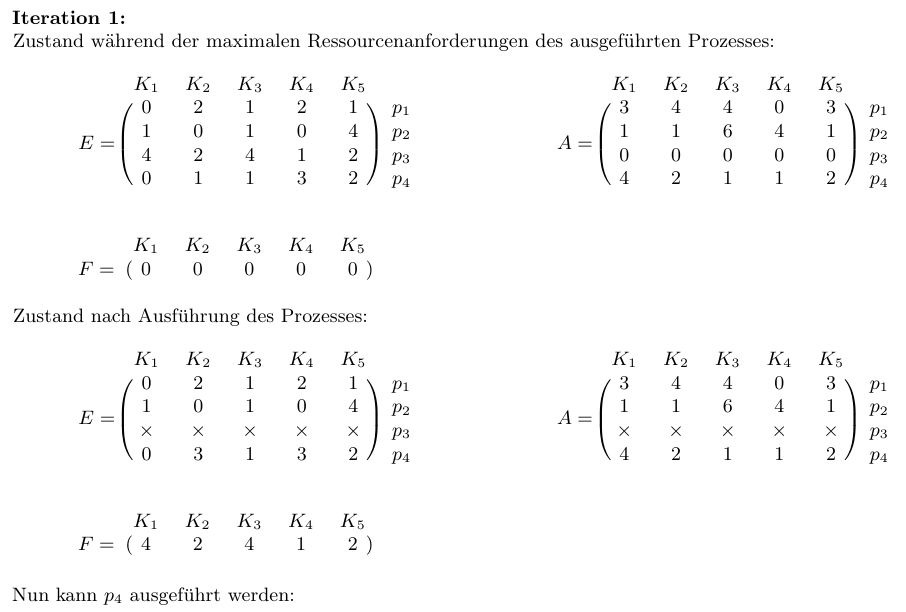

<!--small-->

---

## Übungsblatt
### Aufgabe 2 b)
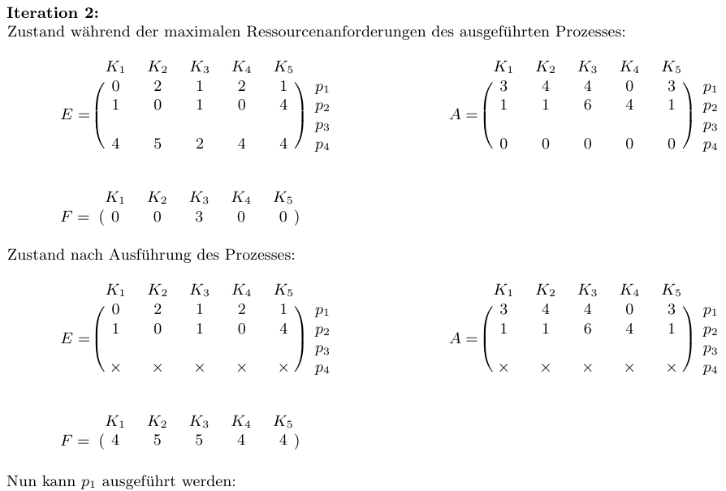

<!--small-->

---

## Übungsblatt
### Aufgabe 2 b)
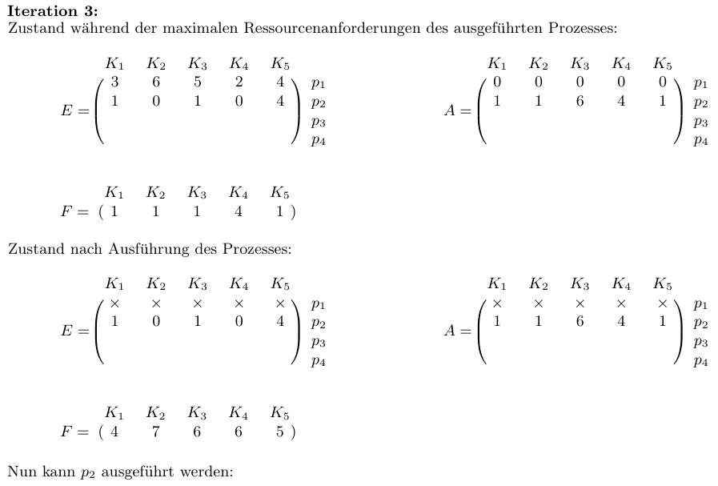

<!--small-->

---

## Übungsblatt
### Aufgabe 2 b)
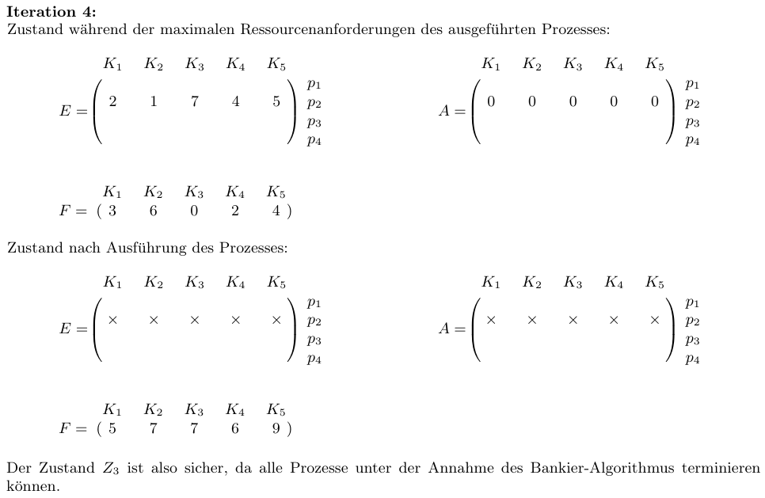

<!--small-->

---

## Übungsblatt
### Aufgabe 3 a)
- Der **Bankier-Algorithmus** betrachtet nur die **Maximalanforderungen** und nicht den tatsächlichen **Programmablauf**
**🠒** Bankier-Algorithmus verhält sich oft zu **restrektiv**

#### Beispiel 2
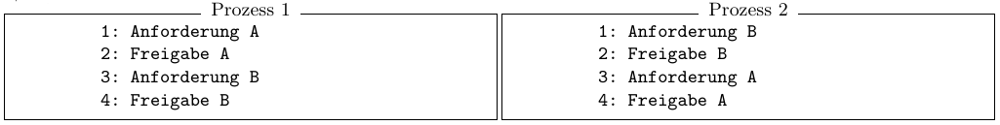
- Die **Zeitintervalle**, in denen verschiedene **Ressourcen** für einen Prozess **reserviert** sind, müssen sich **nicht** überlappen

<!--small-->

---

## Übungsblatt
### Aufgabe 3 a)
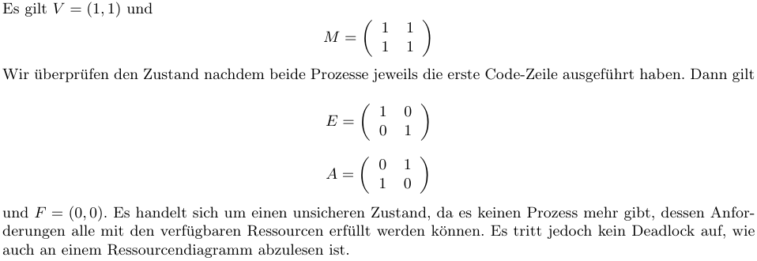

<!--small-->

---

## Übungsblatt
### Aufgabe 3 b)
- Ein Prozess muss **nicht zwingend** die von ihm angegebene ”**maximale Anzahl** angeforderter Ressourcen“ einer **Klasse** auch wirklich anfordern

#### Beispiel 2
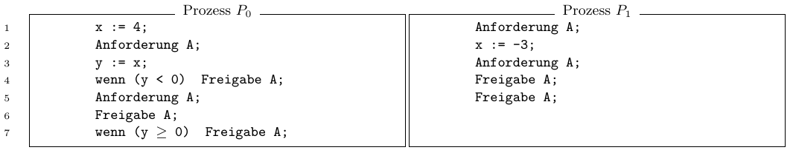

- Variable `x` von beiden Prozessen **gemeinsam** genutzt, Ausführung jeder Zeile **atomare** Operation

<!--small-->

---

## Übungsblatt
### Aufgabe 3 b)
- Wir nehmen $V = 2$ an
- $M_0 = 2$ (kann im Fall von $y \ge 0$ auftreten) $M_1 = 2$
- Die **Voraussetzungen** für den **Bankier-Algorithmus** sind erfüllt:
  – Die **Maximalanforderungen** sind im Voraus bekannt
  – $M_0 \le V$ und $M_1 \le V$, also übersteigen die **Maximalanforderungen** für keinen Prozess die zur Verfügung stehenden **Ressourcen**
- **Unsichrer Zustand nach Ereignissen:**
  - $P_0$ führt zuerst Zeile $1$ und $2$ aus, danach führt $P_1$ die Zeilen $1$ und $2$ aus:
  - **Unsichrer Zustand:** $E_{0}=1, E_{1}=1, A_{0}=M_{0}-E_{0}=1, A_{1}=M_{1}-E_{1}=1$ und $F_{A}=V_{A}-E_{0}-E_{1}=2-1-1=0$.

<!--small-->

---

## Übungsblatt
### Aufgabe 3 b)
- Es kann für **keinen** Prozess eine **Restausführung** gewährleistet werden, da der **Bankier-Algorithmus** die **Maximalanforderungen** betrachtet ohne den **tatsächlichen Programmablauf** zu berücksichtigen
- Da $x = −3$ ist, wird von $P_0$ **nie** mehr als eine **Ressource** **gleichzeitig** von $A$ verwendet. Deshalb gibt es ausgehend von diesem Zustand **keine Möglichkeit** einen **Deadlock** zu erhalten

#### Fazit
- In den beiden Beispielen, **kann** (nicht muss) es einen **unsicheren Zustand** geben, der aber **nicht zwingend** zu einem **Deadlock** führt

<!--small-->

---

# Quellen

<!--_class: lead-->
<!--big-->

<!-- _backgroundColor: #000D0D; -->

---

## Quellen
### Wissenquellen

- :shrug:

<!--small-->

---

## Quellen
### Bildquellen

- :shrug:

<!--small-->

---

# Vielen Dank für eure Aufmerksamkeit!
# :penguin:

<!--_class: lead-->
<!--big-->

<!-- _backgroundColor: #000D0D; -->
