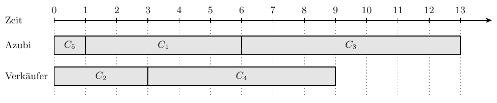
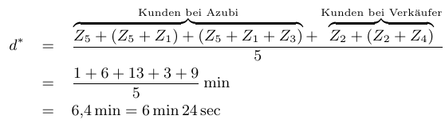
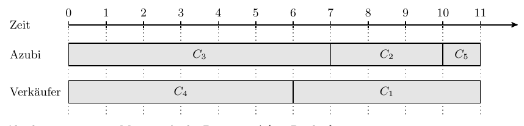
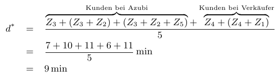

# Tutorat 13 <!--fit-->
### Scheduling <!--fit-->

<!--_class: lead-->
<!--big-->

---

# Übungsblatt

<!--_class: lead-->
<!--big-->

<!-- _backgroundColor: #BACC8B; -->

---

## Übungsblatt
### Aufgabe 1
- **🠒** **Evaluation**

<!--small-->

---

## Übungsblatt
### Aufgabe 2 a)
- $Z_1 = 5$, $Z_2 = 3$, $Z_3 = 7$, $Z_4 = 6$, $Z_5 = 1$
- **1:** In der Vorlesung wurde bewiesen, dass die Schedulingstrategie **Shortest Job First** (**SJF)** die **durchschnittliche Durchlaufzeit** (= die Zeit zwischen Eingang und Abschluss des Jobs) **minimiert**
**🠒** $C_5, C_2 ,C_1 ,C_4, C_3$
- **2:** $\displaystyle\sum_{i=1}^{5} Z_{i}=5+3+7+6+1=22$ Minuten

<!--small-->

---

## Übungsblatt
### Aufgabe 2 a)
- **3:**
  $$\begin{aligned}
  d^{*} &=\frac{Z_{5}+\left(Z_{5}+Z_{2}\right)+\left(Z_{5}+Z_{2}+Z_{1}\right)+\left(Z_{5}+Z_{2}+Z_{1}+Z_{4}\right)+(\overbrace{\left.Z_{5}+Z_{2}+Z_{1}+Z_{4}+Z_{3}\right)}^{\text {Wartezeit von } C_{3}}}{5} \\
  &=\frac{5 Z_{5}+4 Z_{2}+3 Z_{1}+2 Z_{4}+1 Z_{3}}{5} \\
  &=\frac{5 \cdot 1+4 \cdot 3+3 \cdot 5+2 \cdot 6+1 \cdot 7}{5} \min \\
  &=\frac{51}{5} \min =10,2 \min =10 \min 12 \mathrm{sek}
  \end{aligned}$$

<!--small-->

---

## Übungsblatt
### Aufgabe 2 b)
#### Shortest Job First
- **1:** *Abarbeitungsreihenfolge*
  
- **2:** *Abarbeitungszeit:* 13 Minuten

<!--small-->

---

## Übungsblatt
### Aufgabe 2 b)
- **3:** *Durchschnittliche Aufenthaltszeit*
  

<!--small-->

---

## Übungsblatt
### Aufgabe 2 c)
#### Longest Job First
- **1:** *Abarbeitungsreihenfolge*
  
- **2:** *Abarbeitungszeit:* 11 Minuten

<!--small-->

---

## Übungsblatt
### Aufgabe 2 c)
- **3:** *Durchschnittliche Aufenthaltszeit:*
  
- Aus Sicht des **Azubis** ist **Longest Job First** optimal, da so nur $11$ statt $13$ Minuten zum Abarbeiten aller Kunden benötigt wird
- Aus Sicht der **Kunden** ist **Shortest Job First** optimal, da sie sich so durchschnittlich nur $6,4$ Minuten statt $9$ Minuten in der Bäckerei aufhalten müssen

<!--small-->

---

## Übungsblatt
### Aufgabe 2 c) - Anmerkungen
- **SJF** ist der **optimale Scheduler** zur **Minimierung der durchschnittlichen Durchlaufzeit** (Beweis siehe Vorlesung). **LJF** liefert einen Schedule mit **hohem Durchsatz**. In diesem Spezialfall sogar den optimalen Plan.
  - Wie man an diesem Beispiel sieht, sind **Durchlaufzeit** und **Durchsatz** verschieden und **nicht** gleichzeitig optimierbar.
- Den optimalen Schedule zur Maximierung des **Durchsatzes** zu bestimmen ist im Allgemeinen NP-schwer, **LJF** ist jedoch eine gute **Heuristik**, die eine **obere Grenze** für die Gesamtdauer von $\left(\frac{4}{3}-\frac{1}{3 m}\right) \cdot O P T$ garantiert, wobei $m$ die **Anzahl der Verkäufer** bzw. **parallelen Prozessoren** und OPT die **Gesamtdauer** des **optimalen Schedule** ist.

<!--small-->

---

## Übungsblatt
### Aufgabe 3

<!--small-->

---
