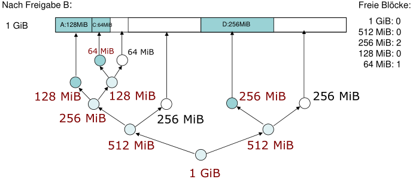
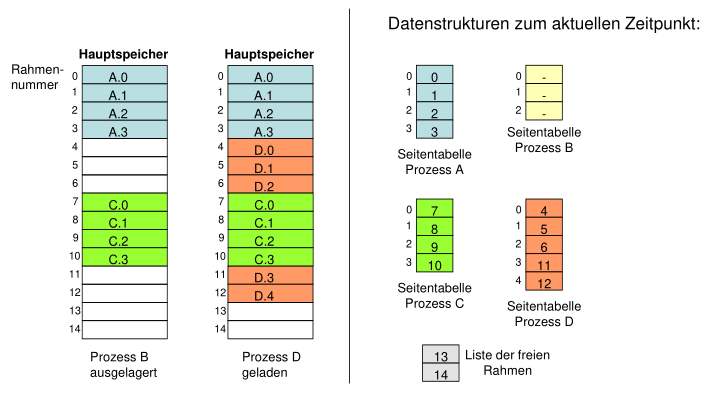
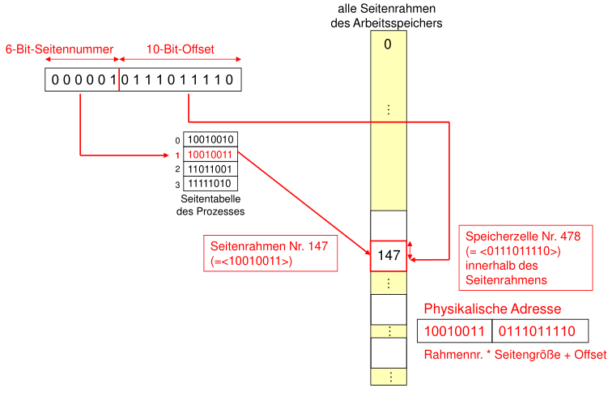

# Tutorat 14 <!--fit-->
### Speicherverwaltung <!--fit-->

<!--_class: lead-->
<!--big-->

---

# Vorbereitungen

<!--_class: lead-->
<!--big-->

<!-- _backgroundColor: #476042; -->

---

## Vorbereitungen
### Definitionen
- **Interne Fragmentierung:** Prozess *kleiner* als die dafür vorgesehene *Partition*
- **Externe Fragmentierung:** Wenn es zu der Situation kommen kann, dass der gesamte *Speicherplatz* eigentlich *ausreicht* für einen Prozess, aber der Prozess *nicht* abgespeichert werden kann, da dieser Speicherplatz nicht *kontinuierlich* ist
- **Virtueller Speicher** = *Hauptspeicher* + *Hintergrundspeicher*

<!--small-->

---

## Vorbereitungen
### Speicherzuteilungsalgorithmen
- **Best Fit:** Suche *kleinsten* Block, der *ausreicht*
- **First Fit:** Suche *beginnend* mit *Speicheranfang* bis *ausreichend* großer Block gefunden
- **Next Fit:** Suche beginnend mit der Stelle der *letzten Speicherzuweisung*

<!--small-->

---

## Vorbereitungen
### Buddy System

- **freie** Blöcke können nur **verschmolzen** werden, wenn sie **denselben Elterknoten** haben

<!--small-->

---

## Vorbereitungen
### Paging
- **Logische Adresse** im Programm besteht aus *Seitennummer* und *Offset*
- **Physikalische Adresse** besteht aus *Rahmennummer* und *Offset*

<!--small-->

---

## Vorbereitungen
### Paging

<!--small-->

---

# Quellen

<!--_class: lead-->
<!--big-->

<!-- _backgroundColor: #476042; -->

---

## Quellen
### Wissenquellen

- :shrug:
- source

<!--small-->

---

## Quellen
### Bildquellen

- :shrug:
- source

<!--small-->

---

# Vielen Dank für eure Aufmerksamkeit!
# :penguin:

<!--_class: lead-->
<!--big-->

<!-- _backgroundColor: #476042; -->
