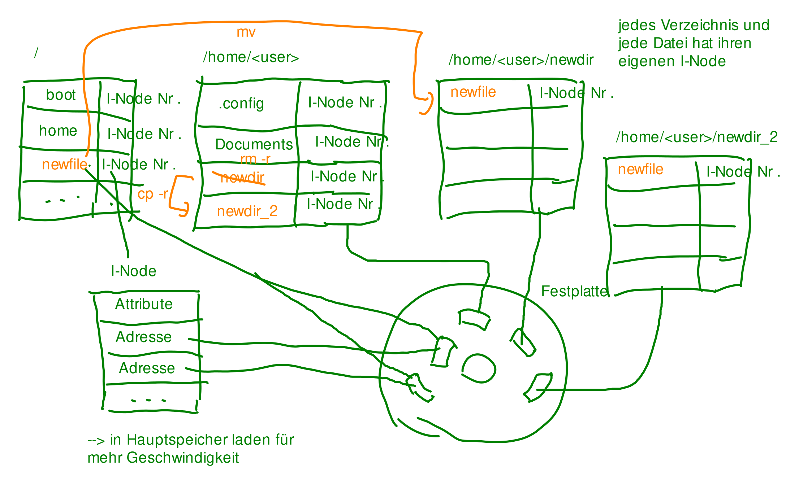
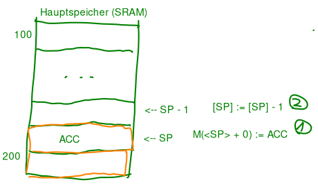
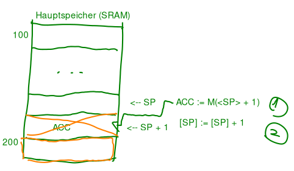

# Tutorat 2 <!--fit-->
### Hardware <!--fit-->

<!--_class: lead-->
<!--big-->


---

# Korrektur

<!--_class: lead-->
<!--big-->


---

## Korrektur
### Häufige Fehler und Interessantes

- `last -s today` oder `last -s 0:00`
- `find -iname "*.pdf"` for insensitive (lange Schreibweise `-i -name`, das selbe bei `ls -alh` bzw. `ls -a -l -h`)
- "Datein und Ordner" bei ls
  - im **I-Node System** sind **Verzeichnisse** quasi **Dateien**
- `cd /usr/share/doc` statt `cd /; cd usr; cd share; cd doc`
- **versteckte Dateien** und Verzeichnisse (`.file` und `.folder`)
- `date +"Datum: %F`, Zeit: `%T` nicht `%X`
- `cd` führt zu `/home/<user>` bzw. `~`
  - `cd ./pfad/verzeichnis` oder auch `cd pfad/verzeichnis`
- `/` gehört Root, und `~` gehört User

<!--small-->


---

## Korrektur
### Häufige Fehler und Interessantes
- `cp /pfad/datei_oder_verzeichnis_1 ./pfad/datei_oder_verzeichnis_2 /pfad_2`: kopieren
  - `cp /pfad/datei_oder_verzeichnis ./pfad/file_or_directoy`: kopieren und umbenennen
  - `-r`: copy directories recursively (Inhalte von nichtleeren Ordnern werden mitkopiert)
- `mv /pfad/datei_oder_verzeichnis_1 ./pfad/datei_oder_verzeichnis_2 ./pfad_2`: verschieben
  - `mv /pfad/datei_oder_verzeichnis /pfad/file_or_directoy`: umbenennen
- `rm /pfad/datei`: remove
  - `-r`: remove directories recursively (nichtleere Ordner löschen)

<!--small-->


---

## Korrektur
### Aufgabe c) - 1



<!--small-->


---

# Übungsblatt

<!--_class: lead-->
<!--big-->


---
## Übungsblatt
### Aufgabe 1
- `STOREIN ACC SP i`: M(<ACC>+[i]) := SP
- `<i>` ist **unsigned** und `[i]` ist **signed** (letztes Bit ist Zweierkomplement oder Einerkomplement **➞** negative Zahlen möglich)

#### 
<!-- #### Die erweiterte RETI -->

<!--small-->


---

## Übungsblatt
### Aufgabe 1
- `MOVE IN2 ACC`: ACC := IN2

#### 
#### Die erweiterte RETI

<!--small-->


---

## Übungsblatt
### Aufgabe 1
- `ADD ACC IN1`: ACC := ACC + IN1

#### 
#### Die erweiterte RETI

<!--small-->


---

## Übungsblatt
### Aufgabe 1
- **0 auf dem linken Operanden-Bus:** `LOADI ACC i` (ACC := 0^10i)

#### 

#### Die erweiterte RETI

<!--small-->


---

## Übungsblatt
### Aufgabe 2
- **subtrahieren** $\hat =$ Speicher allokieren, **addieren** $\hat =$ Speicher freigeben
- **push:**
  ```
  STOREIN SP ACC 0
  SUBI SP 1
  ```

#### 

<!--small-->


---

## Übungsblatt
### Aufgabe 2
- **pop:**
  ```
  LOADIN SP ACC 1        ODER        ADDI SP 1
  ADDI SP 1                          LOADIN SP ACC 0
  ```

#### 

<!--small-->


---

## Übungsblatt
### Aufgabe 2
> Wozu INT i und RTI einführen? Warum nicht mit restlichen Befehlssatz das gleiche umsetzbar?
- **Software-Interrupt:**
  - Stand des PCs auf dem Stack zwischenspeichern
  - mit Nummer `i` aus **Interruptvektortabelle IVT** Anfangsadresse von Routine auslesen
  - Sprung an Adresse $IVT[i]$ ($PC := IVT[i]$)
  - Wechsel in **Systemmodus**
  - Rückkehr mit `RTI` als letzter Befehl der Betriebssystemroutine

<!--small-->


---

## Übungsblatt
### Aufgabe 2

- MOVE SP ACC
- STOREIN SP ACC 1
- SUBI

<!--small-->


---


---

## Übungsblatt
### Aufgabe 3

```c
#include <stdio.h>
int main(void) {
  int value;
  FILE *fptr = fopen("myfile.txt","w");
  for(int i = 0; i < 2500; i++) {
    fprintf(fptr,"%d ",i);
  }
  fclose(fptr);
```

`...`

<!--small-->


---

## Übungsblatt
### Aufgabe 3

```c
  fptr = fopen("myfile.txt", "r");
  for(int j = 0; j < 2500; j++)
  {
    fscanf(fptr, "%d ", &value);
  }
  fclose(fptr);
  return 42;
}
```

- `fopen`, `fprintf();`, `fclose()`
- `fscanf(fp, "%s %s %s %d", str1, str2, str3, &year);`
  - `%d`: Decimal integer, `%s`: String of character

<!--small-->


---

## Übungsblatt
### Aufgabe 3
- **Kontextwechsel:** Prozess gibt Kontrolle über CPU an *Kernel* ab. Nach dem *Systemaufruf* gibt der Kernel die CPU wieder an den Prozess im *Benutzer-Modus* ab und führt den Programmcode an der Stelle fort, an der der Kontextwechsel zuvor gefordert wurde.
- **Kernelmodus:** Privilegierter Modus für Zugriff auf *Ein- und Ausgabegeräte* und Verändern von *Speicherschutz*. (Häufig damit einhergehend: Zugriff auf den kompletten Befehlssatz der CPU und den gesamten Speicherbereich)
- **Benutzer-Modus:** Modus in dem *Benutzerprogramme* ausgeführt werden. Teilt dem Kernel über *Systemaufrufe* mit, wenn er spezielle (*höher privilegierte*) Dienste des *Kernels* nutzen will. (Häufig damit einhergehend: Benutzerprozesse *weniger privilegiert* mit weniger zu Verfügung stehenden Instructions der CPU. Dadurch soll sichergestellt werden, dass nicht andere Prozesse oder die Stabilität des Kernels gefährdet werden)

<!--small-->


---

## Übungsblatt
### Aufgabe 3
- **Systemaufruf (system call):** Vom *Betriebssystem* zur Verfügung gestellter *Satz von Kommandos* mit dem z.B. auf *Ein-/Ausgabegeräte* zugegriffen werden kann werden kann. Unter *Linux* unter der *x86 ISA* z.B. `mov $6,  %eax;` (`close()` ist *Systemaufruf 6*) und unter *Window* `mov eax, 0x2f;` (`NtClose()` trägt die Nummer `0x2f` in Windows Vista). Darauffolgende *Argumentübergabe* und Auslösen des *Systemaufrufes*: `mov $15, %ebx;` `int $0x80;` unter *Linux*.
- **Bibliotheksfunktionen:** Bilden zusammen eine Programmierschnittstelle (*API*), die einem *Programmierer* helfen Tasks zu erledigen, die Zugriff auf *höher priviligierte* Instructions der CPU brauchen. Z.B. `open`, `close`, `read`, `write`, `execve`, `fork` oder `exit` (https://linuxhint.com/list_of_linux_syscalls/#execve) können vom Benutzer wie normale Funktionen genutzt werden, führen aber unbemerkt im Hintergrund einen *Kontextwechsel* durch. Der Benutzer muss sich durch diese *Abstrakion* keine Überlegungen über die interne Funktionsweise des *Betriebssystems* oder *Hardware* machen.

<!--small-->


---

## Übungsblatt
### Aufgabe 3
- **Instruction Set:** Satz an Kommandos eines Computers, dass von Computer zu Computer *unterschiedlich* ist.
- **Gerätetreiber:** Implementieren die CPU-Seite der *I/O-Protokolle* in Software.
- **Gate-Treiber:** Elektronisches Bauteil, dass man sich wie eine Art *Wasserhahn* vorstellen kann, der entweder Signale auf einen *Bus* lässt oder Signale davon abhält auf einen Bus zu kommen.
- **Busprotokolle:** Regeln die *Lese-/Schreibvorgänge* auf *Bus*.
- **I/O-Protokolle** Regeln die *Kommunikation* zwischen *CPU* und *I/O-Einheit* (Bsp.: Handshake zwischen CPU und Peripherie-Gerät). Eine Hierarchiestufe *höher* als *Busprotokolle*.

<!--small-->


---

## Übungsblatt
### Aufgabe 3
```
brk(0x2228000)
```
- alloziiert neuen Speicher (Datensegment des Prozesses)
```
openat(AT_FDCWD, "myfile.txt", O_WRONLY|O_CREAT|O_TRUNC, 0666) = 3
```
- Von fopen erzeugt. Öffnet Datei mit relativem Pfad, andere Argumente: AT_FDCWD legt fest, dass im current working directory geschaut werden soll. Optionen Write-only, Create, wenn es die Datei noch nicht gab,
Datei leer machen. Mode für Permissions

<!--small-->


---

## Übungsblatt
### Aufgabe 3
```
fstat(3, {st_mode=S_IFREG|0644, st_size=0, ...}) = 0
```
- Fragt Dateistatus ab, file descriptor ist 3, Dateityp und -modus (mehr Info auf INODE manpage- nicht so wichtig), regular file, st_size ist die Größe (bisher 0)
```
write(3, "0 1 2 3 4 5 6 7 8 9 10 11 12 13 "..., 4096) = 4096
write(3, "041 1042 1043 1044 1045 1046 104"..., 4096) = 4096
write(3, "60 1861 1862 1863 1864 1865 1866"..., 3198) = 3198
```
- Von fprintf erzeugt. Schreibt in File 3, den gegebenen String der Länge in Bytes.  Trotz 2500 fprintf Aufrufen nur 3 write Systemaufrufen, weil das Schreiben in die Datei gepuffert wird.

<!--small-->


---

## Übungsblatt
### Aufgabe 3
```
close(3)
```
- Von fclose ausgelöst. Schließt den Dateizugriff von File 3
```
openat(AT_FDCWD, "myfile.txt", O_RDONLY, 0666) = 3
```
- Wie oben. Diesmal allerdings als Read Only Zugriff
```
fstat(3, {st_mode=S_IFREG|0664, st_size=11390, ...}) = 0
```
- Wie zuvor. Diesmal ist die Größe nicht mehr 0

<!--small-->


---

## Übungsblatt
### Aufgabe 3
```
read(3, "0 1 2 3 4 5 6 7 8 9 10 11 12 13 "..., 4096) = 4096
read(3, "041 1042 1043 1044 1045 1046 104"..., 4096) = 4096
read(3, "60 1861 1862 1863 1864 1865 1866"..., 4096) = 3198
read(3, "", 4096)
```
- Von fscanf ausgelöst. Liest Inhalt von File 3
```
close(3)
```
- Von fclose ausgelöst. Schließt den Dateizugriff von File 3 wieder

<!--small-->


---

## Übungsblatt
### Aufgabe 3
```
exit_group(42)
```
- Verlässt den Thread mit Return Code 42
```
+++ exited with 42 +++
```

<!--small-->


---

# Quellen

<!--_class: lead-->
<!--big-->


---

## Quellen
### Wissenquellen

- https://www.tutorialspoint.com/c_standard_library/c_function_fscanf.htm
- https://de.wikipedia.org/wiki/Systemaufruf

---

# Vielen Dank für eure Aufmerksamkeit!
# :penguin:

<!--_class: lead-->
<!--big-->

