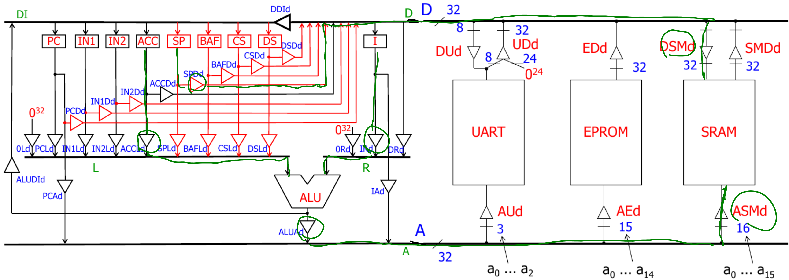

# Tutorat 2 <!--fit-->
### Hardware <!--fit-->

<!--_class: lead-->
<!--big-->


---

# Korrektur

<!--_class: lead-->
<!--big-->


---

## Korrektur
### Häufige Fehler und Interessantes

- `last -s today` oder `last -s 0:00`
- `find -iname "*.pdf"` for insensitive
- `pwd` "Pfad" (I-Node System)
- "Datein und Ordner" bei ls
  - im I-Node System sind Verzeichnisse quasi Dateien
- `cd /usr/share/doc` statt `cd /; cd usr; cd share; cd doc`
- versteckte Dateien und Verzeichnisse (`.file` und `.folder`)
- cp -r und mv -r?, mkdir -r, rm -r, alias
- `date +"Datum: %F`, Zeit: `%T` nicht `%X`
- `cd` zu `/home/<user>` bzw. `~`
- `/` gehört Root, und `~` gehört User

<!--small-->


---

## Korrektur
### Häufige Fehler und Interessantes
- `cp /pfad/datei_1 ./pfad/datei_2 /pfad_2`: kopieren
  - `cp /pfad/datei ./pfad/datei_2`: kopieren und umbenennen
  - `-r`: copy directories recursively (Inhalte von nichtleeren Ordnern werden mitkopiert)
- `mv /pfad/datei_1 ./pfad/datei_2 ./pfad_2`: verschieben
  - `mv /pfad/datei /pfad/datei_2`: umbenennen
- `rm /pfad/datei`: remove
  - `-r`: remove directories recursively (nichtleere Ordner löschen)

<!--small-->


---

## Korrektur
### Aufgabe c) - 1


<!--small-->


---

# Übungsblatt

<!--_class: lead-->
<!--big-->


---
## Übungsblatt
### Aufgabe 1
- `STOREIN ACC SP i`: M(<ACC>+[i]) := SP

#### 
#### Die erweiterte RETI

<!--small-->


---

## Übungsblatt
### Aufgabe 1
- `MOVE IN2 ACC`: ACC := IN2

#### 
#### Die erweiterte RETI

<!--small-->


---

## Übungsblatt
### Aufgabe 1
- `ADD ACC IN1`: ACC := ACC + IN1

#### 
#### Die erweiterte RETI

<!--small-->


---

## Übungsblatt
### Aufgabe 1
- **0 auf dem linken Operanden-Bus:** `LOADI ACC i` (ACC := 0^10i)

#### 

#### Die erweiterte RETI

<!--small-->


---

## Übungsblatt
### Aufgabe 2
- **subtrahieren** $\hat =$ Speicher allokieren, **addieren** $\hat =$ Speicher freigeben
- **push:**
  ```
  STOREIN SP ACC 0
  SUBI SP 1
  ```

<!--small-->


---

## Übungsblatt
### Aufgabe 2
- **pop:**
  ```
  LOADIN SP ACC 1
  ADDI SP 1
  ```
  **oder:**
  ```
  ADDI SP 1
  LOADIN SP ACC 0
  ```

<!--small-->


---

# Vielen Dank für eure Aufmerksamkeit!
# :penguin:

<!--_class: lead-->
<!--big-->

