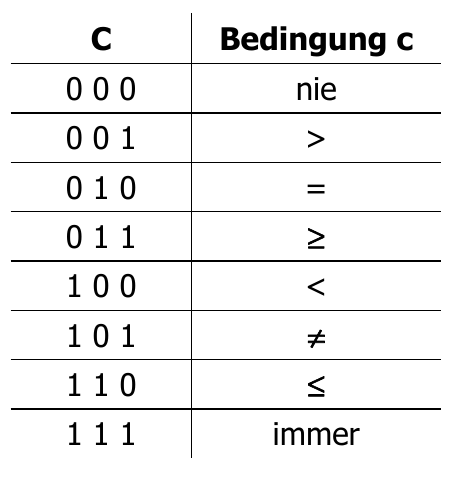
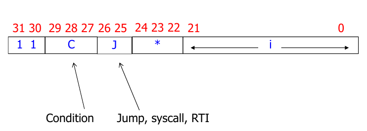

# Tutorat 3 <!--fit-->
### IO-Devices <!--fit-->

<!--_class: lead-->
<!--big-->


---

# Korrektur

<!--_class: lead-->
<!--big-->


---

## Korrektur
### Korrektursystem

- **Punkte** sind nur zum Vergleich untereinander
- **Ampelsystem:**
  - : Sehr gut, damit ist man für die Klausur auf der sicheren Seite
  - : Ausreichend, aber bezüglich Klausur sollte man dann zumindest im Tutorat gut aufpassen
  - : Nicht ausreichend. Leider zu wenig Arbeitsaufwand investiert

<!--small-->


---

# Vorbereitung

<!--_class: lead-->
<!--big-->


---

## Vorbereitung
### Bitweise Logiktricks
- **Herausfinden, ob ein bestimmes Bit 1 ist:**
  - ___`10100111 00101101 10010100 00000100`
  `&` `00000000 00000000 00000000 00000100`
  ___`00000000 00000000 00000000 00000100`
- **Herausfinden, ob ein bestimmes Bit 0 ist:**
  - ___`01011000 11010010 01101011 11111011`
  `|` `11111111 11111111 11111111 11111011`
  ___`00000000 00000000 00000000 00000100`

<!--small-->


---

# Übungsblatt

<!--_class: lead-->
<!--big-->


---

## Übungsblatt
### Aufgabe 1

- **Adressebus der RETI:** `01000000 00000000 00000000 00000XXX`
- **UART:**
  - **R0:** `XXXXXXXX`, Senderegister (Senden an Peripheriegerät)
  - **R1:** `XXXXXXXX`, Empfangsregister (Empfangen vom Peripheriegerät)
  - **R2:** `b0,b1,X,X,X,X,X,X`, Statusregister
    - `R2[0] = b0`: `senderegister_befuehlbar`
    - `R2[1] = b1`: `empfangsregister_befuehlt`
  - **R3-7:** `XXXXXXXX`

<!--small-->


---

## Übungsblatt
### Aufgabe 1

- **Versenden:**
  ```c
  if (senderegister_befuehlbar == 1) {  // R2[0] == 1
    write_data(R0);
    R2[0] = 0;
  }
  // else: warten, denn die UART versendet gerade noch Inhalt von R0 ans
  // Peripheriegerät
  ```
- **Empfangen:**
  ```c
  if (empfangsregister_befuehlt == 1) {  // R2[1] == 1
    read_data(R1);
    R2[1] = 0;
  }
  // else: warten, denn die UART ist noch beim Fühlen des Registers, die UART
  // wird sobald sie fertig ist R2[1] = 0; auf 1 setzen
  ```

<!--small-->


---

## Übungsblatt
### Aufgabe 1a)

- **C-Code:**
  ```c
  uart_selektieren()
  while (empfangsregister_befuehlt == 0) {  // R2[1] == 0
    // warten, denn die UART ist noch beim Fühlen des Registers, die UART
    // wird sobald sie fertig ist R2[1] = 0; auf 1 setzen
  }
  read_data(R1);
  R2[1] = 0;
  ```
- `while (1) {if (empfangsregister_befuehlt == 1) { }}`
  **➞** `while (!(empfangsregister_befuehlt == 1)) { }`
  **➞** `while (empfangsregister_befuehlt == 0) { }`
- **Adresse im EPROM:** `r = 00XXXXXX XXXXXXXX XXXXXXXX XXXXXXXX`
  - **passender Konstante:** `SRAM[r] = 01000000 00000000 00000000 00000000`

<!--small-->


---

## Übungsblatt
### Aufgabe 1a)

- **DS:** `00000000 00000000 00000000 00000000` **➞** `01000000 00000000 00000000 00000000`
- **RETI-Assembler-Code (UART selektieren):**
  ```assembler
  LOADI IN1 0 // IN1 auf 0 setzen (hier kann später Inhalt aus R1 addiert werden).
  LOAD DS r // Konstante 010...0 in DS laden --> Zugriff auf UART
  LOAD ACC 2 // Statusregister R2 in Akkumulator laden.
  // while (empfangsregister_befuehlt == 0) { }
  ANDI ACC 00000000 00000000 00000000 00000010  // Berechne R2 && 0b10 (2). Wenn b1=1, steht im ACC jetzt eine 2, ansonsten 0.
  JUMP= -2 // JUMP EQUAL. Wenn Bit 1 (b1) von R2 immernoch 0
  read_data(R1);
  R2[1] = 0;
  ```

<!--small-->


---

## Übungsblatt
### Aufgabe 1a)
- **RETI-Assembler-Code:**
  ```assembler
  LOADI IN1 0 // IN1 auf 0 setzen (hier kann später Inhalt aus R1 addiert werden).
  LOADI DS 0 // Zugriff auf Daten im EPROM
  LOAD DS r // Konstante 010...0 in DS laden --> Zugriff auf UART
  LOAD ACC 2 // Statusregister R2 in Akkumulator laden.
  #####
  read_data(R1);
  R2[1] = 0;
  ```

<!--small-->


---

# Ergänzungen

<!--_class: lead-->
<!--big-->


---

## Ergänzungen
### Trick mit Codierung von Jump Condition



<!--small-->


---

# Vielen Dank für eure Aufmerksamkeit!
# :penguin:

<!--_class: lead-->
<!--big-->

