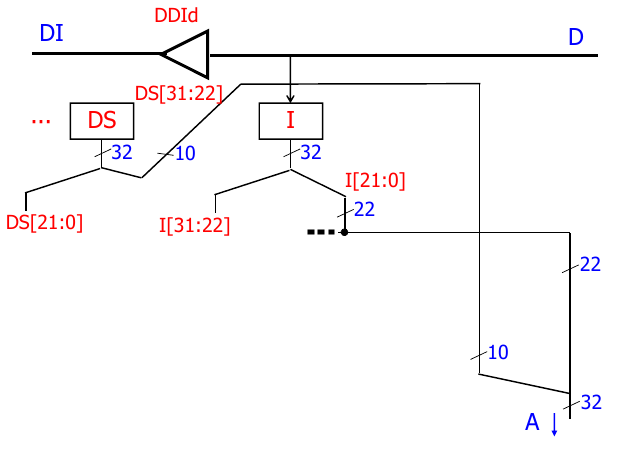

# Tutorat 3 <!--fit-->
### IO-Devices <!--fit-->

<!--_class: lead-->
<!--big-->


---

# Korrektur

<!--_class: lead-->
<!--big-->


---

## Korrektur
### Interessantes und häufige Fehler

- einige Fehler bei der RETI Treiberaufgabe
- viele kleinere Fehler bei der push pop Aufgabe
- Aufgabe 3 haben sich so gut wie alle gespart, da sie auch nicht wirklich relevant für die Klausur ist n_n
- die Sache mit `[SP]` und `<SP>`

<!--small-->


---

## Korrektur
### Korrektursystem

- **Punkte** sind nur zum Vergleich untereinander
- **Ampelsystem:**
  - : Sehr gut, damit ist man für die Klausur auf der sicheren Seite
  - : Ausreichend, aber bezüglich Klausur sollte man dann zumindest im Tutorat gut aufpassen
  - : Nicht ausreichend. Leider zu wenig Arbeitsaufwand investiert

<!--small-->


---

# Vorbereitung

<!--_class: lead-->
<!--big-->


---

## Vorbereitung
### Bitweise Logiktricks
- **Bestimmte Bits auf `0` setzen u. alle anderen unverändert lassen (_Maskieren_):**
  - ___`10100111 00101101 10010100 00000100`
  `&` `00000000 00000000 00000000 11111111`
  ___`00000000 00000000 00000000 00000100`
  - `0` ist **controlling value** zum mit **`0`en überschreiben**
  - **Herleitung über Decision Tree:**
  

<!--small-->


---

## Vorbereitung
### Bitweise Logiktricks
- **Bestimmte Bits auf `1` setzen u. alle anderen unverändert lassen (_Maskieren_):**
  - ___`10100111 00101101 10010100 01100101`
  `|` `00000000 00000000 00000000 11111111`
  ___`10100111 00101101 10010100 11111111`
  - `1` ist **controlling value** zum mit **`1`en überschreiben**
- **Test auf bestimmten Bitwert:**
  - **non-controlling value** von `&` bzw. `|` nutzen, um ein bestimmtes Bit **unverändert beizubehalten** und dann aus diesem bzw. dessen Negation zu schlussfolgern, dass da eine `1` bzw. `0` steht
  - mit `JUMP<> i` testen, ob z.B. **Bit 3** von `REG` `1` bzw. `0` ist. Dazu `ACC = REG & 00000100` bzw. `ACC = ~(REG | 11111011)` und dann: `<PC> + [i]` *gdw.* `ACC` $\ne$ `00000000` *gdw.* **Bit 3** ist `1` bzw. `0`

<!--small-->


---

## Vorbereitung
### Bitweise Logiktricks
- **Bestimmte Bits negieren und alle anderen unverändert lassen (_Differenz_):**
    - ___`10100111 00101101 10110100 01100101`
    `⊕` `10111100 10101001 00000000 11111111`
    ___`00011011 10000100 10110100 10011010`
    - **Unterschiede** werden hervorgehoben
    - `1` ist **controlling value** zum **Negieren** von `0` zu `1` bzw. `1` zu `0`
    - `0` ist **non-controlling value** zum **unverändert Beibehalten**
- **Test auf Gleichheit:**
  - **Bits, die gleich sind rauswerfen:**
  - mit `JUMP= i` testen, ob zwei Register gleiche Bitworte haben. Dazu `ACC` $=$ `REG1` $\oplus$ `REG2` und dann: `<PC> + [i]` *gdw.* `ACC` $=$ `00000000` *gdw.* `REG1` $=$ `REG2`

<!--small-->


---

## Vorbereitung
### Bitweise Logiktricks
- **Bitshiften :**
  - Shiften um **3** Stellen nach **links**
    - `10110 x 1000 = 10110000`
  - Shiften um **3** Stellen nach **rechts**
    - `10110000 / 1000 = 10110`
  - Zahl finden, die **Modulo 2** den passenden Wert (hier: **3**) hat bzw. entsprechende Anzahl `0`en hat (**3** `0`en)
    - `8 % 2 = 3`, also hat **3** `0`en **➞** passt

<!--small-->


---

## Vorbereitung
### Merkhilfe RETI Befehlssatz
- **to** `X` = **from** `X`
- **Compute:** *calc* `D` `OP` `S` *to* `D`,  *calc* `D` `OP` `M(<i>)` *to* `D`, *calc* `D` `OP` `[i]` *to* `D`
- **Load:**
  - `LOAD` *to* `D` *from* `M(<S>)` und `LOADI` *to* `D` *directly from* `i`
  - `LOADIN` *from* `M(<S>+[i])` *to* `D`
- **Store:**
  - `Store` *from* `D` *to* `M(<S>)` und `move` *from* `D` *directly to* `S`
    - es gibt kein `STOREI`, da die erweiterte RETI und vor allem der **SRAM** nicht dazu konzepiert sind, dass **zwei Argumente** beide auf den Speicher zugreifen (die RETI ist eine **Register-Memory Architektur**, aber keine **Register plus Memory Architektur**)
  - `STOREIN` *to* `M(<S>+[i])` *from* `D`

<!--small-->


---

## Vorbereitung
### Merkhilfe RETI Befehlssatz
- **Jump:** `JUMPc i` *gdw.* `ACC` `c` `0`
  - mache `JUMPc i` *gdw.* `3` `<` `4` *gdw.* `3 - 4` `<` `0`
- **Kodierung der Condition:**


<!--small-->


---

# Übungsblatt

<!--_class: lead-->
<!--big-->


---

## Übungsblatt
### Aufgabe 1
- **auf verschiedene Register der UART zugreifen:** `00000000 00000000 00000XXX`
- **UART:**
  - **R0:** `XXXXXXXX`, Senderegister (Senden an Peripheriegerät)
  - **R1:** `XXXXXXXX`, Empfangsregister (Empfangen vom Peripheriegerät)
  - **R2:** `b0,b1,X,X,X,X,X,X`, Statusregister
    - `R2[0] = b0`: `senderegister_befuehlbar`
    - `R2[1] = b1`: `empfangsregister_befuehlt`
  - **R3-7:** `XXXXXXXX`

<!--small-->


---

## Übungsblatt
### Aufgabe 1
- **Vorgefertige Adressen im EPROM:** `r/s/t = 00XXXXXX XXXXXXXX XXXXXXXX XXXXXXXX`
  - **UART Konstante:** `EPROM[r] = 01000000 00000000 00000000 00000000`
  - **SRAM Konstante:** `EPROM[s] = 10000000 00000000 00000000 00000000`
  - **`LOADI PC 0` als Konstante:** `EPROM[t] = 01110000 00000000 00000000 00000000`



<!--small-->


---

## Übungsblatt
### Aufgabe 1

- **zu UART wechseln:**
  ```
  LOADI DS 01000000 00000000 00000000
  MULTI DS 00000000 00000001 00000000
  ```
- **zu SRAM wechseln:**
  ```
  LOADI DS 10000000 00000000 00000000
  MULTI DS 00000000 00000001 00000000
  ```
- **zu EPROM wechseln:**
  ```
  LOADI DS 00000000 00000000 00000000
  MULTI DS 00000000 00000001 00000000
  ```

<!--small-->


---

## Übungsblatt
### Aufgabe 1

- **Versenden:**
  ```c
  if (senderegister_befuehlbar == 1) {  // R2[0] == 1
    write_data(R0);
    R2[0] = 0;
  }
  // else: warten, denn die UART versendet gerade noch Inhalt von R0 ans
  // Peripheriegerät
  ```
- **Empfangen:**
  ```c
  if (empfangsregister_befuehlt == 1) {  // R2[1] == 1
    read_data(R1);
    R2[1] = 0;
  }
  // else: warten, denn die UART ist noch beim Fühlen des Registers, die UART
  // wird sobald sie fertig ist R2[1] = 0; auf 1 setzen
  ```

<!--small-->


---

## Übungsblatt
### Aufgabe 1a)

- **C-Code:**
  ```c
  polling_loop(int new_instruction) {
    uart_selektieren()
    while (empfangsregister_befuehlt == 0) {  // R2[1] == 0
      // warten, denn die UART ist noch beim Fühlen des Registers, die UART
      // wird sobald sie fertig ist R2[1] = 0; auf 1 setzen
    }
    new_instruction[7:0] = R1;  // IN1[7:0] = R1
    R2[1] = 0;
  }
  ```
- `while (1) {if (empfangsregister_befuehlt == 1) { }}`
  **➞** `while (!(empfangsregister_befuehlt == 1)) { }`
  **➞** `while (empfangsregister_befuehlt == 0) { }`

<!--small-->


---

## Übungsblatt
### Aufgabe 1a)

- **RETI-Assembler-Code:**
  ```
  # POLLING-LOOP
  LOADI DS 01000000 00000000 00000000  # zu UART switchen
  MULTI DS 00000000 00000001 00000000
  LOAD ACC 2  # R2 laden.
  # while (empfangsregister_befuehlt == 0) { }
  ANDI ACC 00000000 00000000 00000010
  JUMP= -2  # Jump backward wenn das Peripheriegerät mitteilt, dass es noch nicht fertig ist
  # new_instruction[7:0] = R1;  # IN1[7:0] = R1
  LOAD ACC 1  # R1 in ACC zwischenspeichern
  OR IN1 ACC  # Verändere nur die ersten 8 Bits, für 1b) wichtig
  # R2[1] = 0;
  LOAD ACC 2  # R2 laden
  ANDI ACC 11111101 11111111 11111101  # 2tes Bit auf 0 setzen
  STORE ACC 2  # Bitwort mit 2tem Bit auf 0 gesetzt wieder zurück in R2
  ```

<!--small-->


---

## Übungsblatt
### Aufgabe 1b)
- **C-Code:**
  ```c
  void instruction_loop(int new_instruction) {  // IN1 = 0
    int counter = 4;  // IN2 = 4
    while (counter > 0) {
      new_instruction << 8;  // IN1 << 8
      polling_loop(&new_instruction) // Code aus Teil a)
      counter--;  // IN2 - 1
    }
  }
  ```

<!--small-->


---

## Übungsblatt
### Aufgabe 1b)
- **RETI-Assembler-Code:**
  ```
  # INSTRUCTION-LOOP
  LOADI IN2 4  # Benutze IN2 als Temporary für einen Schleifenzaehler
  LOADI IN1 0  # Intruction soll in ein mit 0en überschriebenes Register abgelegt werden
  # l1
  MULTI IN1 00000000 00000001 00000000 # um 8 Stellen nach links shiften
  POLLING-LOOP  # Code aus Teil a)
  SUBI IN2 1
  MOV IN2 ACC
  JUMP> -{Lines between this jump and comment l1}
  ```

<!--small-->


---

## Übungsblatt
### Aufgabe 1c)
- **Adresse `a`, um im SRAM nächste Instruction abzulegen:**
  `a = 00000000 XXXXXXXX XXXXXXXX` (16 Bit)
- `final_command` ist die Instruction `01110000 00000000 00000000 00000000` mit dem die Übertragung endet
- **C-Pseudo-Code:**
  ```c
  void load_code(int free_address, int final_command) {  // Adresse a
    while (new_instruction != final_command) {
      instruction_loop(&new_instruction)  // Code aus Teil b)
      SRAM[free_address] = new_instruction;  // M(<a>) := IN1
      free_address++;  // a + 1
    }
  }
  ```
- es sind nicht mehr genug **freie Register** da, daher muss die Variable `free_address` mit der Adresse `a` auf dem **Stack** gespeichert werden

<!--small-->


---

## Übungsblatt
### Aufgabe 1c)
- **RETI-Assembler-Code:**
  ```
  # LOAD-CODE
  LOADI IN2 a
  # l2
  STOREIN SP IN2 0  # Startadresse a auf Stack zwischenspeichern
  SUBI SP 1
  INSTRUCTION-LOOP  # Code aus Teil b)
  LOADI DS 10000000 00000000 00000000  # zu SRAM wechseln
  MULTI DS 00000000 00000001 00000000
  # SRAM[free_address] = new_instruction, M(<a>) := IN1
  STOREIN IN2 IN1 0
  # free_address++, a + 1
  LOADIN SP IN2 1
  ADDI SP 1
  ADDI IN2 1  # nächste Adresse
  # while (new_instruction != final_command) { /*...*/ }
  LOADI ACC 01110000 00000000 00000000  # final_command erzeugen
  MULTI ACC 00000000 00000001 00000000
  OPLUSI ACC IN1  # auf Unterschiede testen
  JUMP<> -{Lines between this jump and comment l2}
  ```

<!--small-->


---

# Quellen

<!--_class: lead-->
<!--big-->


---

## Quellen
### Wissenquellen

- https://en.wikipedia.org/wiki/Register%E2%80%93memory_architecture

<!--small-->


---

# Vielen Dank für eure Aufmerksamkeit!
# :penguin:

<!--_class: lead-->
<!--big-->

