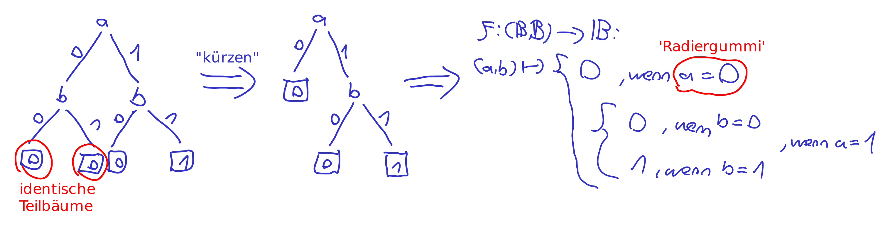
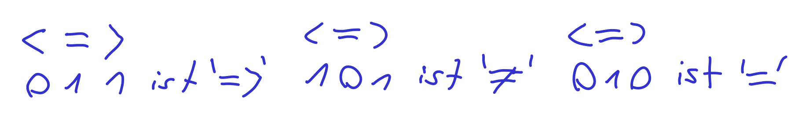

# Tutorat 3 <!--fit-->
### IO-Devices <!--fit-->

<!--_class: lead-->
<!--big-->


---

# Korrektur

<!--_class: lead-->
<!--big-->


---

## Korrektur
### Korrektursystem

- **Punkte** sind nur zum Vergleich untereinander
- **Ampelsystem:**
  - : Sehr gut, damit ist man für die Klausur auf der sicheren Seite
  - : Ausreichend, aber bezüglich Klausur sollte man dann zumindest im Tutorat gut aufpassen
  - : Nicht ausreichend. Leider zu wenig Arbeitsaufwand investiert

<!--small-->


---

# Vorbereitung

<!--_class: lead-->
<!--big-->


---

## Vorbereitung
### Bitweise Logiktricks
- **Bestimmte Bits auf `0` setzen u. alle anderen unverändert lassen (_Maskieren_):**
  - ___`10100111 00101101 10010100 00000100`
  `&` `00000000 00000000 00000000 11111111`
  ___`00000000 00000000 00000000 00000100`
  - `0` ist **controlling value** zum mit **`0`en überschreiben**
  - **Herleitung über Decision Tree:**
  

<!--small-->


---

## Vorbereitung
### Bitweise Logiktricks
- **Bestimmte Bits auf `1` setzen u. alle anderen unverändert lassen (_Maskieren_):**
  - ___`10100111 00101101 10010100 01100101`
  `|` `00000000 00000000 00000000 11111111`
  ___`10100111 00101101 10010100 11111111`
  - `1` ist **controlling value** zum mit **`1`en überschreiben**
- **Test auf bestimmten Bitwert:**
  - **non-controlling value** von `&` bzw. `|` nutzen, um ein bestimmtes Bit **unverändert beizubehalten** und dann aus diesem bzw. dessen Negation zu schlussfolgern, dass da eine `1` bzw. `0` steht
  - mit `JUMP<> i` testen, ob z.B. **Bit 3** von `REG` `1` bzw. `0` ist. Dazu `ACC = REG & 00000100` bzw. `ACC = ~(REG | 11111011)` und dann: `<PC> + [i]` *gdw.* `ACC` $\ne$ `00000000` *gdw.* **Bit 3** ist `1` bzw. `0`

<!--small-->


---

## Vorbereitung
### Bitweise Logiktricks
- **Bestimmte Bits negieren und alle anderen unverändert lassen (_Differenz_):**
    - ___`10100111 00101101 10110100 01100101`
    `⊕` `10111100 10101001 00000000 11111111`
    ___`00011011 10000100 10110100 10011010`
    - **Unterschiede** werden hervorgehoben
    - `1` ist **controlling value** zum **Negieren** von `0` zu `1` bzw. `1` zu `0`
    - `0` ist **non-controlling value** zum **unverändert Beibehalten**
- **Test auf Gleichheit:**
  - **Bits, die gleich sind rauswerfen :**
  - mit `JUMP= i` testen, ob zwei Register gleiche Bitworte haben. Dazu `ACC` $=$ `REG1` $\oplus$ `REG2` und dann: `<PC> + [i]` *gdw.* `ACC` $=$ `00000000` *gdw.* `REG1` $=$ `REG2`

<!--small-->


---

# Übungsblatt

<!--_class: lead-->
<!--big-->


---

## Übungsblatt
### Aufgabe 1

- **Adressebus der RETI:** `01000000 00000000 00000000 00000XXX`
- **UART:**
  - **R0:** `XXXXXXXX`, Senderegister (Senden an Peripheriegerät)
  - **R1:** `XXXXXXXX`, Empfangsregister (Empfangen vom Peripheriegerät)
  - **R2:** `b0,b1,X,X,X,X,X,X`, Statusregister
    - `R2[0] = b0`: `senderegister_befuehlbar`
    - `R2[1] = b1`: `empfangsregister_befuehlt`
  - **R3-7:** `XXXXXXXX`

<!--small-->


---

## Übungsblatt
### Aufgabe 1

- **Versenden:**
  ```c
  if (senderegister_befuehlbar == 1) {  // R2[0] == 1
    write_data(R0);
    R2[0] = 0;
  }
  // else: warten, denn die UART versendet gerade noch Inhalt von R0 ans
  // Peripheriegerät
  ```
- **Empfangen:**
  ```c
  if (empfangsregister_befuehlt == 1) {  // R2[1] == 1
    read_data(R1);
    R2[1] = 0;
  }
  // else: warten, denn die UART ist noch beim Fühlen des Registers, die UART
  // wird sobald sie fertig ist R2[1] = 0; auf 1 setzen
  ```

<!--small-->


---

## Übungsblatt
### Aufgabe 1a)

- **C-Code:**
  ```c
  polling_loop(int new_instruction) {
    uart_selektieren()
    while (empfangsregister_befuehlt == 0) {  // R2[1] == 0
      // warten, denn die UART ist noch beim Fühlen des Registers, die UART
      // wird sobald sie fertig ist R2[1] = 0; auf 1 setzen
    }
    new_instruction[7:0] = R1;  // IN1[7:0] = R1
    R2[1] = 0;
  }
  ```
- `while (1) {if (empfangsregister_befuehlt == 1) { }}`
  **➞** `while (empfangsregister_befuehlt == 0) { }`
- **Adresse im EPROM:** `r = 00XXXXXX XXXXXXXX XXXXXXXX XXXXXXXX`
  - **UART Konstante:** `EPROM[r] = 01000000 00000000 00000000 00000000`

<!--small-->


---

## Übungsblatt
### Aufgabe 1a)

- **DS:** `00000000 00000000 00000000 00000000` **➞** `01000000 00000000 00000000 00000000`
- **RETI-Assembler-Code:**
  ```
  LOADI IN1 0 // IN1 auf 0 setzen (hier kann spaeter Inhalt aus R1 addiert werden)
  LOADI DS 00000000 00000000 00000000 // Zugriff auf Daten im EPROM
  LOAD DS r // Konstante 010...0 in DS laden --> Zugriff auf UART
  LOAD ACC 2 // Statusregister R2 in Akkumulator laden.
  // while (empfangsregister_befuehlt == 0) { }
  ANDI ACC 00000000 00000000 00000010
  JUMP= -2 // Jump backward wenn Bit 1 (b1) von R2 immernoch 0
  // new_instruction[7:0] = R1;  // IN1[7:0] = R1
  Load ACC 1 // Zwischenspeichere R1 in ACC
  OR IN1 ACC // verändere nur die ersten 8 Bits  // für 1b) wichtig
  // R2[1] = 0;
  LOAD ACC 2 // Lade R2
  ANDI ACC 11111101 11111111 11111101
  STORE ACC 2 // speichere verändertes Bitwort wieder zurück in R2
  ```

<!--small-->


---

## Übungsblatt
### Aufgabe 1b)
- **C-Code:**
  ```c
  void instruction_loop(int new_instruction) {  // IN1 = 0
    int counter = 4;  // IN2 = 4
    while (counter > 0) {
      new_instruction << 8;  // IN1 << 8
      polling_loop(&new_instruction) // Code aus Teil a)
      counter--;  // IN2 - 1
    }
  }
  ```

<!--small-->


---

## Übungsblatt
### Aufgabe 1b)
- **RETI-Assembler-Code:**
  ```
  LOADI IN2  4 // Benutze IN2 als Schleifenzaehler
  LOADI IN1 0
  # l1
  MULTI IN1 00000000 00000001 00000000
  POLLING-LOOP // Code aus Teil a)
  SUBI IN2 1
  MOV IN2 ACC
  JUMP> -{Lines between this jump and comment l1}
  ```

<!--small-->


---

## Übungsblatt
### Aufgabe 1c)
- **C-Code:**
  ```c
  void load_code(int free_address) {
    while (new_instruction != last_command) {
      instruction_loop(&new_instruction)  // Code aus Teil b)
      SRAM[free_address] = new_instruction;  // IN1
      free_address++;
    }
  }
  ```

<!--small-->


---

## Übungsblatt
### Aufgabe 1c)
- **Adresse `a`, um im SRAM nächste Instruction abzulegen:**
  `a = XXXXXXXX XXXXXXXX XXXXXXXX`
- **Adresse im EPROM:** `s = 00XXXXXX XXXXXXXX XXXXXXXX XXXXXXXX`
  - **SRAM Konstante:** `EPROM[s] = 10000000 00000000 00000000 00000000`
- **DS:** `00000000 00000000 00000000 00000000` **➞** `10000000 00000000 00000000 00000000`
- **RETI-Assembler-Code:**
  ```
  Instruction-Loop  // Code aus Teil b)

  // zu SRAM wechseln
  ```

<!--small-->


---

## Übungsblatt
### Aufgabe 1c)
- **RETI-Assembler-Code:**
  ```
  Instruction-Loop  // Code aus Teil b)
  // zu SRAM wechseln
  ```

<!--small-->


---

# Ergänzungen

<!--_class: lead-->
<!--big-->


---

## Ergänzungen
### Tipps zu `JUMP`'s

- **Tipp bzgl. JUMP:** mache `JUMP< i` *gdw.* $3 < 4$ *gdw.* $3 - 4 < 0$





<!--small-->


---

# Vielen Dank für eure Aufmerksamkeit!
# :penguin:

<!--_class: lead-->
<!--big-->

