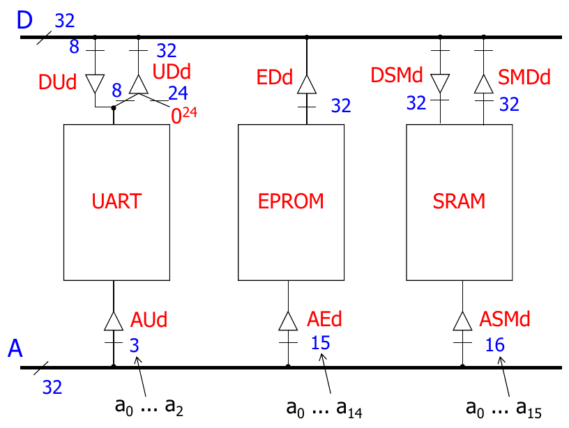

# Tutorat 3 <!--fit-->
### IO-Devices <!--fit-->

<!--_class: lead-->
<!--big-->


---

# Einstieg

<!--_class: lead-->
<!--big-->


---

## Einstieg
### Fakeupdate
- https://fakeupdate.net/

<!--small-->


---

# Korrektur

<!--_class: lead-->
<!--big-->


---

## Korrektur
### Interessantes und häufige Fehler
- ein paar Fehler bei der **RETI Treiberaufgabe**
- viele kleinere Fehler bei der **push und pop** Aufgabe
- **Aufgabe 3** haben sich viele gespart
- **Usermodus** und **Kernelmodus** hatten einige Fragen
- **Terminal** Bedienung
- die Sache mit `<SP>` und `[SP]`
- **Packagemanager**, unter Linux Sachen installieren
- **kein Feedback:** https://forms.gle/2tGvF4ao5hAVNeRs5

<!--small-->


---

## Korrektur
### Korrektursystem

- **Punkte** sind nur zum Vergleich untereinander
- **Ampelsystem:**
  - : Sehr gut, damit ist man für die Klausur auf der sicheren Seite
  - : Nur ein Hinweis darauf, dass da einige klausurrelevante Sachen vielleicht nochmal vielleicht über das Tutorat nachvollzogen werden sollten
  - : Nicht ausreichend. Leider zu wenig Arbeitsaufwand investiert

<!--small-->


---

# Vorbereitung

<!--_class: lead-->
<!--big-->


---

## Vorbereitung
### Bitweise Logiktricks
- **Bestimmte Bits auf `0` setzen u. alle anderen unverändert lassen (_Maskieren_):**
  - ___`10100111 00101101 10010100 00000100`
  `&` `00000000 00000000 00000000 11111111` (**_Maske_**)
  ___`00000000 00000000 00000000 00000100`
  - `0` ist **controlling value** zum mit **`0`en überschreiben**
  - **Herleitung über Decision Tree:**
  

<!--small-->


---

## Vorbereitung
### Bitweise Logiktricks
- **Bestimmte Bits auf `1` setzen u. alle anderen unverändert lassen (_Union_):**
  - ___`10100111 00101101 10010100 01100101`
  `|` `00000000 00000000 00000000 11111111`
  ___`10100111 00101101 10010100 11111111`
  - `1` ist **controlling value** zum mit **`1`en überschreiben**
- **Test auf bestimmten Bitwert:**
  - **non-controlling value** von `&` bzw. `|` nutzen, um ein bestimmtes Bit **unverändert beizubehalten** und dann aus diesem bzw. dessen Negation zu schlussfolgern, dass da eine `1` bzw. `0` steht
  - mit `JUMP<> i` testen, ob z.B. **Bit 3** von `REG` `1` bzw. `0` ist. Dazu `ACC = REG & 00000100` bzw. `ACC = ~(REG | 11111011)` und dann: `<PC> + [i]` *gdw.* `ACC` $\ne$ `00000000` *gdw.* **Bit 3** ist `1` bzw. `0`

<!--small-->


---

## Vorbereitung
### Bitweise Logiktricks
- **Bestimmte Bits negieren und alle anderen unverändert lassen (_Differenz_):**
    - ___`10100111 00101101 10110100 01100101`
    `⊕` `10111100 10101001 00000000 11111111`
    ___`00011011 10000100 10110100 10011010`
    - **Unterschiede** werden hervorgehoben
    - `1` ist **controlling value** zum **Negieren** von `0` zu `1` bzw. `1` zu `0`
    - `0` ist **non-controlling value** zum **unverändert Beibehalten**
- **Test auf Gleichheit:**
  - mit `JUMP= i` testen, ob zwei Register gleiche Bitworte haben. Dazu `ACC` $=$ `REG1` $\oplus$ `REG2` und dann: `<PC> + [i]` *gdw.* `ACC` $=$ `00000000` *gdw.* `REG1` $=$ `REG2`

<!--small-->


---

## Vorbereitung
### Bitweise Logiktricks
- **Bitshiften :**
  - Shiften um **3** Stellen nach **links**
    - `10110 x 1000 = 10110000`
  - Shiften um **3** Stellen nach **rechts**
    - `10110000 / 1000 = 10110`
  - Zahl finden, die **Logarithmus 2** den passenden Wert (hier: **3**) hat bzw. entsprechende Anzahl `0`en hat (hier: **3** `0`en)
    - `log2(8) = 3`, also hat **3** `0`en **➞** passt

<!--small-->


---

## Vorbereitung
### Bitweise Logiktricks
- **Signextension:**

<!--small-->


---

## Vorbereitung
### Merkhilfe RETI Befehlssatz
- **to** `X` = **from** `X`
- **Compute:** *calc* `D` `OP` `S` *to* `D`,  *calc* `D` `OP` `M(<i>)` *to* `D`, *calc* `D` `OP` `[i]` *to* `D`
- **Load:**
  - `LOAD` *to* `D` *from* `M(<S>)` und `LOADI` *to* `D` *directly from* `i`
  - `LOADIN` *from* `M(<S>+[i])` *to* `D`
- **Store:**
  - `Store` *from* `D` *to* `M(<S>)` und `move` *from* `D` *directly to* `S`
    - es gibt kein `STOREI`, da die erweiterte RETI und vor allem der **SRAM** nicht dazu konzepiert sind, dass **zwei Argumente** beide auf den Speicher zugreifen
  - `STOREIN` *to* `M(<S>+[i])` *from* `D`

<!--small-->


---

## Vorbereitung
### Merkhilfe RETI Befehlssatz
- **Jump:** `JUMPc i` *gdw.* `ACC` `c` `0`
  - mache `JUMPc i` *gdw.* `3` `<` `4` *gdw.* `3 - 4` `<` `0`
- **Kodierung der Condition:**


<!--small-->


---

# Übungsblatt

<!--_class: lead-->
<!--big-->


---

## Übungsblatt
### Aufgabe 1
- **auf verschiedene Register der UART zugreifen:** `__000000 00000000 00000XXX`
  - **R0:** `XXXXXXXX`, Senderegister (**Senden** an Peripheriegerät)
  - **R1:** `XXXXXXXX`, Empfangsregister (**Empfangen** vom Peripheriegerät)
  - **R2:** `X,X,X,X,X,X,b1,b0`, Statusregister (**Big Endian**)
    - `R2[0] = b0`: `senderegister_befuehlbar`
    - `R2[1] = b1`: `empfangsregister_befuehlt`
  - **R3-7:** `XXXXXXXX`
- **Vorgefertige Adressen im EPROM:** `r/s/t = 00XXXXXX XXXXXXXX XXXXXXXX XXXXXXXX`
  - **UART Konstante:** `EPROM[r] = 01000000 00000000 00000000 00000000`
  - **SRAM Konstante:** `EPROM[s] = 10000000 00000000 00000000 00000000`
  - **`LOADI PC 0` als Konstante:** `EPROM[t] = 01110000 00000000 00000000 00000000`

<!--small-->


---

## Übungsblatt
### Aufgabe 1

- **Adressbus bekommt:** `DSDSDSDS DSIIIIII IIIIIIII IIIIIIII`
- **Kontrollogik bekommt:** `IIIIIIII II______ ________ ________`
- **Rechter Datenbus bekommt:** `SSSSSSSS SSIIIIII IIIIIIII IIIIIIII`
  - *Signextension* `S`, *Instruktionsregister* `I`, *Datensegmentregister* `DS`


<!--small-->


---

## Übungsblatt
### Aufgabe 1

- **zu UART wechseln:**
  ```
  LOADI DS __010000 00000000 00000000
  MULTI DS __000000 00000100 00000000
  ```
- **zu SRAM wechseln:**
  ```
  LOADI DS __100000 00000000 00000000
  MULTI DS __000000 00000100 00000000
  ```
- **zu EPROM wechseln:**
  ```
  LOADI DS __000000 00000000 00000000
  MULTI DS __000000 00000100 00000000
  ```
- **Signextension** bei SRAM, aber wird sowieso weggeshiftet

<!--small-->


---

## Übungsblatt
### Aufgabe 1

- **Versenden:**
  ```c
  if (senderegister_befuehlbar == 1) {  // R2[0] == 1
    write_data(R0);
    R2[0] = 0;
  }
  // else: warten, denn die UART versendet gerade noch Inhalt von R0 ans
  // Peripheriegerät
  ```
- **Empfangen:**
  ```c
  if (empfangsregister_befuehlt == 1) {  // R2[1] == 1
    read_data(R1);
    R2[1] = 0;
  }
  // else: warten, denn die UART ist noch beim Fühlen des Registers, die UART
  // wird sobald sie fertig ist R2[1] = 0; auf 1 setzen
  ```

<!--small-->


---

## Übungsblatt
### Aufgabe 1a)

- **C-Code:**
  ```c
  polling_loop(int new_instruction) {
    uart_selektieren()
    while (empfangsregister_befuehlt == 0) {  // R2[1] == 0
      // warten, denn die UART ist noch beim Fühlen des Registers, die UART
      // wird sobald sie fertig ist R2[1] = 0; auf 1 setzen
    }
    new_instruction[7:0] = R1;  // IN1[7:0] = R1
    R2[1] = 0;
  }
  ```
- `while (1) {if (empfangsregister_befuehlt == 1) { }}`
  **➞** `while (!(empfangsregister_befuehlt == 1)) { }`
  **➞** `while (empfangsregister_befuehlt == 0) { }`

<!--small-->


---

## Übungsblatt
### Aufgabe 1b)
- **C-Code:**
  ```c
  void instruction_loop(int new_instruction) {  // IN1 = 0
    int counter = 4;  // IN2 = 4
    while (counter > 0) {
      new_instruction << 8;  // IN1 << 8
      polling_loop(&new_instruction) // Code aus Teil a)
      counter--;  // IN2 - 1
    }
  }
  ```

<!--small-->


---

## Übungsblatt
### Aufgabe 1c)
- **Adresse `a`, um im SRAM nächste Instruction abzulegen:**
  `a = __000000 XXXXXXXX XXXXXXXX` (SRAM hat nur **16 Bit** zur Adressierung)
- `final_command` ist die Instruction `01110000 00000000 00000000 00000000` mit der die Übertragung endet
- **C-Pseudo-Code:**
  ```c
  void load_code(int free_address, int final_command) {  // Adresse a
    while (new_instruction != final_command) {
      instruction_loop(&new_instruction)  // Code aus Teil b)
      SRAM[free_address] = new_instruction;  // M(<a>) := IN1
      free_address++;  // a + 1
    }
  }
  ```
- es sind nicht mehr genug **freie Register** da, daher muss die Variable `free_address` mit der Adresse `a` auf dem **Stack** gespeichert werden

<!--small-->


---

# Ergänzungen

<!--_class: lead-->
<!--big-->


---

## Ergänzungen
### Packages installieren mit `apt`
##### updating
- `sudo apt update`: update package lists
- `sudo apt update -y && sudo apt full-upgrade`:
##### ](_resources/_2021-11-11-00-32-09.png)
- `sudo apt update -y && sudo apt full-upgrade qutebrowser`: update a program
>- `full-upgrade` is the recommended way over `upgrade`

<!--small-->


---

## Ergänzungen
### Packages installieren mit `apt`
##### installing
- `sudo apt update -y && sudo apt install gcc -y`: install package from repo
- `sudo apt update -y && sudo apt install ./foo_1.0_all.deb -y`: install local package

##### removing
- `sudo apt update -y && sudo apt purge gcc -y`: uninstalls package, es werden alle Konfigurationsdateien gelöscht
- `sudo apt update -y && sudo apt autoremove -y` uninstalls all packages, that are not needed anymore and have no dependencies to other packages
>- `purge` is the recommended way over `remove`

<!--small-->


---

## Ergänzungen
### Packages installieren mit `apt`


##### searching
- autocomplete application name, e.g. `sudo apt install openjdk`, double tab
- `apt list gcc`: lists als packages with which fit the search term
- `apt list gcc --installed`: only list packages that are installed
- `apt show gcc`:  shows desciption of package matching the search term
- `apt search gcc`: lists alls packages which the search term in their discription or name
>- glob-pattern or regex as search pattern

<!--small-->


---

## Ergänzungen
### Packages installieren mit `apt`

##### other
- `sudo apt download emacs`: download `.deb`-package
- `sudo apt install alacritty -y`: no `y` each time
- `sudo do-release-upgrade`: upgrade **Distro** to a newer release
>- instead of confirming with y, once can also just spam enter
>- access packages over `/var/cache/apt/archives`

<!--small-->


---

## Ergänzungen
### Packages installieren mit `apt`

##### comparisson to apt-get


<!--small-->


---

## Ergänzungen
### Packages installieren mit `pacman`
##### Synchronising with the repositories
- `sudo pacman -Sy`: As new packages are added to the repositories you will need to regularly synchronise the package lists. This will only download the package lists if there has been a change (sudo apt update)
- `sudo pacman -Syy`: Occasionally you may want to force the package lists to be downloaded

##### Updating software
- `sudo pacman -Su`: perform an update of software already installed (sudo apt upgrade)
- `sudo pacman -Syu`: check whether the package lists are up-to-date at the same time

<!--small-->


---

## Ergänzungen
### Packages installieren mit `pacman`
##### Searching for software
- `pacman -Ss ^hunspell`: searching a package by name in repos. Supports Regex
- `pacman -Qs hunspell`: searching package locally
- `pacman -Q`: list all packages installed on computer
- `pacman -Qeq`: self installed programs (e), only the program names, not the version number (q)
- `pacman -Qen`: packages self installed from main repos (n)
- `pacman -Qem`: packages self installed from aur (m)
- `pacman -Qdt`: orphans, unneeded dependencies

##### Find out where package installed
- `pacman -Ql handbrake`: look up where application gets installed

<!--small-->


---

## Ergänzungen
### Packages installieren mit `pacman`
##### Installing software
- `sudo pacman -S gimagereader-gtk`: install package from repo
- `sudo pacman -U /var/cache/pacman/pkg/rofi-1.6.1-1-x86_64.pkg.tar.zst`: install local package

##### Removing software
- `sudo pacman -Rns dmenu`: remove a package (R), dependencies (s) and configuration files (n)
- `sudo pacman -Rns $(pacman -Qtdq)`: if at a later date you want to remove all orphan packages and configuration files for packages that you removed some time ago
- `sudo pacman -Sc`: remove unused packages and repos from cache

<!--small-->


---

## Ergänzungen
### Packages installieren mit `pacman`
##### Misc
- If a package in the list is already installed on the system, it will be reinstalled even if it is already up to date. This behavior can be overridden with the `--needed` option.

##### Prinzip
- capital letter at beginning
- `S`: sync with repository in some way
- `Q`: search locally
- `R`: remove

<!--small-->


---

## Ergänzungen
### Packages installieren mit `pacman`
##### Edit configuration files
- `sudo nvim /etc/pacman.conf`

- `sudo nvim /etc/pacman.d/mirrorlist`

##### Anmerkungen
- **PAC**kage **MAN**ager
- always make `sudo pacman -Syu` before installing new software

<!--small-->


---

## Ergänzungen
### Packages installieren mit `pacman`
##### Yay
- commands are the same as in `pacman`
- adds search in the **AUR (Arch User Repository)**: https://aur.archlinux.org/ (**Duckduckgo:** `!au`)
- `yay polybar` erlaubt auswahl an packages, die z.B. Discord im Namen haben

<!--small-->


---

# Quellen

<!--_class: lead-->
<!--big-->


---

## Quellen
### Wissenquellen

- https://en.wikipedia.org/wiki/Register%E2%80%93memory_architecture

<!--small-->


---

# Vielen Dank für eure Aufmerksamkeit!
# :penguin:

<!--_class: lead-->
<!--big-->

