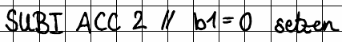

# Tutorat 4 <!--fit-->
### Zustandsdiagramme, DMA <!--fit-->

<!--_class: lead-->
<!--big-->

---

# Einstieg

<!--_class: lead-->
<!--big-->

<!-- _backgroundColor: #7b738f; -->

---

## Einstieg
### asdf
- `asdf`

<!--small-->

---

# Korrektur

<!--_class: lead-->
<!--big-->

<!-- _backgroundColor: #7b738f; -->

---

## Korrektur
### Interessantes und häufige Fehler
- -0.25 Ihr überschreibt so aber die Daten, dir ihr in der b) nach links shiftet. OR IN1 1 kann dafür genutzer werden, wegen seinem Non-Controlling Bit 0
   00000000 00000000 00000000 10110101
OR 00000000 00000000 10101110 00000000
   00000000 00000000 10101110 10110101

- LOADI DS 0 für EPROM weil dann alles da mit 0en ist bei den ersten 10 Bits
- ](_resources/_2021-11-16-01-12-01.png)
- etwas ganuer sollte es noch sein.
Aber korrekt, wenn man es weiter ausführt, mit dem MULTI Befehl
kann man quasi nen Bitshift durchführen
und die Bits an die passende Stelle shiften, z.B. für das IN1 und IN2 Register. So muss man das Register DS garnicht anrühren.
- (0b00000100 // 0b00000010 = 1)
- Der Trick liegt darin die passenden 32Bit Konstanten in Registern IN1 und IN2 zu speichern mittels Bitshiftung durch MULTI oder laden der passenden Konstante in die Register aus dem EPROM und dann über LOADIN IN1 ACC 1 oder z.B. STOREIN IN2 ACC 1 Adressen im UART oder SRAM anzusteuern.
Da ganze umgeht quasi das Datensegmentregister, indem es die über die 32Bit Register direkt die Memory Map über die Bits 31 und 30 über den Adressbus ansteuert.

Der Trick liegt darin die passenden 32Bit Konstanten in Registern IN1 und IN2 zu speichern mittels Bitshiftung durch MULTI oder laden der passenden Konstante in die Register aus dem EPROM und dann über LOADIN IN1 ACC 1 oder z.B. STOREIN IN2 ACC 1 Adressen im UART oder SRAM anzusteuern.
Da ganze umgeht quasi das Datensegmentregister, indem es die über die 32Bit Register direkt die Memory Map über die Bits 31 und 30 über den Adressbus ansteuert. (0b00000100 // 0b00000010 = 1)
- der EPROM ist READONLY -> hat keinen Stack
- andere Flags des Statusregister

<!--small-->

---

# Quellen

<!--_class: lead-->
<!--big-->

<!-- _backgroundColor: #7b738f; -->

---

## Quellen
### Wissenquellen

<!--small-->

---

# Vielen Dank für eure Aufmerksamkeit!
# :penguin:

<!--_class: lead-->
<!--big-->

<!-- _backgroundColor: #7b738f; -->
