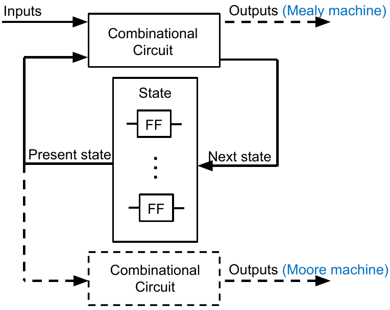
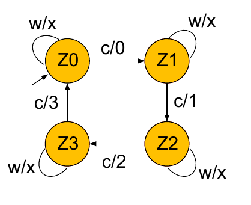
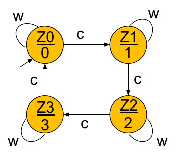
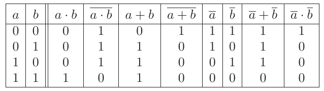
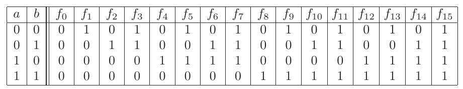
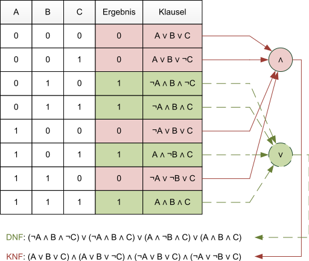
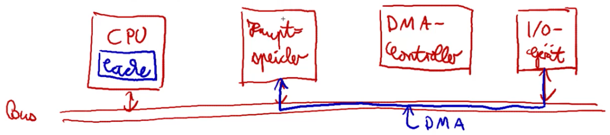
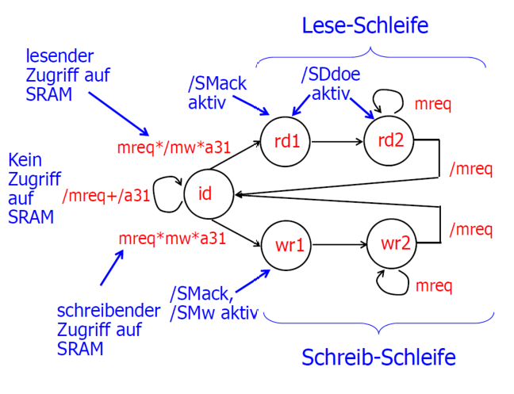
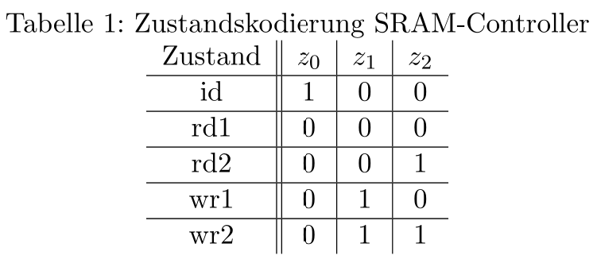

# Tutorat 4 <!--fit-->
### Zustandsdiagramme, DMA <!--fit-->

<!--_class: lead-->
<!--big-->


---

# Vorbereitung

<!--_class: lead-->
<!--big-->

<!-- _backgroundColor: #7b738f; -->

---

## Vorbereitung
### Mealy und Moore

####   
#### **Source:** https://earth.informatik.uni-freiburg.de/uploads/es-2122/03_finitestate.html

<!--small-->


---

## Vorbereitung
### Mealy und Moore

- **Primäre Eingänge:** Bekommen Werte *„von außen“*.
- **Primäre Ausgänge:** Liefern Werte *„nach außen“*.
- **Sekundäre Eingänge:** Sind mit den Datenausgängen der Flipflops im Register verbunden. Auf diese Weise kann der aktuelle Zustand des Schaltkreises in den *Übergangs- und Ausgabefunktionen* berücksichtigt werden.
- **Sekundäre Ausgänge:** Sind mit den Dateneingängen der Flipflops verbunden. Durch sie wird der *nächste Zustand* des Schaltkreises spezifiziert.

<!--small-->


---

## Vorbereitung
### Mealy und Moore

##### Beispiel Erweiterte RETI (Aufgabe 1 Übungsblatt)
- **Eingabevektor:** $i = (/mreg, /mw, a31)$ (*= Primäre Eingänge*)
- **Ausgabevektor:** $o = (/SMack, /SDdoe, /SMw)$ (*= Primäre Ausgänge*)
- **Zustandsvektor:** $z = (z_0, z_1, z_2)$
- **Übergangsfunktion:** $\delta: Z \times I \rightarrow Z$
- **Ausgabefunktion (Mealy):** $\lambda: Z \times I \rightarrow O$
  - auf den Kanten stehen *Inputsymbole* und *Outputsymbole*, dafür stehen in den Zuständen nur die Zustandsbezeichnungen
- **Ausgabefunktion (Moore):** $\lambda: Z \rightarrow O$
  - auf den Kanten stehen *Inputsymbole*, dafür stehen in den Zuständen *Zustandsbezeichnungen* und *Outputsymbole*

<!--small-->


---

## Vorbereitung
### Anzahl Formeln
- **Anzahl Modelle / Zeilen in Wahrheitstabelle:** $2^{\text{\# Variablen}}$
- **Anzahl Aussagenlogische Formeln:** $2^{\text{\#Zeilen}} = 2^{2^{\text{\#Variablen}}}$
  - bei 3 **Aussagenlogischen Variablen** gibt es $2^3=8$ Zeilen in der Wahrheitstabelle und damit $2^{(2^3)}=256$ verschiedenen Aussagenlogische Formeln, da man diese $2^3$ Zeilen auch nochmal auf **exponentiell** $2^{\text{\#Zeilen}}$ viele verschiedene Arten belegen kann



<!--small-->


---

## Vorbereitung
### Minterme und Maxterme
- **16 mögliche Logikfunktionen für 2 Aussagenlosche Variablen:**
  
- $f1$, $f2$, $f4$ und $f8$ sind **Minterme** (für genau eine *Variation* der Eingabewerte den Wert $1$)
- $f7$, $f11$, $f13$ und $f14$ sind **Maxterme** (für genau eine *Variation* der Eingabewerte den Wert $0$)

<!--small-->


---

## Vorbereitung
### Minterme und Maxterme
- die 4 **Minterme** können als **Konjunktionen** dargestellt werden:
  $m_{0}(a, b)=\bar{a} \cdot \bar{b}, m_{1}(a, b)=\bar{a} \cdot b, m_{2}(a, b)=a \cdot \bar{b}, m_{3}(a, b)=a \cdot b$
- die 4 **Maxterme** können als **Disjunktionen** dargestellt werden:
  $M_{0}(a, b)=\bar{a} + \bar{b}, M_{1}(a, b)=\bar{a} + b, M_{2}(a, b)=a + \bar{b}, M_{3}(a, b)=a + b$
- **Vergleich:**
  $
  \begin{array}{|c|c||c|c|}
  \hline a & b & ¬a \cdot b & a + ¬b\\
  \hline 0 & 0 & 0 & 1\\
  0 & 1 & 1 & 0 \\
  1 & 0 & 0 & 1 \\
  1 & 1 & 0 & 1 \\
  \hline
  \end{array}
  $
- $¬(¬a \wedge b) = a \vee ¬b$: "alles außer" $¬a \wedge b$ ist $1$ **➞** ($a=0, b=1$) ist als einziges $0$


<!--small-->


---

## Vorbereitung
### DNF und KNF

- aus drei **Basistypen** (Disjunktion, Konjunktion oder Negation) lassen sich alle anderen **Logikfunktion** erzeugen
- Jede Logikfunktion $f: B^{2} \rightarrow B$ lässt sich in **disjunktiver Normalform (DNF):**
$f(a, b)=f(0,0) \cdot \bar{a} \cdot \bar{b}+f(0,1) \cdot \bar{a} \cdot b+f(1,0) \cdot a \cdot \bar{b}+f(1,1) \cdot a \cdot b$
- Und auch in **konjunktiver Normalform (KNF):**
$f(a, b)=(f(0,0)+a+b) \cdot(f(0,1)+a+\bar{b}) \cdot(f(1,0)+\bar{a}+b) \cdot(f(1,1)+\bar{a}+\bar{b})$
- man möchte **Logische Funktion** (Wertetabelle) mit möglichst wenig Schaltelementen realisieren **➞** schauen, ob **DNF** oder **KNF** kürzer ist, je nachdem, ob die Logische Funktion (Menge an Formeln) mehr oder weniger **Modelle** besitzt, also mehr oder weniger Variationen aus Aussagenlogischen Variablen besitzt, die $1$ ergeben

<!--small-->


---

## Vorbereitung
### DNF und KNF

#### https://de.wikipedia.org/wiki/Disjunktive_Normalform#/media/Datei:Knf+dnf.svg

<!--small-->


---

## Vorbereitung
### DNF und KNF
- **Beispiel:** "**höchstens** 2 wahre aussagenlogische Variablen"
  - **DNF:** $(¬a\cdot ¬b\cdot ¬c)+(¬a\cdot ¬b\cdot c)+(¬a\cdot b\cdot ¬c)+(¬a\cdot b\cdot c)+(a\cdot ¬b\cdot ¬c)+(a\cdot ¬b\cdot c)+(a\cdot b\cdot ¬c)$
  - **KNF:** $(¬a+¬b+¬c)$

<!--small-->


---

## Vorbereitung
### Klauseln, Literale, Klausel Normalform

- **Atom:** *Atomare Formel* (=Formel, die nur aus einer einzigen *Aussagenlogischen Variable* besteht)
- **Literal:** (möglicherweise *negierte*) *atomare Formel*
- **Klausel:** *Disjunktion* von *Literalen*
- **Klausel Normalform:** Formel in *konjunktiver Normalform (KNF)*, bei der die *Konjunktionen* jeweils in *Mengenschreibweise* zusammengefasst sind
  - $((a \vee b) \wedge(b \vee c) \wedge(a \vee \neg d \vee \neg e) \wedge d)$
 **➞** $\{\{a, b\},\{b, c\},\{a, \neg d, \neg e\},\{d\}\}$
  - $\{\neg(P \vee(\neg(P \wedge Q) \wedge \neg R))\}$ **➞** $\{\{\neg P\},\{\neg(\neg(P \wedge Q) \wedge \neg R)\}\}$ **➞** $\{\{\neg P\},\{\neg \neg(P \wedge Q), \neg \neg R\}\}$ **➞** $\{\{\neg P\},\{(P \wedge Q), R\}\}$ **➞** $\{\{\neg P\},\{P, R\},\{Q, R\}\}$

<!--small-->


---

## Vorbereitung
### Binärepräfixe

- Speicher wird in **Byte** = $8$ **Bit** angegeben
- **Dezimalpräfixe:** Kilobyte [kB], Megabyte [MB], Gigabyte [GB], Terabyte [TB], Petabyte [PB], Exabyte [EB]
- **Binärpräfixe:** Kibibyte [KiB], Mebibyte [MiB], Gibibyte [GiB], Tebibyte [TiB], Pebibyte [PiB], Exbibyte [EiB]
- **Einheit umrechnen:**
`1 000 000 000 kB` $\xLeftarrow{\cdot 1000}$ `1 000 000 MB` $\xLeftarrow{\cdot 10^3}$ `1 000 GB` $\xLeftarrow{\cdot 10^3}$ `1 TB`
$\Downarrow \cdot 10^3$
`1 000 000 000 000 B`
$\Downarrow \operatorname{:} 2^{10}$
`976 562 500 KiB` $\xRightarrow{\operatorname{:} 1024}$ `953 674,32 MiB` $\xRightarrow{\operatorname{:} 2^{10}}$ `931,32 GiB` $\xRightarrow{\operatorname{:} 2^{10}}$ `0,91 TiB`

<!--small-->


---

## Vorbereitung
### Binärepräfixe

- $1\cdot2^{10}B=1KiB$, $1\cdot2^{20}=1MiB$, $1\cdot2^{30}=1GiB$ etc.
- $1\cdot10^3B=1KB$, $1\cdot10^{6}B=1MB$, $1\cdot10^{9}B=1GB$ etc.
- **Windows** verwendet $GiB$, schreibt aber $GB$ hin, einige **Linux Distributionen** auch, der **Manjaro Installer** aber z.B. $GiB$
- wird von **Festplattenherstellern** genutzt, um $100GB$ draufzuschreiben, was viele fälschlicherweise als $GiB$ interpretieren, aber nur $(100 \cdot 1000 \cdot 1000 \cdot 1000) / 1024 / 1024 / 1024 \approx 93.13GiB$ tatsächlich zu liefern
- **Unterschied** wird immer größer, z.B. zwischen GB und GiB sind es $7,4\%$
- bei **SD-Karten** wird in GiB angegeben (512GiB)
- **Arbeitsspeicher** wird in GiB angegebn (8 GiB Arbeitsspeicher)

<!--small-->


---

## Vorbereitung
### DMA (Direct Memory Access)


- direkt ohne **Umweg** über **CPU**
- Funktioniert nur, wenn CPU Daten im **Cache** findet. Wenn sie an den **Hauptspeicher** gehen muss, dann gibts **Buskonflikt**
- Bevor eine **Adresse** über **Adressbus** an **Hauptspeicher** geht, geht Adresse zunächst an den **Cache**. Cache meldet zurück, es gibt nen **Cache Hit** **🠒** man kann direkt liefern

<!--small-->


---

# Übungsblatt

<!--_class: lead-->
<!--big-->

<!-- _backgroundColor: #7b738f; -->

---

## Übungsblatt
### Aufgabe 1

##### Vorgehen für Übergangsfunktion
- für $z_x$ schaue, wo $z_x$ in der Spalte $1$ ist und notiere diese *Zustände* des Zustandsdiagrams
- gehe zu diesen *notierten Zuständen* $z_x$ und notiere die *Conditions* und die *adjazenten Vorgängerzustände* $z_x'$, die auf den *eingehenden Kanten* stehen bzw. über sie erreichbar sind
- bilde *Disjunktive Normalform* für *nächsten Zustand* $z_x'$ aus *Conditions* und *der Kodierung der adjazenten Vorgängerzustände* $(z_0, \~z_1, \~z_2)$
- (*Minimieren*)

<!--small-->


---

## Übungsblatt
### Aufgabe 1

##### Vorgehen für Moore Ausgabefunktion
- schaue welche *Zustände* $z_x$ das *Outputsignal* $/S_i$ haben und notiere diese *Zustände* des Zustandsdiagrams
- bilde *Disjunktive Normalform* für Outputsignal $/S_i$ aus der *Kodierung der notierten Zustände* $(\~z_0, z_1, z_2)$

<!--small-->


---

## Übungsblatt
### Aufgabe 1

 
- $mreq$ bedeutet, dass das Eingangssignal $/mreq = 0$ entspricht

<!--small-->


---

## Übungsblatt
### Aufgabe 1

- $z_{0}^{\prime}=\left(z_{0} \wedge \neg z_{1} \wedge \neg z_{2} \wedge / m r e q\right) \vee\left(z_{0} \wedge \neg z_{1} \wedge \neg z_{2} \wedge / a 31\right) \vee\left(\neg z_{0} \wedge \neg z_{1} \wedge z_{2} \wedge / m r e q\right) \vee\left(\neg z_{0} \wedge z_{1} \wedge z_{2} \wedge / m r e q\right)$
- $z_{1}^{\prime}=\left(z_{0} \wedge \neg z_{1} \wedge \neg z_{2} \wedge m r e q \wedge m w \wedge a 31\right) \vee\left(\neg z_{0} \wedge z_{1} \wedge \neg z_{2}\right) \vee\left(\neg z_{0} \wedge z_{1} \wedge z_{2} \wedge m r e q\right)$
- $z_{2}^{\prime}=\left(\neg z_{0} \wedge \neg z_{1} \wedge \neg z_{2}\right) \vee\left(\neg z_{0} \wedge z_{1} \wedge \neg z_{2}\right) \vee\left(\neg z_{0} \wedge \neg z_{1} \wedge z_{2} \wedge m r e q\right) \vee\left(\neg z_{0} \wedge z_{1} \wedge z_{2} \wedge m r e q\right)$
- $/ S M a c k=\neg\left(\left(\neg z_{0} \wedge \neg z_{1} \wedge \neg z_{2}\right) \vee\left(\neg z_{0} \wedge z_{1} \wedge \neg z_{2}\right)\right)$
- $/ S D d o e=\neg\left(\left(\neg z_{0} \wedge \neg z_{1} \wedge \neg z_{2}\right) \vee\left(\neg z_{0} \wedge \neg z_{1} \wedge z_{2}\right)\right)$
- $/ S M w=\neg\left(\neg z_{0} \wedge z_{1} \wedge \neg z_{2}\right)$
- Weil die **Ausgangssignale** alle **active-low** sind, müssen deren **DNF** die zu $1$ führen komplett **negiert** werden

<!--small-->


---

## Übungsblatt
### Aufgabe 2a) - Umsetzung mit Interrupt
- Taktrate des Prozessors = $8\cdot 10^{8}\dfrac{1}{s}$
- Datenübertragungsrate der Festplatte = $8\cdot 2^{20}\dfrac{B}{s}$
```
|8*32Bit=32Byte|1000Takte____|___________|eine Übertragung
|1*2^(-18)s____|1,25*10^(-6)s|___________|einzelne Zeitdauern
|20*2^(-18)s_____________________________|Gesamtdauer
```

<!--small-->


---

## Übungsblatt
### Aufgabe 2a) - Umsetzung mit Interrupt

##### Zeit der Festplatte (Dauer der 32Byte Übertragung)

$1s\overset{\wedge}{=}8 \cdot2^{20}B$
$\Downarrow \cdot2^{-18}$
$1\cdot 2^{-18}s\overset{\wedge}{=}8 \cdot2^{2}B = 32B$

##### Gesamtdauer

$1\cdot 2^{-18}s\overset{\wedge}{=}5\%$
$\Downarrow \cdot 20$
$20\cdot 2^{-18}s\overset{\wedge}{=} 100\%$

<!--small-->


---

## Übungsblatt
### Aufgabe 2a) - Umsetzung mit Interrupt

##### Zeit des Prozessors (Dauer der 1000 Takte)

$1s\overset{\wedge}{=}8\cdot 10^{8} Takte$
$\Downarrow \cdot 1,25\cdot 10^{-6}$
$1,25\cdot 10^{-6}s\overset{\wedge}{=}1000 Takte$

##### Anteil der CPU-Zeit

$\dfrac{1,25\cdot 10^{-6}s}{20\cdot 2^{-18}s}=0.01638\approx1,64\%$

##### Musterlösung
$\displaystyle0.05 \cdot \frac{2^{18} \cdot \frac{1}{800000} \mathrm{~s}}{1 \mathrm{~s}}=\frac{2^{18}}{16000000}=0.016384$

<!--small-->


---

## Übungsblatt
### Aufgabe 2b) - Umsetzung mit DMA
- Taktrate des Prozessors = $8\cdot 10^{8}\dfrac{1}{s}$
- Datenübertragungsrate der Festplatte = $8\cdot 2^{20}\dfrac{B}{s}$
```
|1500Takte|16KB|500Takte______|_________|eine Übertratung
|1500+500Takte_____|16KiB_____|_________|eine Übertratung zusammengefasst
|0.25*10^(-5)s_____|1*2^(-9)s_|_________|einzelne Zeitdauern
|20*2^(-9)s_____________________________|Gesamtdauer
```

<!--small-->


---

## Übungsblatt
### Aufgabe 2b) - Umsetzung mit DMA

##### Zeit der Festplatte (Dauer des 16KiB Block)

$1s\overset{\wedge}{=}8\cdot 2^{20}B$
$\Downarrow \cdot 2^{-9}$
$1\cdot 2^{-9}s\overset{\wedge}{=}8\cdot 2^{11}B = 16KiB$

##### Gesamtdauer

$1\cdot 2^{-9}s\overset{\wedge}{=}5\%$
$\Downarrow \cdot 20$
$20\cdot 2^{-9}s\overset{\wedge}{=}100\%$

<!--small-->


---

## Übungsblatt
### Aufgabe 2b) - Umsetzung mit DMA

##### Zeit des Prozessors (Dauer der 2000 Takte)

$1s\overset{\wedge}{=}8\cdot 10^{8}Takte$
$\Downarrow \cdot 0,25\cdot 10^{-5}$
$0,25\cdot 10^{-5}s\overset{\wedge}{=}2\cdot 10^{3}Takte$

##### Anteil der CPU-Zeit

$\dfrac{0,25\cdot 10^{-5}s}{20\cdot 2^{-9}s}=0.000064=0.0064\%$

##### Musterlösung
$\displaystyle0.05 \cdot \frac{2^{9} \cdot \frac{1}{400000} \mathrm{~s}}{1 \mathrm{~s}}=\frac{2^{9}}{8000000}=0.000064$

<!--small-->


---

## Übungsblatt
### Aufgabe 3
- Interrupts mit **verschiedenen Prioritäten**
- Verwendung **Interrupt Controller**
- Signal $Int$ **🠒** Interrupt Controller **signalisiert** dem Prozessor, dass **Interrupt anliegt**, der Prozessor **unterbrechen** darf
  - wenn **keine ISR** auf Prozessor **aktiv** ist
  - wenn an Interrupt-Controller anliegender Interrupt **höhere Priorität** hat als aktuell auf Prozessor laufende ISR
- Signal $/INTA$ **🠒** nach **Abarbeiten von Interrupt** signalisiert Prozessor dem Interrupt Controller, dass ISR **beendet** wurde
- max. 255 **Hardware Interrupts** mit Prioritäten $0$ bis $254$
- Solange Interrupt $INT_j$ **nicht verarbeitet** darf I/O-Gerät $j$ **keinen** weiteren Interrupt auslösen

<!--small-->


---

## Übungsblatt
### Aufgabe 3a)
> Methode überlegen, wie **Interrupt Controller** feststellen kann, ob auf dem Prozessor aktuell gerade **keine ISR** läuft
- **8-Bit-Zähler**
  - Signale **up** und **down**, (up=1, down=0) **🠒** Zähler zählt bei steigender Flanke **hoch**, (up=0, down=1) **🠒** Zähler zählt bei steigender Flanke **runter**

##### Lösungsweg
- mit $/reset$ Signal **Zähler** mit $0$ initiliasieren
- $INT$ **➞** Zähler **inkrementieren**
- $/INTA$ (Interrupt Acknowledge) **➞**  Zähler **dekrementieren**
- wenn $\text{Zähler} = 0$ **➞** **Controller** weiß, dass **keine** ISR auf der CPU läuft

<!--small-->


---

## Übungsblatt
### Aufgabe 3b)
> Ausreichend, um **Interrupt Controller** zu implementieren? Lösung entwerfen, wo Interrupt Controller **Signal** $INT$ **immer korrekt** setzt.

- Interrupt Controller hat Internen Speicherbereich mit $256$ **Speicherzellen**
  - über 8-Bit **Adressen** angesprochen, **Speicherzellen** mit **8-Bit Wortbreite**
- **8-Bit Zähler** aus a) weiterverwendbar
- **Interrupt-Controller** speichert **Nummer** des anliegenden **Interrupts** mit der **höchsten Priorität** in Register `IVN` und **Priorität** in einem Register `PR` (also **Priorität** des Interrupts, der der CPU übergeben wird)

<!--small-->


---

## Übungsblatt
### Aufgabe 3b)
##### Lösungsweg
- **Szenario:**
  - mehr als ein **Interrupt** ($\text{Zähler} > 1$) gleichzeitig in **ISR** **angefangen** ($INT_i$ von $INT_j$ mit **höherer Priorität** unterbrochen)
  - vor Eintreffen von $INT_k$ min. eine **ISR** ($INT_j$) **beendet** (und $INT_i$ fortgesetzt **🠒** sobald $INT_k$ eintrifft, weiß Controller **nicht**, ob aktuell ausgeführte ISR **höhere Priorität** hat)
- **Idee:** Speicher als Stack für Historie über die übergebenen Interrupts
  - oben auf dem Stack liegt immer die **Priorität** des aktuell in der CPU abgearbeiteten Interrupts, welche immer die **höchste Priorität** aller **schon gestarteten** aber noch **nicht beendeten** ISR hat

<!--small-->


---

## Übungsblatt
### Aufgabe 3b)
##### Lösungsweg
- bei **Senden** von $INT$ **🠒** Inhalt von Register `PR` auf Stack des Controllers
   - **Stack** des **Controllers** ist nicht der **Stack** der **CPU**!
- bei **Empfangen** von $/INTA$ **🠒** oberster Eintrag vom Stack **entfernt**
- durch **Vergleich** von **PR** mit **obersten Eintrag des Stacks** wird bestimmt, ob ankommender $INT_l$ an CPU weitergeleitet wird
  - **Zähler** aus a) für die **Adressierung des Stacks** genutzt, da **kein** eigenes Stackpointer Register gegeben

<!--small-->


---

# Quellen

<!--_class: lead-->
<!--big-->

<!-- _backgroundColor: #7b738f; -->

---

## Quellen
### Wissenquellen

- https://de.wikipedia.org/wiki/Klausel-Normalform

<!--small-->


---

## Quellen
### Bildquellen

- Von WikiBasti 21:12, 21. Jan. 2011 (CET) und JensKohl - Datei:KNF+DNF.png, CC-by-sa 2.0/de, https://de.wikipedia.org/w/index.php?curid=5947670

<!--small-->


---

# Vielen Dank für eure Aufmerksamkeit!
# :penguin:

<!--_class: lead-->
<!--big-->

<!-- _backgroundColor: #7b738f; -->
