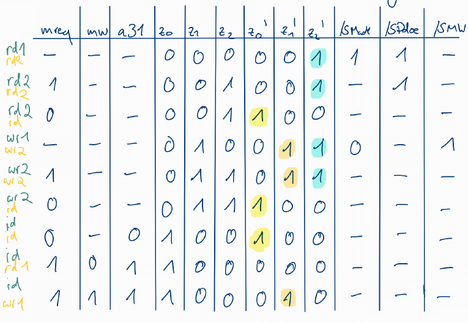

# Tutorat 4 <!--fit-->
### Zustandsdiagramme, DMA <!--fit-->

<!--_class: lead-->
<!--big-->


---

# Übungsblatt

<!--_class: lead-->
<!--big-->

<!-- _backgroundColor: #7b738f; -->

---

## Übungsblatt
### Aufgabe 1

<!--  -->

<!--small-->


---

## Übungsblatt
### Aufgabe 2a)
- Taktrate des Prozessors = $8\cdot 10^{8}\dfrac{1}{s}$
- Datenübertragungsrate der Festplatte = $8\cdot 10^{6}\dfrac{B}{s}$
```
|8*32Bit=32Byte|1000Takte____|__________|Aktionen
|4*10^(-6)s____|1,25*10^(-6)s|__________|einzelne Zeitdauern
|8*10^(-5)s_____________________________|Gesamtdauer
```

<!--small-->


---

## Übungsblatt
### Aufgabe 2a)

##### Zeit der Festplatte (Dauer der 32Byte Übertragung)

$1s\overset{\wedge}{=}800\cdot10^{6}B$
$\Downarrow \cdot 4\cdot10^{-6}$
$4\cdot10^{-6}s\overset{\wedge}{=}32B$

##### Gesamtdauer

$4\cdot 10^{-6}s\overset{\wedge}{=}5\%$
$\Downarrow \cdot 20$
$8\cdot 10^{-5}s\overset{\wedge}{=} 100\%$

<!--small-->


---

## Übungsblatt
### Aufgabe 2a)

##### Zeit des Prozessors (Dauer der 1000 Takte)

$1s\overset{\wedge}{=}8\cdot 10^{8} Takte$
$\Downarrow \cdot 1,25\cdot 10^{-6}$
$1,25\cdot 10^{-6}s\overset{\wedge}{=}1000 Takte$

##### Anteil der CPU-Zeit

$\dfrac{1,25\cdot 10^{-6}s}{8\cdot 10^{-5}s}=0.0156=1,56\%$

<!--small-->


---

## Übungsblatt
### Aufgabe 2b)
- Taktrate des Prozessors = $8\cdot 10^{8}\dfrac{1}{s}$
- Datenübertragungsrate der Festplatte = $8\cdot 10^{6}\dfrac{B}{s}$
```
|1500Takte|16KB|500Takte______|_________|Aktionen
|1500+500Takte_____|16KB______|_________|Aktionen zusammengefasst
|2,5*10^(-6)s______|2*10^(-3)s|_________|einzelne Zeitdauern
|4*10^(-2)s_____________________________|Gesamtdauer
```

<!--small-->


---

## Übungsblatt
### Aufgabe 2b)

##### Zeit der Festplatte (Dauer des 16KB Block)

$1s\overset{\wedge}{=}8\cdot 10^{6}B$
$\Downarrow \cdot 2\cdot 10^{-3}$
$2\cdot 10^{-3}s\overset{\wedge}{=}16\cdot 10^{3}B$

##### Gesamtdauer

$2\cdot 10^{-3}s\overset{\wedge}{=}5\%$
$\Downarrow \cdot 20$
$4\cdot 10^{-2}s\overset{\wedge}{=}100\%$

<!--small-->


---

## Übungsblatt
### Aufgabe 2b)

##### Zeit des Prozessors (Dauer der 2000 Takte

$1s\overset{\wedge}{=}8\cdot 10^{8}Takte$
$\Downarrow \cdot 2,5\cdot 10^{-6}$
$2,5\cdot 10^{-6}s\overset{\wedge}{=}2\cdot 10^{3}Takte$

##### Anteil der CPU-Zeit

$\dfrac{2,5\cdot 10^{-2}s}{0.04s}=6,25\cdot 10^{-5}=0.0000625=0.00625\%$

<!--small-->


---

## Übungsblatt
### Aufgabe 3

<!--small-->


---

# Quellen

<!--_class: lead-->
<!--big-->

<!-- _backgroundColor: #7b738f; -->

---

## Quellen
### Wissenquellen

<!--small-->


---

# Vielen Dank für eure Aufmerksamkeit!
# :penguin:

<!--_class: lead-->
<!--big-->

<!-- _backgroundColor: #7b738f; -->
