# Tutorat 5 <!--fit-->
### Zusatzautomat, Kontrolllogik, RETI übersetzen <!--fit-->

<!--_class: lead-->
<!--big-->


---

# Vorbereitung

<!--_class: lead-->
<!--big-->

<!-- _backgroundColor: #65a5ff; -->

---

## Vorbereitung
### "Xor-Terme"

##### 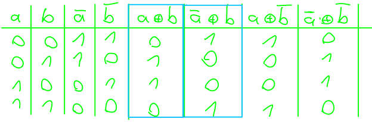

##### 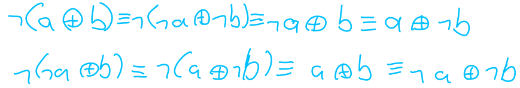

<!--small-->


---

## Vorbereitung
### "Xor-Terme"

- damit sind die meisten **Variationen** aus **2 Aussagenlogischen Variablen** durch **Minterme**, **Maxterme**, **"Xor-Terme"**, **Top** und **Bottom** darstellbar:

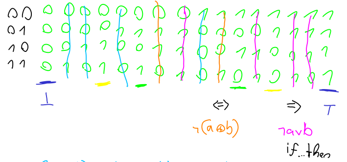

<!--small-->


---

## Vorbereitung
### "Xor-Ausdrücke" mit mehreren Aussgnl. Variablen

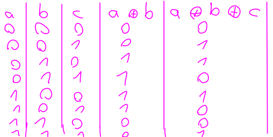
- ist **true** *gdw.* $\#$`1`en **ungerade** ist:
  - `1` ist **controllling value** und switcht `1` **🠒** `0` und `0` **🠒** `1`
  - `0` ist **non-controllling value** und belässt es so wie es ist
  - **Bsp. `01011`:** 0 $\overset{1}{\rightarrow}$ 1 $\overset{0}{\rightarrow}$ 0 $\overset{1}{\rightarrow}$ 1 $\overset{1}{\rightarrow}$ 0

<!--small-->


---

<!--  -->
<!-- ## Vorbereitung -->
<!-- ### Neues Konzept: Aufgaben direkt lösen -->
<!--  -->
<!-- 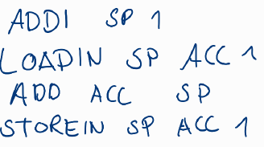 -->
<!--  -->
<!-- - Das was du auschreibst ist ist quasi so ne richtig lange Bedingung dafür, wann das Signal SPckenPre den Wert 1, also true annimst. -->
<!-- Und es soll genau dann true sein, also akitv sein in der bestimmten Phase von Execute (E ~s0 s1) im Normalbetrieb wenn die Befehle ...  kodiert an die -->
<!-- Kontrollogoik vom Instruktionsregister weitergegeben werden und ggf. im Zusatzautomat in den Zuständen ... -->
<!-- *1: es soll da der Wert stehen, der in der Symboltabelle als value eintragen ist für diesen -->
<!-- Identifier, also 5. Hast du korrekt gemacht n_n -->
<!-- *2: Ja die Compilerpattern sind nicht effizient, es werden alle Variablen auf dem Stack gespeichert. Echte Compiler versuchen allerdings mittels Graph Coloring möglichst viele Variablen Registern zuzuweisen, was nicht immer so einfach ist, weil man erst die liveness  (von wo bis wo eine Variable verwendet wird und ab wann ihr Wert nicht mehr gebrachtw wird) jeder einzelnen Variable herausfinden muss und schauen muss, wo sich Varaiblen überschneiden, also nicht dem gleichen Register zugewiesen werden können usw. -->
<!-- - Normalbetrieb sind Befehle ADDI, STOREIN LOAD INT usw., die der User über Bibliothekfunktionenen indirekt aufruft mit Fetch und Execute Phase usw. INT i könnte z.B. sein, dass an man eine Datei von der Festplatte lädt, aber nur der Befehl der es einleitet ist Normalbetrieb, nicht die darauffolgende ISR selber. Die ISR selber ist dann Nichtnormalbetrieb und läuft diesen Zustandsautomaten aus Aufg. 1 durch. Neben Software-Interrupt gibt es noch Hardware Interrupt, wenn man z.B. eine Tast auf dem Keyboard drückt. -->
<!--  -->
<!--  -->
<!--  -->
<!-- [>small<] -->
<!--  -->
<!--  -->
<!-- --- -->

# Übungsblatt

<!--_class: lead-->
<!--big-->

<!-- _backgroundColor: #65a5ff; -->

---

## Übungsblatt
### Aufgabe 1

##### 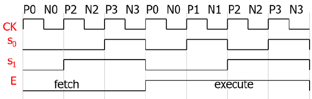
- CNTinc, CNTdec, CNTzero
##### 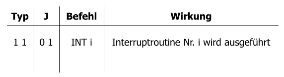 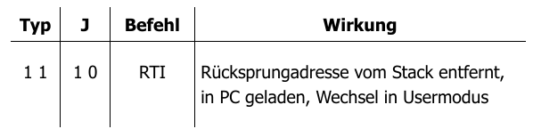

<!--small-->


---

## Übungsblatt
### Aufgabe 1

##### 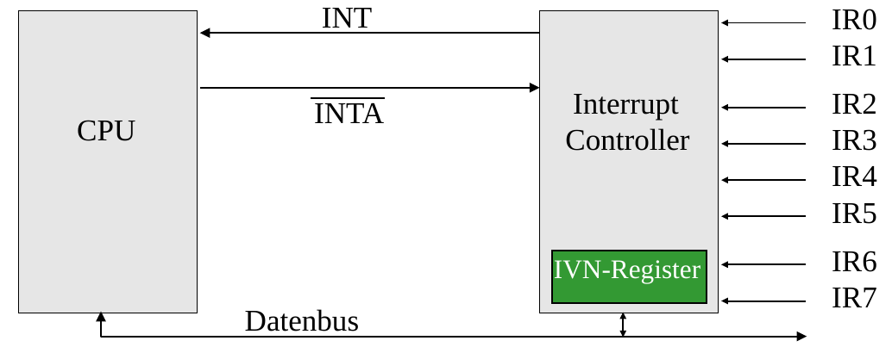

- **Normalbetrieb** sind Befehle `ADDI D i`, `STOREIN D S i`, `INT i` usw., die der User über **Bibliothekfunktionenen** indirekt aufruft mit **Fetch** und **Execute Phase** usw. **INT i** ist nur der Befehl der eine **ISR** einleitet und läuft selber im **Normalbetrieb**. Die **ISR** selber ist dann im **Nichtnormalbetrieb** und läuft den Zustandsautomaten durch. Neben **Software-Interrupt** gibt es noch **Hardware Interrupt**, wenn man z.B. eine Taste auf dem Keyboard drückt.

<!--small-->


---

## Übungsblatt
### Aufgabe 1

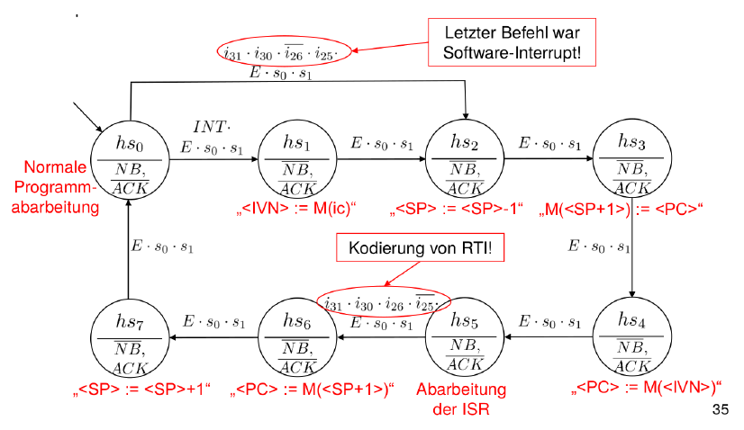

<!--small-->


---

## Übungsblatt
### Aufgabe 1

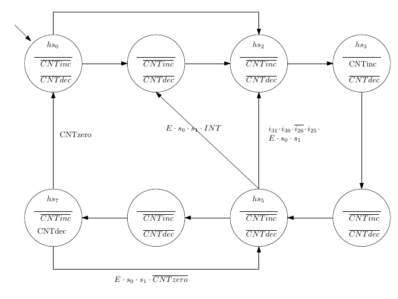

<!--small-->


---

## Übungsblatt
### Aufgabe 2

##### 
##### 

##### 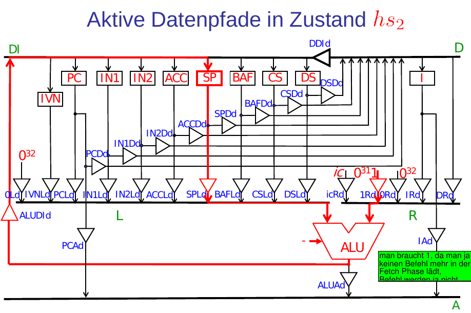 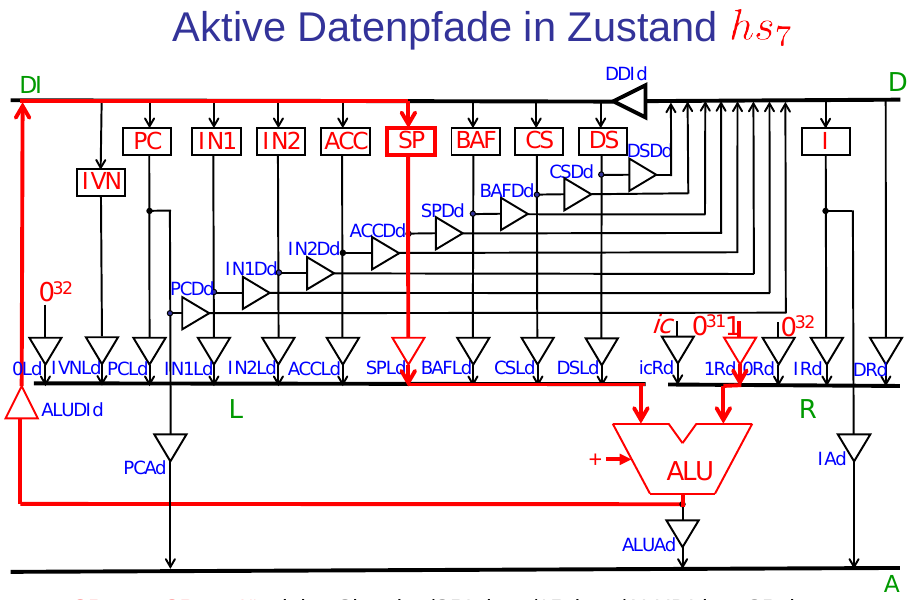 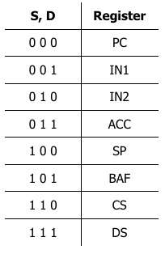

<!--small-->


---

## Übungsblatt
### Aufgabe 2
##### 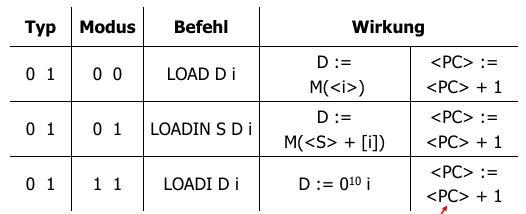 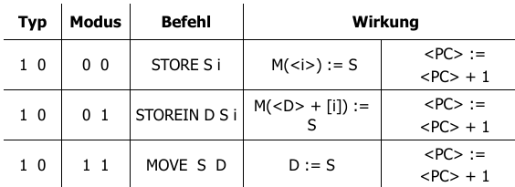
- ComputeImmedate: `0000`, Compute Memory: `0010`, Compute Register: `00*1`

<!--small-->


---

## Übungsblatt
### Aufgabe 2

$$
\begin{align*}
\text { SPcken }_{\text {pre }}=&\left[E \cdot \overline{s_{1}} \cdot s_{0}\right]
\left\{\left[\overline{I_{31}} \cdot I_{30} \cdot I_{24} \cdot \overline{I_{23}} \cdot \overline{I_{22}}+\right.\right. \\
&\overline{I_{31}} \cdot \overline{I_{30}} \cdot I_{24} \cdot \overline{I_{23}} \cdot \overline{I_{22}}+\\
&\left.I_{31} \cdot \overline{I_{30}} \cdot I_{29} \cdot I_{28} \cdot I_{24} \cdot \overline{I_{23}} \cdot \overline{I_{22}}\right] \cdot N B+\\
&{\left[\overline{h_{2}} \cdot h_{1} \cdot \overline{h_{0}}+\right.}
\left.\left.h_{2} \cdot h_{1} \cdot h_{0}\right]\right\}
\end{align*}
$$

- *true* **gdw.** bestimmte Phase von *Execute* (E ~s0 s1)**,** im *Normalbetrieb* (NB) **und** wenn die *Befehle* [...]  kodiert an die
Kontrollogoik vom Instruktionsregister weitergegeben werden **oder** im Zusatzautomat in den *Zuständen* [...]

<!--small-->


---

## Übungsblatt
### Aufgabe 2

##### 
##### 
##### 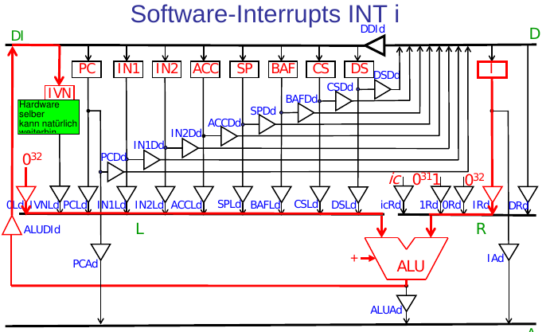 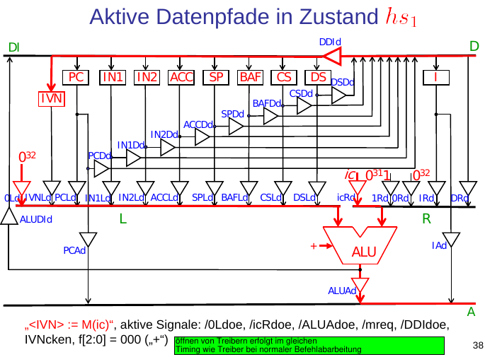

<!--small-->


---

## Übungsblatt
### Aufgabe 2

##### 

$$
I V N c k e n_{p r e}=\left[E \cdot \overline{s_{1}} \cdot s_{0}\right]
\left\{\left[\overline{h_{2}} \cdot \overline{h_{1}} \cdot h_{0}\right]+\right.
\left.N B \cdot I_{31} \cdot I_{30} \cdot \overline{I_{26}} \cdot I_{25}\right\}
$$

<!--small-->


---

## Übungsblatt
### Aufgabe 3

```
void main()
{
  //Deklarationsteil
  int x;
  int y;
  const int z = 5;

  //Anweisungsteil
  y = 3;
  x = 2;

  x = (x + ((y * z) + 10)); // vollstaendig geklammerter Ausdruck
}
```

<!--small-->


---

## Übungsblatt
### Aufgabe 3 a)
##### Symboltabelle

-  st(x) = (var,int,128)
 st(y) = (var,int,129)
 st(z) = (const,int,’5’)

<!--small-->


---

## Übungsblatt
### Aufgabe 3 b)

```
LOADI ACC 3  // Variablenbezeichner y, Adresse 129
STORE ACC 129

LOADI ACC 2   // Variablenbezeichner x, Adresse 128
STORE ACC 128
```

<!--small-->


---

## Übungsblatt
### Aufgabe 3 b)

```
SUBI SP 1 // Variablenbezeichner x, Adresse 128
LOAD ACC 128
STOREIN SP ACC 1 // x=2 auf Stack

SUBI SP 1 // Variablenbezeichner y, Adresse 129
LOAD ACC 129
STOREIN SP ACC 1 // y=3 auf Stack

SUBI SP 1
LOADI ACC 5 // z ist Konstante, also direkt 5 nutzen.
STOREIN SP ACC 1 // z=5 auf Stack
```

<!--small-->


---

## Übungsblatt
### Aufgabe 3 b)

```
LOADIN SP ACC 2 // ACC:= y=3
LOADIN SP IN2 1 // IN2:= z=5
MUL ACC IN2 // ACC:= 3*5=15
STOREIN SP ACC 2 // 15 auf den Stack (zweitoberste Stack-Zelle)
ADDI SP 1 // Stack um eins verkuerzen

SUBI SP 1
LOADI ACC 10 // ACC:= 10
STOREIN SP ACC 1 // 10 auf Stack
```

<!--small-->


---

## Übungsblatt
### Aufgabe 3 b)
```
LOADIN SP ACC 2 // ACC:= 15
LOADIN SP IN2 1 // IN2:= 10
ADD ACC IN2 // ACC:= 15+10=25
STOREIN SP ACC 2 // 25 auf den Stack (zweitoberste Stack-Zelle)
ADDI SP 1 // Stack um eins verkuerzen

LOADIN SP ACC 2 // ACC:= 2
LOADIN SP IN2 1 // IN2:= 25
ADD ACC IN2 // ACC:= 2+25=27
STOREIN SP ACC 2 // 27 auf den Stack (zweitoberste Stack-Zelle)
ADDI SP 1
```

<!--small-->


---

## Übungsblatt
### Aufgabe 3 c)

- $(x_1 \circ (x_2 \circ (x_3 \circ . . . (x_{n−1} \circ x_n )) . . .)$ **🠒** max. n Teilergebnisse
- $((. . . (x_1 \circ x_2 ) \circ x_3 ) \circ . . . \;x_{n−1}) \circ x_n)$ **🠒** max. 2 Teilergebnisse

##### Anmerkung
- Compilerpattern sind nicht effizient **🠒** alle Variablen auf dem Stack gespeichert
- Echte Compiler versuchen allerdings mittels **Graph Coloring** möglichst viele Variablen **Registern** zuzuweisen, was nicht immer so einfach ist, weil man erst die **liveness** (**live** *gdw.* wenn der momentante Wert der Variablen zu einem späteren Zeitpunkt im Programm genutzt wird) jeder einzelnen Variable herausfinden muss und schauen muss, wo sich diese Zeiträume überschneiden, also nicht dem **gleichen** Register zugewiesen werden können usw.

<!--small-->


---

# Quellen

<!--_class: lead-->
<!--big-->

<!-- _backgroundColor: #65a5ff; -->

---

## Quellen
### Wissenquellen

- :shrug:

<!--small-->


---

## Quellen
### Bildquellen

- :shrug:

<!--small-->


---

# Vielen Dank für eure Aufmerksamkeit!
# :penguin:

<!--_class: lead-->
<!--big-->

<!-- _backgroundColor: #65a5ff; -->
