# Tutorat 6 <!--fit-->
### Sehr viel RETI und Isomorphismus Beweis <!--fit-->

<!--_class: lead-->
<!--big-->


---

# Klarstellung

<!--_class: lead-->
<!--big-->

<!-- _backgroundColor: #c47f63; -->

---

## Klarstellung
### Nicht A oder B

- $a \Rightarrow b$: **Wenn** ihr weiter laut seid, **dann** rufe ich die Polizei
  - `if (sind_laut(Nachbarn)) { rufe(Polizei) }`
- $¬a \vee b$: **Entweder** ihr seid leise (**nicht** laut) **oder** ich rufe die Polizei
  - `¬sind_laut(Nachbarn) v rufe(Polizei)`
    - liegt am **ODER**
    - Wenn Bedingung `a` **false**, prüfe `b` **nicht** mehr, da bereits durch **Negation** des ersten **Atoms** gesamte Formel **true** (auch **Lazy Evaluation** genannt)
    - Wenn Bedingung `a` **true**, prüfe `b`, da erstes **Literal** false ist, aber mit dem zweiten **Literal** die Möglichkeit besteht **true** zu werden


<!--small-->


---

## Klarstellung
### Übungsblatt 5 Aufgabe 3 Korrektur

- siehe **korrigierte** Foliensatz

<!--small-->


---

# Vorbereitungen

<!--_class: lead-->
<!--big-->

<!-- _backgroundColor: #c47f63; -->

---

## Vorbereitungen
### Funktionen
##### Definition
- auch **Abbildung**
- ordnet jedem Element $x$ einer **Definitionsmenge / Defintionsbereich** $D$ (Menge, auf der eine Funktion "definierbar" ist) genau ein Element $y$ einer **Zielmenge / Wertemenge / Wertebereich** $Z$ zu.
  - **Umkehrung gilt nicht:** Ein Element der Zielmenge kann genau einem, mehreren, aber auch keinem Element der Definitionsmenge zugeordnet sein
- für das dem Element $x\in D$ zugeordnete **Element der Zielmenge** schreibt man im Allgemeinen $f(x)$
- $f(x)=y\Leftrightarrow (x, y) \in f$

<!--small-->


---

## Vorbereitungen
### Funktionen
##### Definition
- $f:D\to Z$ ist Teil**menge** $f\subset D\times Z$, d. h. $f$ ist somit eine spezielle **Relation** zwischen $D$ und $Z$, die die folgenden Eigenschaften hat:
    - $f$ ist **[linkstotal](Relationen_injektiv_surjektiv_bijektiv.md)**: für jedes Element $x$ aus der **Definitionsmenge** $D$ existiert **mindestens** einen Funktionswert $y$ in $Z$
    - $f$ ist **[rechtseindeutig](Relationen_injektiv_surjektiv_bijektiv.md)**: zu jedem Element $x$ von der **Definitionsmenge** $D$ gibt es **höchstens** ein Element $y$ von $Z$


<!--small-->


---

## Vorbereitungen
### Funktionen
##### Bezeichnungen
$f(x)=y\Leftrightarrow\text{Funktion}(\text{Funktionsargument/unabhängige Variable})=\text{Funktionswert/abhängige Variable}$
- Elemente der **Definitionsmenge** heißen **Funktionsargumente**
- Elemente der **Zielmenge** heißen **Zielwerte**
- **Bildmenge (auch Bild) einer Funktion:** Teilmenge der Zielmenge, Menge der Bilder aller Elemente der Definitionsmenge ($D$ ($f(D)=\{f(x) \mid x \in D\}$)
  - Element der Bildmenge heißen **Funktionswerte** / **Bildelemente** / **Bilder** (diejenigen Elemente von $Z$, die tatsächlich auch als Bild eines Funktionsarguments auftreten)

<!--small-->


---

## Vorbereitungen
### Funktionen
##### Bezeichnungen

- **Bildmenge (auch Bild) von S:** Teilmenge der Bildmenge der Funktion, Menge der Bilder der Elemente aus der Definitionsmenge, die in der Teilmenge S sind, welche auch nur aus einem einzigen Funktionsargument bestehen kann ($f(S)=\{f(x) \mid x \in S\}, \quad S\subseteq D$)
  - auch als **Einschränkung auf Teilemgen $S$ der Defintinsmenge** bezeichnet
- **Urbild einer Teilmenge $T$ der Zielmenge:** Menge aller Elemente der Definitionsmenge, deren Bild Element dieser Teilmenge $T$ ist ($f^{-1}(T)=\{x \in D \mid f(x) \in T\}$)
- bei einer Funktion ist Urbild der gesamten Zielmenge = der gesamten Definitionsmenge, weil Funktionen linkseindeutig sind. Daher nennt man die Definitionsmenge auch **Urbildmenge**

<!--small-->


---

## Vorbereitungen
### Funktionen
##### Bezeichnungen

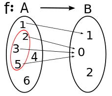
- **Faser / Urbild $f^{-1}(y)$ eines Elements $y$ der Zielmenge**: Menge aller Elemente der Definitionsmenge, deren Bild $y$ ist ($f^{-1}(\{y\})=\{x \in D \mid f(x)=y\}$)
- Elemente der Urbildmenge heißen **Urbilder** (bzw sind =Funktionsargumente)

<!--small-->


---

## Vorbereitungen
### Funktionen
##### Funktion und keine Funktion

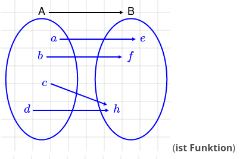 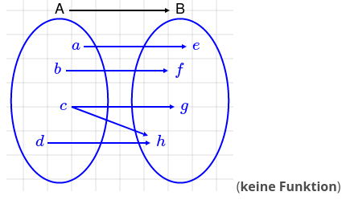

<!--small-->


---

## Vorbereitungen
### Funktionen
##### Multi- und Partielle Funktionen
- **Partielle Funktion:** $f: X\rightharpoonup Y$
  - **rechtseindeutige** (aber **nicht** umbedingt **linkstotale**) Relation
  - es darf Elemente der Definitionsmenge geben, denen kein Wert der Zielmenge zugeordnet ist
- **Multifunktion:** $f: X \multimap Y$
  - **linkstotale** (aber **nicht** umbedingt **rechtseindeutige**) Relation
  - Elemente der Definitionsmenge X können auf mehrere Elemente der Zielmenge Y abgebildet werden
- um normale Funktionen: $f: X\to Y$ zu unterscheiden, bezeichnet man sie auch als **totale Funktionen**

<!--small-->


---

## Vorbereitungen
### Funktionen
##### Schreibweisen
  - $f(x)=x^2,\quad x\in \{1, 2, 3, 4\}$ (Funktionsgleichung mit Definitionsmenge)
  - $f: \{1, 2, 3, 4\}\to \{1, 4, 9, 16\}, (x)\mapsto (x^2)$ (eindeutige Zuordnungsvorschrift mit Definitions- und Zielmenge)
  - $f = \{(1,4),(2,3),(3,2),(4,1)\}$ (als Relation)
  - $f(x)=
  \begin{cases}
  1 & \text { falls} & x=1 \\
  x^2 & \text { falls} & 2\le x\le3 \\
  16 & \text { falls} & x\ge4
  \end{cases}, \quad x\in\{1, 2, 3, 4\}$ (als Fallunterscheidung)

<!--small-->


---

## Vorbereitungen
### Funktionen
##### Injektivität, Surjektivität, Bijektivität

- **Injektivität/Linkseindeutigkeit:** Wenn jedes Element der <u>Zielmenge</u> höchstens ein Urbild
  - $f\left(x_{1}\right)=f\left(x_{2}\right)$ $\Rightarrow$ $x_{1}=x_{2}$
- **Surjektivität/Rechtstotalität:** Wenn jedes Element <u>der Zielmenge</u> mindestens ein Urbild hat
  - $\forall y\in Y\exists x\in X:f(x)=y$
  - Surjektive Funktion $f: X \rightarrow Y$ zwischen endlichen Mengen, dann kann $Y$ höchstens so viele Elemente wie $X$ haben, es gilt also $|Y| \leq|X|$
- **Bijektivität:** Wenn sie injektiv und surjektiv ist (wenn jedes Element der Zielmenge genau ein Urbild hat)

<!--small-->


---

## Vorbereitungen
### Funktionen
##### Injektivität, Surjektivität, Bijektivität

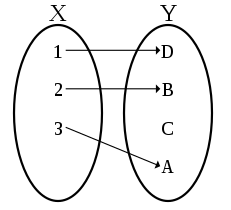 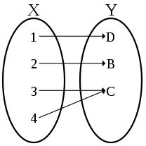 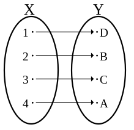

> beim Funktionsbegriff beziehen sich **Linkstotalität** und **Rechtseindeutigkeit** auf die **Definitionsmenge**, hier bezieht sich alles auf die **Zielmenge**
<!--small-->


---

## Vorbereitungen
### Funktionen
##### Homomorphismen
- **Struktur**: $\mathcal{S}=\left(S,\left\{c_{i}^{\mathcal{S}}\right\}_{i \in I},\left\{f_{j}^{\mathcal{S}}\right\}_{j \in J},\left\{R_{k}^{\mathcal{S}}\right\}_{k \in K}\right)$, *Bsp.*: $G = (V, R, α, ω)$
  - **Konstantenzeichen**, **Funktionszeichen**, **Relationszeichen**, die sich alle innerhalb der **Grundmenge** $S$ bewegen
-  $F\left(c^{\mathcal{A}}\right)=c^{\mathcal{B}}$;
- $F\left(f^{\mathcal{A}}\left(a_{1}, \ldots, a_{n}\right)\right)=f^{\mathcal{B}}\left(F\left(a_{1}\right), \ldots, F\left(a_{n}\right)\right)$
- $\left(a_{1}, \ldots, a_{m}\right)\in R^{\mathcal{A}}$ *gdw.* $\left(F\left(a_{1}\right), \ldots, F\left(a_{m}\right)\right)\in R^{\mathcal{B}}$
- **Monomorphismus** (auch **Einbettung**): ist **injektiver** Homomorphismus
- **Isomorphismus**: ist **bijektiver** Homomorphismus, $\mathcal{A} \simeq \mathcal{B}$
  - **Isomorphie** $\Rightarrow$ **Elementare Äquivalenz** (erfüllen dieselben Aussagen)

<!--small-->


---

## Vorbereitungen
### Strukturen
##### Monoid $(M, \circ)$
  - **Assoziativgesetz:** $(a \circ b) \circ c=a \circ(b \circ c)$
  - **neutrales Element:** $n \circ a=a \circ n=a,\quad n\in G$

##### $(G, \circ)$ (Monoid, in dem jedes Element invertierbar ist)
- wobei $a \circ b \in G, \quad \forall a, b, c\in G:$
- **Assoziativgesetz:** $(a \circ b) \circ c=a \circ(b \circ c)$
- **neutrales Element:** $n \circ a=a \circ n=a,\quad n\in G$
- **inverses Element:** $\forall a\exists! i(a):a \circ i(a)=i(a) \circ a=n$

<!--small-->


---

## Vorbereitungen
### Strukturen
##### Körper $(\mathbb{K}, +, \cdot)$
- $\forall a, b, c\in \mathbb{K}:$
- kommutative Gruppe $(\mathbb{K}, +)$ mit neutralem Element $0$
- kommutative Gruppe $(\mathbb{K}\setminus\{0\}, \cdot)$ mit neutralem Element $1$
- **Distributivgesetz:** $a \cdot b+a \cdot c=a \cdot(b+c)$
  - regelt, wie die beiden Verknüpfungen sich miteinander vertragen

<!--small-->


---

## Vorbereitungen
### Strukturen
##### Ring $(R, +,\cdot)$
- $\forall a, b, c\in R:$
- kommutative Gruppe $(R, +)$ mit neutralem Element $0$
- **Assoziativgesetz:** $(a \cdot b) \cdot c=a \cdot(b \cdot c)$
- **Distributivgesetz:** $a \cdot b+a \cdot c=a \cdot(b+c)$

<!--small-->


---

## Vorbereitungen
### Beweisarten

- auch "zeigen" oder "nachweisen", statt "beweisen"
- $A\Rightarrow B$ ist meist nur eine kurzschreibweise für $\forall x\in M: A(x)\Rightarrow B(x)$
- **Voraussetzungen** und **Konklusion**, in Form einer **Behauptung** (wo man $Z\hspace{-0.25em}\raisebox{-0.25em}Z:$ davor schreibt) sind gegeben
  - es gibt neben **expliziten Voraussetzungen** auch **implizite Voraussetzungen**, die nicht ausdrücklich genannt werden (Rechenregeln und Standard-Definitionen)
  - in der **Behauptung** steht immer eine wahre Aussage. Hat man eine Aussage, die nicht wahr ist, muss man sie negiert in die Behauptung schreiben

<!--small-->


---

## Vorbereitungen
### Beweisarten

- gesucht wird ein **Beweis**, der zeigt, dass zwischen den vorgegebenen Voraussetzungen und der vorgegebenen Behauptung eine logische Folgerungsbeziehung besteht
  - man muss nachweisen, sofern die Voraussetzungen erfüllt sind, ist garantiert, dass die Behauptung ebenfalls gilt
  - **Beweissuche** mithilfe von **Vorwärs- und Rückwärtsschließen**, sowie **bidirektionaler Suche** und **Beweispräsentation** können sich sehr unterscheiden
- $q.e.d.$ für **quod erat demonstrandum** ("was zu beweisen war")

<!--small-->


---

## Vorbereitungen
### Schließen
##### Deduktives Schließen
##### 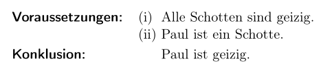
- meist vom **Allgemeinen** zum **Speziellen**
- Voraussetzungen müssen nicht umgedingt wahr sein
  - im obigen Beispiel ist die Voraussetzung $(i)$ falsch, trotzdem besteht logische Folgerungsbeziehung zwischen Voraussetzungen und Konklusion
  - es ist unmöglich, dass die Voraussetzungen wahr und die Konklusion falsch ist
- Mathematisches Beweisen beruht meistens darauf

<!--small-->


---
## Vorbereitungen
### Schließen
##### Induktives Schließen
##### 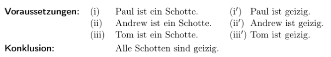
- vom **Speziellen** zum **Allgemeinen**
- bei erfüllten Voraussetzungen ist eine induktive Konklusion nicht mit Sicherheit wahr. Sie ist nur mehr oder weniger wahrscheinlich. Man schließt aus Einzelfällen auf ein allgemeines Gesetz
- bei **vollständiger Induktion** besteht Grundidee darin, nicht nur einige Einzelfälle zu betrachten, sondern tatsächlich alle. Wenn die Induktion in diesem Sinne vollständig ist, gilt bei erfüllten Voraussetzungen zwangsläufig auch die Konklusion

<!--small-->


---
## Vorbereitungen
### Schließen
##### Vorwärtsschließen

- geht von Voraussetzungen aus und erschließt daraus die Behauptung. Beginnend mit Voraussetzungen folgen also Beweisschritte, bis die Behauptung dasteht.

##### Rückwärtsschließen

- beginnt mit der Behauptung und verfolgt rückwärts die Argumentketten, mit denen die Behauptung bewiesen wird, bis diese Ketten mit Voraussetzungen enden

##### Bidirektionales Schließen

- Mischformen von Vorwärts- und Rückwärtsschließen. Auch bidirektionale Suche genannt, da es meistens zur Beweissuche dient

<!--small-->


---

## Vorbereitungen
### Beweisarten

- **Deduktive Kette** (Beweis durch "Ausrechnen")
  - Behauptung ist Gleichung
  - kann zu **Deuktivem Netz** werden:
  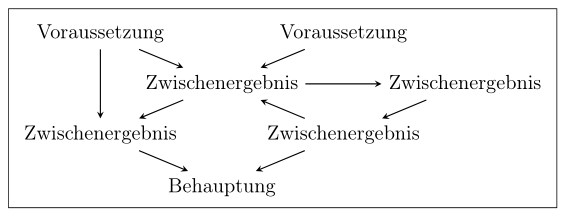
- **Implikationsbeweis**, $\mathcal{F}\Rightarrow\mathcal{G}$
  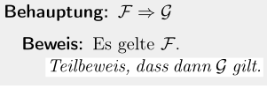

<!--small-->


---

## Vorbereitungen
### Beweisarten
- **Allbeweis**, $\forall x\;\mathcal{F}(x)$
  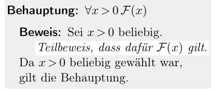
  - Beweis durch **Fallunterschiedung**, $((A \rightarrow B) \wedge(\neg A \rightarrow B)) \rightarrow B$
  - Beweis durch **Vollständige Induktion**
- **Existenzbeweis**
  - ohne $\forall$-Vorspann: $\exists x\;\mathcal{F}(x)$
  - mit $\forall$-Vorspann: $\forall x\exists y\;\mathcal{F}(x, y)$
  - *konstruktiv* oder *nicht-konstruktiv*

<!--small-->


---

## Vorbereitungen
### Beweisarten
- **Äquivalenzbeweis**, $\mathcal{F}\Leftrightarrow\mathcal{G}\equiv(\mathcal{F}\Rightarrow\mathcal{G})\wedge(\mathcal{G}\Rightarrow\mathcal{F})$
  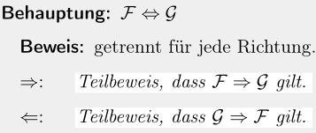
  - Beweis durch **Ringschluss**, bei z.B. $(\mathcal{F_1}\Leftrightarrow\mathcal{F_2})\wedge(\mathcal{F_1}\Leftrightarrow\mathcal{F_3})\wedge(\mathcal{F_2}\Leftrightarrow\mathcal{F_3})$ bräuchte man damit nur $3$ Teilbeweise, anstatt $6$ (wenn man das erste Beweissschema drei Mal verwenden würde)
  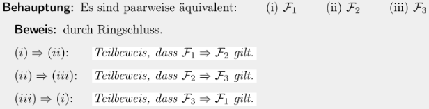

<!--small-->


---

## Vorbereitungen
### Beweisarten
- **Beweis durch Kontraposition**, $\mathcal{F}\Rightarrow\mathcal{G}\Leftrightarrow¬\mathcal{F}\vee\mathcal{G}\Leftrightarrow¬¬\mathcal{G}\vee¬\mathcal{F}\Leftrightarrow¬\mathcal{G}\Rightarrow¬\mathcal{F}$
  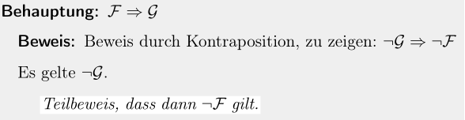
- **Widerspruchsbeweis**, $V\Rightarrow B\Leftrightarrow ¬V\vee B\Leftrightarrow¬(V\wedge ¬B)\Leftrightarrow(V\wedge¬B\Rightarrow\bot)$
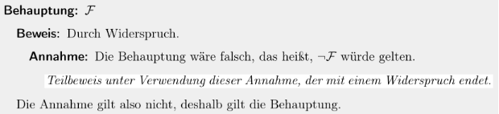

<!--small-->


---

## Vorbereitungen
### Beweise
##### Begriffe
- **Ohne Beschränkung der Allgemeinheit:**
  - abgekürzt **o. B. d. A.**
  - eine Einschränkung führt nur zur *Vereinfachung* (z.B. bei Symmetrie) der Beweisführung (Verringerung der Schreibarbeit), ohne dass die *Gültigkeit* der im Anschluss getroffenen Aussagen in Bezug auf die *Allgemeinheit darunter leidet
- **(fest aber) beliebig:** "'fest' hat darin *keine Bedeutung*. Es stellt bestenfalls eine Erklärung des Autors dar, dass dieses Symbol, wenn es später wieder auftaucht, *dieselbe Bedeutung* haben soll – das ist aber eine *Selbstverständlichkeit*, die man wirklich nicht zu betonen braucht!" (*Quelle:* Prof. Dr. Albrecht Beutelspacher - „Das ist o.B.d.A. trivial!“ Eine Gebrauchsanleitung zur Formulierung mathematischer Gedanken[...])
<!--small-->


---
<!--  -->
<!-- ## Vorbereitungen -->
<!-- ### Beweisarten -->
<!-- ##### Beispiel für Beweis (Deduktive Kette) -->
<!--  -->
<!-- ##### 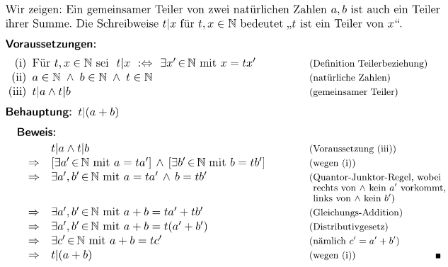 -->
<!--  -->
<!-- [>small<] -->
<!--  -->
<!--  -->
<!-- --- -->

## Vorbereitungen
### Addition binär und dezimal
```text
  011011 (27)            17718
+ 011101 (29)          +  6524
  11111                  11 1
  ======                ======
  111000 (56)            24242
```
```
00 + 00 = 00               00 + 00 (+ 01) = 01
00 + 01 = 01               00 + 01 (+ 01) = 10
01 + 00 = 01               01 + 00 (+ 01) = 10
01 + 01 = 10               01 + 01 (+ 01) = 11
```

<!--small-->


---

## Vorbereitungen
### Subtraktion binär und dezimal (nicht empfohlen, dient Vergleich mit nächster Folie)
```text
(1)
  0111000 (56)         24242
- 0011011 (27)       - 17718
   11111               11 1
  =======             ======
  0011101 (29)          6524
```
```
10 - 00 = 10                10 - 00 (- 01) = 01
10 - 01 = 01                10 - 01 (- 01) = 00
11 - 00 = 11                11 - 00 (- 01) = 10
11 - 01 = 10                11 - 01 (- 01) = 01
```

<!--small-->


---

## Vorbereitungen
### Subtraktion  binär und dezimal (funktioniert immer, egal was für Vorzeichen Zahlen haben)
```text
(2)
   0111000 (56)
 + 1100101 (27) (0011011 negiert und +1)
  11
   =======
   0011101 (29)
```
- **Zweierkomplement Negation:** `11011 -> 011011 -> 100100 -> 100101`
  - `0`en hinzufügen bis **Minuend** und **Subtrahend** beide gleiche Länge haben und Platz für ihr **Vorzeichenbit** ist und dieses korrekt gesetzt ist
  - **1er Komplement Negation** und `+1` nicht vergessen für den **Subtrahenden**

<!--small-->


---

## Vorbereitungen
### Multiplikation binär und dezimal
```text
1101 x 1001 (13 * 9)          1304 x 12
       1101                          48
      0000                       +   0
     0000                        + 36
    1101                         +12
   ========                      ======
    1110101 (117)                 15648
```
- **Verschiebung** ist aufgrund der `0`en, die hier ausgelassen sind

<!--small-->


---

## Vorbereitungen
### Division binär
```text
  1110101 / 1011 (117 : 11) = 1010 (10) Rest: 111 (7)
- 1011|||
 =====|||
    111||
-     0||
   ====||
    1110|
-   1011|
   =====|
      111
-       0
     ====
      111
```

<!--small-->


---

## Vorbereitungen
### Division dezimal
```text
15658 / 12 = 1304,833...
12|||
==|||
 36||
 36||
 ==||
  05|
   0|
  ==|
   58
   48
   ...
```

<!--small-->


---

## Vorbereitungen
### Division dezimal
```text
   ==
   10|0  oder Rest: 10
    9 6
    ===
      40
      36
      ==
       40
       36
       ==
        4...
```

<!--small-->


---

## Vorbereitungen
### Division binär
- bei **binärer Division** gibt es nur **2 Zustände** (`1` oder `0`), dementsprechend wird entweder die Zahl so übernommen (Zahl $\cdot$ `1`) oder die Zahl ist `0` (Zahl $\cdot$ `0`)

### Division allgemein
- nach jeder Addition ein Zahl runterholen, bis keine mehr runtergeholt werden kann $\to$ dann Ende (bei **ganzzahliger Division**). Was unten stehen bleibt ist der **Rest**
- bei Division mit Nachkommastellen, 0en runterbringen, bis einmal **kein Rest** mehr rauskommt oder Grenze setzen bis zu der man weiter macht $\to$ dann Ende
- ist der **Dividend** trotz runtergebrachter weiter Stelle (weil einmal kein Rest übrig blieb) immernoch kleiner als der **Divisor**, so ist der **Quotient** $0$, weil nur durch $\cdot 0$ rechnen kann der **Divisor** noch kleiner sein als der **Dividend**


<!--small-->


---

# Übungsblatt

<!--_class: lead-->
<!--big-->

<!-- _backgroundColor: #c47f63; -->

---

## Übungsblatt
### Aufgabe 1
- PicoC-Compiler Binary **herunterladen**
- `nvim input.picoc`
  - `:set paste`
  - Code aus Übungsblatt **kopieren** und mit `"*p` **pasten**
  - Code mit `shift + v` und `<` bzw `>` im **Visual Mode** schön formatieren, `]<space>`
  - `:wq`
- `./pico_c_compiler.exe -S -v -p -s 128 -e 256 input.picoc output.reti`
  - `./pico_c_compiler.exe -h`
- `.reti`-Outputdatei wird später auf **Nextcloud** Server hochgeladen

<!--small-->


---

## Übungsblatt
### Aufgabe 2
- **Lösung** von **Emre** und **Taha** wird später auf **Nextcloud** Server hochgeladen
```
void main() {
  int x = 42;
  int y = -24;
  char is_less = 0;
  // ...
```

<!--small-->


---

## Übungsblatt
### Aufgabe 2
```
  if((x > 0) ^ (y > 0)) {
    is_le = x <= y;
  } else {
    if (x > 0) {
      // x >= 0 -> y < 0 implies x --y <= 0 implies x <= -y
      is_le = 0
    } else {
      // x < 0 -> y >= 0 implies -x - y <= implies -x <= y
      is_le = 1
    }
  }
}
```

<!--small-->


---

## Übungsblatt
### Aufgabe 3

- **Isomorphismus** $F: \left(k_{1}, \ldots, k_{n}\right) \mapsto a+\sum_{i=1}^{n}\left(\prod_{j=i+1}^{n} s_{j}\right) \cdot k_{i}$ von Struktur $\mathcal{A}=(\N^n, 0^{\mathcal{A}}, +^{\mathcal{A}})$ nach $\mathcal{B}=(\N, 0^{\mathcal{B}}, +^{\mathcal{B}})$
- **Deduktives Netz:** Funktion **bijektiv** gdw. **injektiv** und **surjektiv**
- Beweis der Injektivität durch **Beweis durch Kontraposition:**
  - $f(x)=f(y) \Rightarrow x=y$ wird umgeformt zu $x \neq y \Rightarrow f(x) \neq f(y)$
  - $f(x) \neq f(y)$ wird umgeformt zu $f(x) - f(y) \neq 0$ bzw. $f(x) - f(y) > 0$
- **Voraussetzungen:**
  - $\text { Sei } l \text { minimal mit } k_{l} \neq h_{l} . \text { O.B.d.A. gelte } k_{l}<h_{l} \text { und } k_{1}=h_{1}, \ldots, k_{l-1}=h_{l-1}$
- **Behauptung:**
  - $Z\hspace{-0.25em}\raisebox{-0.25em}Z:$ $\left(k_{1}, \ldots, k_{n}\right) \neq\left(h_{1}, \ldots, h_{n}\right) \Rightarrow \left(k_{1}, \ldots, k_{n}\right) \neq \operatorname{ind}\left(h_{1}, \ldots, h_{n}\right)$

<!--small-->


---

## Übungsblatt
### Aufgabe 3
##### Teilbeweis (1/2) der Linkseindeutigkeit (Injektivität)
$$
\begin{aligned}
\operatorname{ind}\left(h_{1}, \ldots, h_{n}\right)-\operatorname{ind}\left(k_{1}, \ldots, k_{n}\right) &=\\
 \sum_{i=1}^{l-1}\left(\prod_{j=i+1}^{n} s_{j}\right) \cdot\underbrace{\left(h_{i}-k_{i}\right)}_{0} + \sum_{i=l}^{n}\left(\prod_{j=i+1}^{n} s_{j}\right) \cdot\left(h_{i}-k_{i}\right) + \underbrace{a - a}_{0} &= \\
\sum_{i=l}^{n}\left(\prod_{j=i+1}^{n} s_{j}\right) \cdot\left(h_{i}-k_{i}\right) &\geq \\
\prod_{j=l+1}^{n} s_{j}+\sum_{i=l+1}^{n}\left(\prod_{j=i+1}^{n} s_{j}\right)\cdot\left(h_{i}-k_{i}\right) &\geq \\
\end{aligned}
$$

<!--small-->


---

## Übungsblatt
### Aufgabe 3
$$
\begin{aligned}
\prod_{j=l+1}^{n} s_{j}+\sum_{i=l+1}^{n}\left(\prod_{j=i+1}^{n} s_{j}\right)\left(-s_{i}+1\right) &>\\
\prod_{j=l+1}^{n} s_{j}+\sum_{i=l+1}^{n-1}\left(\prod_{j=i+1}^{n} s_{j}\right)(-s_{i} + 1)+\left(-s_{n}\right) &= \\
\prod_{j=l+1}^{n} s_{j}+\sum_{i=l+1}^{n-2}\left(\prod_{j=i+1}^{n} s_{j}\right)\left(-s_{i}+1\right)+\left(-s_{n-1}\right) s_{n} &= \\
\ldots&=\\
0
\end{aligned}
$$

<!--small-->


---

## Übungsblatt
### Aufgabe 3
##### Teilbeweis (2/2) der Rechtstotalität (Surjektivität)
- Da **Definitionsmenge** und **Wertemenge** gleich groß sind und die Abbildung $ind$ **injektiv** ist, ist sie auch **surjektiv**

##### Beweis des Isomorphismus
- Aus der **Linkseindeutigkeit** und **Rechtstotalität** des **Homomorphismus** folgt, dass es sich hierbei um einen **Isomorphismus** handelt

**q.e.d.**

<!--small-->


---

# Ergänzungen

<!--_class: lead-->
<!--big-->

<!-- _backgroundColor: #c47f63; -->

---

## Ergänzungen
### Packages installieren mit `apt`
##### updating
- `sudo apt update`: update package lists
- `sudo apt update -y && sudo apt full-upgrade`:
##### ](_resources/_2021-11-11-00-32-09.png)
- `sudo apt update -y && sudo apt full-upgrade qutebrowser`: update a program
>- `full-upgrade` is the recommended way over `upgrade`

<!--small-->


---

## Ergänzungen
### Packages installieren mit `apt`
##### installing
- `sudo apt update -y && sudo apt install gcc -y`: install package from repo
- `sudo apt update -y && sudo apt install ./foo_1.0_all.deb -y`: install local package

##### removing
- `sudo apt update -y && sudo apt purge gcc -y`: uninstalls package, es werden alle Konfigurationsdateien gelöscht
- `sudo apt update -y && sudo apt autoremove -y` uninstalls all packages, that are not needed anymore and have no dependencies to other packages
>- `purge` is the recommended way over `remove`

<!--small-->


---

## Ergänzungen
### Packages installieren mit `apt`


##### searching
- autocomplete application name, e.g. `sudo apt install openjdk`, double tab
- `apt list gcc`: lists als packages with which fit the search term
- `apt list gcc --installed`: only list packages that are installed
- `apt show gcc`:  shows desciption of package matching the search term
- `apt search gcc`: lists alls packages which the search term in their discription or name
>- glob-pattern or regex as search pattern

<!--small-->


---

## Ergänzungen
### Packages installieren mit `apt`

##### other
- `sudo apt download emacs`: download `.deb`-package
- `sudo apt install alacritty -y`: no `y` each time
- `sudo do-release-upgrade`: upgrade **Distro** to a newer release
>- instead of confirming with y, once can also just spam enter
>- access packages over `/var/cache/apt/archives`

<!--small-->


---

## Ergänzungen
### Packages installieren mit `apt`

##### comparisson to apt-get


<!--small-->


---

## Ergänzungen
### Packages installieren mit `pacman`
##### Synchronising with the repositories
- `sudo pacman -Sy`: As new packages are added to the repositories you will need to regularly synchronise the package lists. This will only download the package lists if there has been a change (sudo apt update)
- `sudo pacman -Syy`: Occasionally you may want to force the package lists to be downloaded

##### Updating software
- `sudo pacman -Su`: perform an update of software already installed (sudo apt upgrade)
- `sudo pacman -Syu`: check whether the package lists are up-to-date at the same time

<!--small-->


---

## Ergänzungen
### Packages installieren mit `pacman`
##### Searching for software
- `pacman -Ss ^hunspell`: searching a package by name in repos. Supports Regex
- `pacman -Qs hunspell`: searching package locally
- `pacman -Q`: list all packages installed on computer
- `pacman -Qeq`: self installed programs (e), only the program names, not the version number (q)
- `pacman -Qen`: packages self installed from main repos (n)
- `pacman -Qem`: packages self installed from aur (m)
- `pacman -Qdt`: orphans, unneeded dependencies

##### Find out where package installed
- `pacman -Ql handbrake`: look up where application gets installed

<!--small-->


---

## Ergänzungen
### Packages installieren mit `pacman`
##### Installing software
- `sudo pacman -S gimagereader-gtk`: install package from repo
- `sudo pacman -U /var/cache/pacman/pkg/rofi-1.6.1-1-x86_64.pkg.tar.zst`: install local package

##### Removing software
- `sudo pacman -Rns dmenu`: remove a package (R), dependencies (s) and configuration files (n)
- `sudo pacman -Rns $(pacman -Qtdq)`: if at a later date you want to remove all orphan packages and configuration files for packages that you removed some time ago
- `sudo pacman -Sc`: remove unused packages and repos from cache

<!--small-->


---

## Ergänzungen
### Packages installieren mit `pacman`
##### Finding out version number of local and remote packages
- `pacman -Qi python`: for **local** packages
- `pacman -Si python`: for **remote** packages

<!--small-->


##### Misc
- If a package in the list is already installed on the system, it will be reinstalled even if it is already up to date. This behavior can be overridden with the `--needed` option.

---

## Ergänzungen
### Packages installieren mit `pacman`
##### Prinzip
- capital letter at beginning
- `S`: sync with repository in some way
- `Q`: search locally
- `R`: remove

##### Yay
- commands are the same as in `pacman`
- adds search in the **AUR (Arch User Repository)**: https://aur.archlinux.org/ (**Duckduckgo:** `!au`)
- `yay polybar` erlaubt auswahl an packages, die z.B. Discord im Namen haben

<!--small-->


---

## Ergänzungen
### Packages installieren mit `pacman`
##### Anmerkungen
- **PAC**kage **MAN**ager
- always make `sudo pacman -Syu` before installing new software

##### Edit configuration files
- `sudo nvim /etc/pacman.conf`

- `sudo nvim /etc/pacman.d/mirrorlist`

<!--small-->


---

# Quellen

<!--_class: lead-->
<!--big-->

<!-- _backgroundColor: #c47f63; -->

---

## Quellen
### Wissenquellen

- :shrug:

<!--small-->


---

## Quellen
### Bildquellen

- :shrug:

<!--small-->


---

# Vielen Dank für eure Aufmerksamkeit!
# :penguin:

<!--_class: lead-->
<!--big-->

<!-- _backgroundColor: #c47f63; -->
