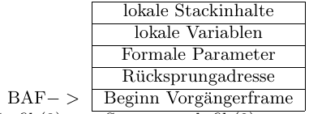

# Tutorat 7 <!--fit-->
### Zeiger Structs und Stackframes <!--fit-->

<!--_class: lead-->
<!--big-->


---

# Vorbereitungen

<!--_class: lead-->
<!--big-->

<!-- _backgroundColor: #909f68; -->

---

## Vorbereitungen
### GDB

- content

<!--small-->


---

## Vorbereitungen
### Hexadezimal zu Binärsystem und vice versa

- content

<!--small-->


---

## Vorbereitungen
### Pointerarithmetik

- content

<!--small-->


---

## Vorbereitungen
### Stackframes

##### 

<!--small-->


---

# Übungsblatt

<!--_class: lead-->
<!--big-->

<!-- _backgroundColor: #909f68; -->

---

## Übungsblatt
### Aufgabe 1
```
#include <stdlib.h> //Stellt Bibliotheksfunktionen malloc() und free() bereit
void main()
{
  struct point
  {
    int x;
    int y;
  };

  // Annahme Symboltabelleneintrag st(p1) = (var, struct point*, 8)
  struct point *p1;
  // Annahme Symboltabelleneintrag st(p3) = (var, struct point*, 9)
  struct point *p3;
  // Annahme Symboltabelleneintrag st(a) = (var, int*, 10)
  int* a;

```

<!--small-->


---

## Übungsblatt
### Aufgabe 1

```
  //Annahme Symboltabelleneintrag:
  //st(p2) = (struct, x -> (int,0), y -> (int,1), 15)
  struct point p2;
  a = &(p2.x);
  p2.x = 7;
  p2.y = 4;
  /*** MARKE 1 ***/

  //Annahme: reserviert zusammenhaengenden Bereich auf dem Heap ab Adresse 33
  p1 = (struct point *) malloc(sizeof(struct point));

  (*p1).y = *a;

  p3 = p1;
  p1 = &p2;
  /*** MARKE 2 ***/
```

<!--small-->


---

## Übungsblatt
### Aufgabe 1

```
  if((*p1).y > 5)
  {
    *a = 42;
  }
  else
  {
    *a = 1;
  };
  /*** MARKE 3 ***/

  free(p3);
};
```

<!--small-->


---

## Übungsblatt
### Aufgabe 1a)

- 8, 9, 10, 15, 16, 34
- **Anmerkung zu 33:** 33 wird nicht gelesen, da für die **Ponterarithmetik** nur die Adresse wichtig ist und die steht in Speicherzelle 10, wo der Zeiger `p1` haust

<!--small-->


---

## Übungsblatt
### Aufgabe 1b)

- **Marke 1:**
  ```
  8: undefiniert   33: undefiniert
  9: undefiniert   34: undefiniert
  10: 15
  15: 7
  16: 4
  ```
- **Marke 2:**
  ```
  8: 15   33: undefiniert
  9: 33   34: 7
  10: 15
  15: 7
  16: 4
  ```

<!--small-->


---

## Übungsblatt
### Aufgabe 1b)
- **Marke 3:**
  ```
  8: 15   33: undefiniert
  9: 33   34: 7
  10: 15
  15: 1
  16: 4
  ```

<!--small-->


---

## Übungsblatt
### Aufgabe 1c)

- Speicheradressen 33 und 34 werden wieder freigegeben
- `p3` zeigt auf den Speicherbereich, der mit `malloc()` reserviert wurde

<!--small-->


---

## Übungsblatt
### Aufgabe 2a

```
int fib(int n)
{
  int res_f, a, b;
  if (n==0)
    res_f = 0;
  else if (n==1)
    res_f = 1;
  else // Fall: n > 1. {
    int a = fib(n-1); // Ruecksprungadresse 200
    int b = fib(n-2); // Ruecksprungadresse 300
    res_f = a + b;
  };
  return res_f;
}
```

<!--small-->


---

## Übungsblatt
### Aufgabe 2b)

- **Ablauf:** `fib(3)`, `fib(3-1)`, `fib(2-1)`, `fib(1)` & `ACC=1`, `fib(2-2)`, `fib(0)` & `ACC=0`, `fib(3-2)`, `fib(1)` & `ACC=1`, ``

<!--small-->


---

## Übungsblatt
### Aufgabe 2c)
##### Nachteil
- Teilergebnisse **mehrfach** berechnet **🠒** $\#$Funktionsaufrufe wächst **exponentiel** **🠒** ineffizient

##### Abschätzug für $\#$Funktionsaufrufe

<!--small-->


---

## Übungsblatt
### Aufgabe 2d)

```
int fib_efficient(int n, int* res) {
  if (n == 0) {
    return 0;
  }
  else if (n == 1) {
    res[0] = 0;
    res[1] = 1;
    return 1;
  }
  res[n] = fib_efficient(n-1, res) + res[n-2];
  return res[n];
}
```

<!--small-->


---

# Ergänzungen

<!--_class: lead-->
<!--big-->

<!-- _backgroundColor: #909f68; -->

---

## Ergänzungen
### Addition binär und dezimal
```text
  011011 (27)            17718
+ 011101 (29)          +  6524
  11111                  11 1
  ======                ======
  111000 (56)            24242
```
```
00 + 00 = 00               00 + 00 (+ 01) = 01
00 + 01 = 01               00 + 01 (+ 01) = 10
01 + 00 = 01               01 + 00 (+ 01) = 10
01 + 01 = 10               01 + 01 (+ 01) = 11
```

<!--small-->


---

## Ergänzungen
### Subtraktion binär und dezimal (nicht empfohlen, dient Vergleich mit nächster Folie)
```text
(1)
  0111000 (56)         24242
- 0011011 (27)       - 17718
   11111               11 1
  =======             ======
  0011101 (29)          6524
```
```
10 - 00 = 10                10 - 00 (- 01) = 01
10 - 01 = 01                10 - 01 (- 01) = 00
11 - 00 = 11                11 - 00 (- 01) = 10
11 - 01 = 10                11 - 01 (- 01) = 01
```

<!--small-->


---

## Ergänzungen
### Subtraktion  binär und dezimal (funktioniert immer, egal was für Vorzeichen Zahlen haben)
```text
(2)
   0111000 (56)
 + 1100101 (27) (0011011 negiert und +1)
  11
   =======
   0011101 (29)
```
- **Zweierkomplement Negation:** `11011 -> 011011 -> 100100 -> 100101`
  - `0`en hinzufügen bis **Minuend** und **Subtrahend** beide gleiche Länge haben und Platz für ihr **Vorzeichenbit** ist und dieses korrekt gesetzt ist
  - **1er Komplement Negation** und `+1` nicht vergessen für den **Subtrahenden**

<!--small-->


---

## Ergänzungen
### Multiplikation binär und dezimal
```text
1101 x 1001 (13 * 9)          1304 x 12
       1101                          48
      0000                       +   0
     0000                        + 36
    1101                         +12
   ========                      ======
    1110101 (117)                 15648
```
- **Verschiebung** ist aufgrund der `0`en, die hier ausgelassen sind

<!--small-->


---

## Ergänzungen
### Division binär
```text
  1110101 / 1011 (117 : 11) = 1010 (10) Rest: 111 (7)
- 1011|||
 =====|||
    111||
-     0||
   ====||
    1110|
-   1011|
   =====|
      111
-       0
     ====
      111
```

<!--small-->


---

## Ergänzungen
### Division dezimal
```text
15658 / 12 = 1304,833...
12|||
==|||
 36||
 36||
 ==||
  05|
   0|
  ==|
   58
   48
   ...
```

<!--small-->


---

## Ergänzungen
### Division dezimal
```text
   ==
   10|0  oder Rest: 10
    9 6
    ===
      40
      36
      ==
       40
       36
       ==
        4...
```

<!--small-->


---

## Ergänzungen
### Division binär
- bei **binärer Division** gibt es nur **2 Zustände** (`1` oder `0`), dementsprechend wird entweder die Zahl so übernommen (Zahl $\cdot$ `1`) oder die Zahl ist `0` (Zahl $\cdot$ `0`)

### Division allgemein
- nach jeder Addition ein Zahl runterholen, bis keine mehr runtergeholt werden kann $\to$ dann Ende (bei **ganzzahliger Division**). Was unten stehen bleibt ist der **Rest**
- bei Division mit Nachkommastellen, 0en runterbringen, bis einmal **kein Rest** mehr rauskommt oder Grenze setzen bis zu der man weiter macht $\to$ dann Ende
- ist der **Dividend** trotz runtergebrachter weiter Stelle (weil einmal kein Rest übrig blieb) immernoch kleiner als der **Divisor**, so ist der **Quotient** $0$, weil nur durch $\cdot 0$ rechnen kann der **Divisor** noch kleiner sein als der **Dividend**


<!--small-->


---


## Ergänzungen
### Packages installieren mit `apt`
##### updating
- `sudo apt update`: update package lists
- `sudo apt update -y && sudo apt full-upgrade`:
##### ](_resources/_2021-11-11-00-32-09.png)
- `sudo apt update -y && sudo apt full-upgrade qutebrowser`: update a program
>- `full-upgrade` is the recommended way over `upgrade`

<!--small-->


---

## Ergänzungen
### Packages installieren mit `apt`
##### installing
- `sudo apt update -y && sudo apt install gcc -y`: install package from repo
- `sudo apt update -y && sudo apt install ./foo_1.0_all.deb -y`: install local package

##### removing
- `sudo apt update -y && sudo apt purge gcc -y`: uninstalls package, es werden alle Konfigurationsdateien gelöscht
- `sudo apt update -y && sudo apt autoremove -y` uninstalls all packages, that are not needed anymore and have no dependencies to other packages
>- `purge` is the recommended way over `remove`

<!--small-->


---

## Ergänzungen
### Packages installieren mit `apt`


##### searching
- autocomplete application name, e.g. `sudo apt install openjdk`, double tab
- `apt list gcc`: lists als packages with which fit the search term
- `apt list gcc --installed`: only list packages that are installed
- `apt show gcc`:  shows desciption of package matching the search term
- `apt search gcc`: lists alls packages which the search term in their discription or name
>- glob-pattern or regex as search pattern

<!--small-->


---

## Ergänzungen
### Packages installieren mit `apt`

##### other
- `sudo apt download emacs`: download `.deb`-package
- `sudo apt install alacritty -y`: no `y` each time
- `sudo do-release-upgrade`: upgrade **Distro** to a newer release
>- instead of confirming with y, once can also just spam enter
>- access packages over `/var/cache/apt/archives`

<!--small-->


---

## Ergänzungen
### Packages installieren mit `apt`

##### comparisson to apt-get


<!--small-->


---

## Ergänzungen
### Packages installieren mit `pacman`
##### Synchronising with the repositories
- `sudo pacman -Sy`: As new packages are added to the repositories you will need to regularly synchronise the package lists. This will only download the package lists if there has been a change (sudo apt update)
- `sudo pacman -Syy`: Occasionally you may want to force the package lists to be downloaded

##### Updating software
- `sudo pacman -Su`: perform an update of software already installed (sudo apt upgrade)
- `sudo pacman -Syu`: check whether the package lists are up-to-date at the same time

<!--small-->


---

## Ergänzungen
### Packages installieren mit `pacman`
##### Searching for software
- `pacman -Ss ^hunspell`: searching a package by name in repos. Supports Regex
- `pacman -Qs hunspell`: searching package locally
- `pacman -Q`: list all packages installed on computer
- `pacman -Qeq`: self installed programs (e), only the program names, not the version number (q)
- `pacman -Qen`: packages self installed from main repos (n)
- `pacman -Qem`: packages self installed from aur (m)
- `pacman -Qdt`: orphans, unneeded dependencies

##### Find out where package installed
- `pacman -Ql handbrake`: look up where application gets installed

<!--small-->


---

## Ergänzungen
### Packages installieren mit `pacman`
##### Installing software
- `sudo pacman -S gimagereader-gtk`: install package from repo
- `sudo pacman -U /var/cache/pacman/pkg/rofi-1.6.1-1-x86_64.pkg.tar.zst`: install local package

##### Removing software
- `sudo pacman -Rns dmenu`: remove a package (R), dependencies (s) and configuration files (n)
- `sudo pacman -Rns $(pacman -Qtdq)`: if at a later date you want to remove all orphan packages and configuration files for packages that you removed some time ago
- `sudo pacman -Sc`: remove unused packages and repos from cache

<!--small-->


---

## Ergänzungen
### Packages installieren mit `pacman`
##### Finding out version number of local and remote packages
- `pacman -Qi python`: for **local** packages
- `pacman -Si python`: for **remote** packages

<!--small-->


##### Misc
- If a package in the list is already installed on the system, it will be reinstalled even if it is already up to date. This behavior can be overridden with the `--needed` option.

---

## Ergänzungen
### Packages installieren mit `pacman`
##### Prinzip
- capital letter at beginning
- `S`: sync with repository in some way
- `Q`: search locally
- `R`: remove

##### Yay
- commands are the same as in `pacman`
- adds search in the **AUR (Arch User Repository)**: https://aur.archlinux.org/ (**Duckduckgo:** `!au`)
- `yay polybar` erlaubt auswahl an packages, die z.B. Discord im Namen haben

<!--small-->


---

## Ergänzungen
### Packages installieren mit `pacman`
##### Anmerkungen
- **PAC**kage **MAN**ager
- always make `sudo pacman -Syu` before installing new software

##### Edit configuration files
- `sudo nvim /etc/pacman.conf`

- `sudo nvim /etc/pacman.d/mirrorlist`

<!--small-->


---

# Quellen

<!--_class: lead-->
<!--big-->

<!-- _backgroundColor: #909f68; -->

---

## Quellen
### Wissenquellen

- :shrug:

<!--small-->


---

## Quellen
### Bildquellen

- :shrug:

<!--small-->


---

# Vielen Dank für eure Aufmerksamkeit!
# :penguin:

<!--_class: lead-->
<!--big-->

<!-- _backgroundColor: #909f68; -->
