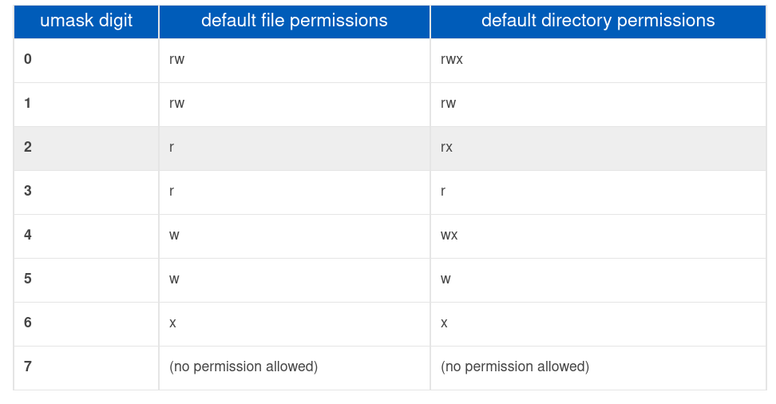
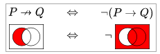
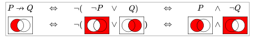
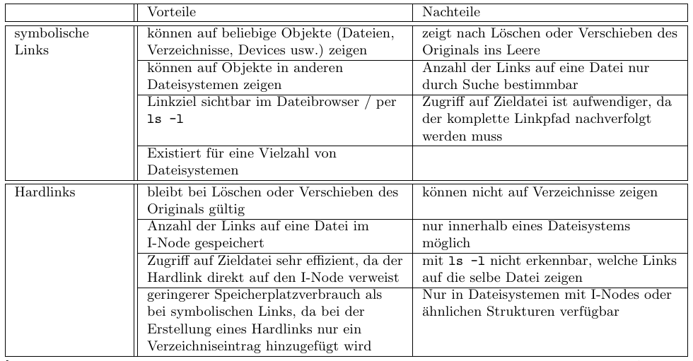
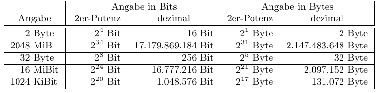
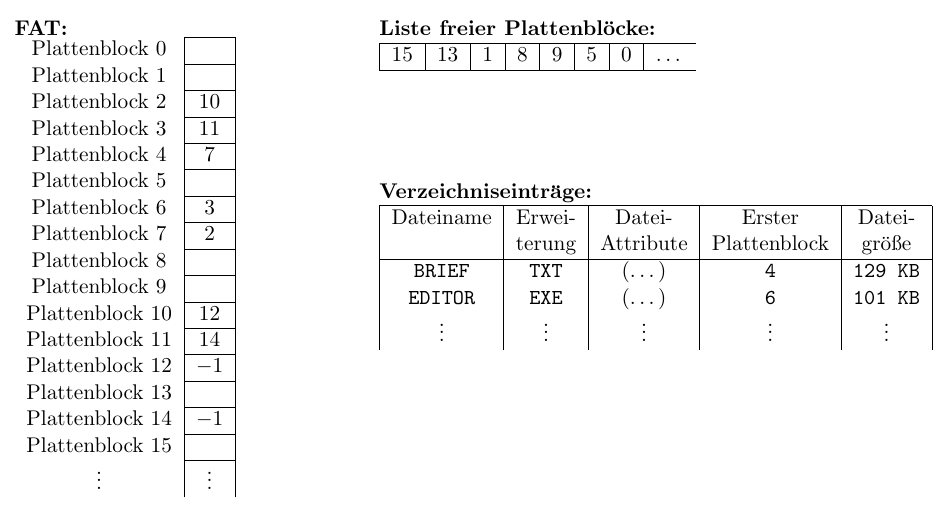
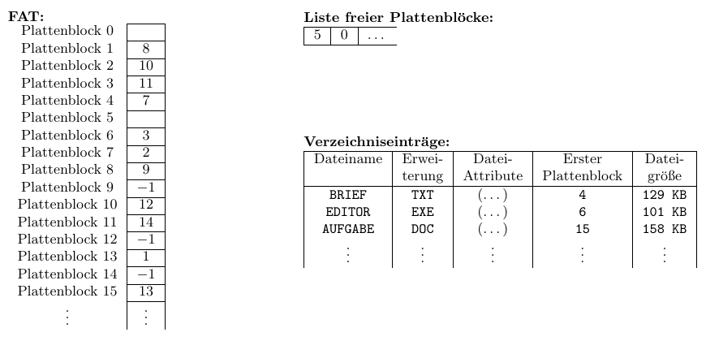

# Tutorat 8 <!--fit-->
### Dateisystem, Zugriffsrechte, Binärpräfixe, Links, FAT, I-Nodes <!--fit-->

<!--_class: lead-->
<!--big-->


---

# Einstieg

<!--_class: lead-->
<!--big-->

<!-- _backgroundColor: #9db7b4; -->

---

## Einstieg
### Xsnow
- https://www.ratrabbit.nl/ratrabbit/xsnow/downloads/index.html
- `yay -S xsnow`

<!--small-->


---

# Vorbereitungen

<!--_class: lead-->
<!--big-->

<!-- _backgroundColor: #9db7b4; -->

---

## Vorbereitungen
### `umask`-Befehl
- Falls Zugriffsrechte **verloren** gehen, liegt das daran, dass die Zugriffsrechte mit der `umask` maskiert werden
- **Beispiele:**
  - `umask 0002` beim Kopieren wird Schreibrecht (w = 2) für **Others** gelöscht.
  - `umask 0077` beim **Kopieren** werden alle Rechte (r+w+x = 4+2+1 = 7) für **Gruppe** und **Others** gelöscht.
- Die führende `0` gibt an, dass es sich um **Oktaldarstellung** handelt
  - the **first zero** is a special permission digit and can be ignored **🠒** `0002` is the same as `002`
- Mit `umask -S` lassen sich die Rechte von neu erstellen **Dateien** anzeigen
- To view current `umask` value: `umask`

<!--small-->


---

## Vorbereitungen
### `umask`-Befehl
- in Linux, the default permissions value is `666` for a **regular file**, and `777` for a **directory**. When creating a new file or directory, the kernel takes this **default value**, **"subtracts"** the umask value, and gives the new files the resulting permissions
- **folder:** $777 - 022 = 755$
- **file:** $666 - 022 = 644$
> *not really subtraction:* technically, the mask is **negated** (its bitwise compliment is taken) and this value is then applied to the default permissions using a logical **AND** operation (**🠒** **Material nonimplication**)

<!--small-->


---

## Vorbereitungen
### `umask`-Befehl


#### https://www.computerhope.com/unix/uumask.htm

<!--small-->


---

## Vorbereitungen
### `umark`-Befehl
- `umask u-x,g=r,o+w`:
- The default mask for a **non-root user** is `002`, changing the **folder** permissions to `775` (`rwxrwxr-x`), and **file** permissions to `664` (`rw-rw-r--`).
- The default mask for a **root user** is `022`, changing the **folder** permissions to `755` (`rwxr-xr-x`), and **file** permissions to `644` (`rw-r--r--`).

<!--small-->


---

## Vorbereitungen
### Material nonimplication
- "p **minus** q.", "p **without** q.", "p **but not** q."
##### 
##### 
##### https://en.wikipedia.org/wiki/Material_nonimplication
<!--small-->


---

## Vorbereitungen
### Binärpräfixe

- Speicher wird in **Byte** = $8$ **Bit** angegeben
- **Dezimalpräfixe:** Kilobyte [kB], Megabyte [MB], Gigabyte [GB], Terabyte [TB], Petabyte [PB], Exabyte [EB]
- **Binärpräfixe:** Kibibyte [KiB], Mebibyte [MiB], Gibibyte [GiB], Tebibyte [TiB], Pebibyte [PiB], Exbibyte [EiB]
- **Einheit umrechnen:**
`1 000 000 000 kB` $\xLeftarrow{\cdot 1000}$ `1 000 000 MB` $\xLeftarrow{\cdot 10^3}$ `1 000 GB` $\xLeftarrow{\cdot 10^3}$ `1 TB`
$\Downarrow \cdot 10^3$
`1 000 000 000 000 B`
$\Downarrow \operatorname{:} 2^{10}$
`976 562 500 KiB` $\xRightarrow{\operatorname{:} 1024}$ `953 674,32 MiB` $\xRightarrow{\operatorname{:} 2^{10}}$ `931,32 GiB` $\xRightarrow{\operatorname{:} 2^{10}}$ `0,91 TiB`

<!--small-->


---

## Vorbereitungen
### Binärpräfixe

- $1\cdot2^{10}B=1KiB$, $1\cdot2^{20}=1MiB$, $1\cdot2^{30}=1GiB$ etc.
- $1\cdot10^3B=1KB$, $1\cdot10^{6}B=1MB$, $1\cdot10^{9}B=1GB$ etc.
- **Windows** verwendet $GiB$, schreibt aber $GB$ hin, einige **Linux Distributionen** auch, der **Manjaro Installer** aber z.B. $GiB$
- wird von **Festplattenherstellern** genutzt, um $100GB$ draufzuschreiben, was viele fälschlicherweise als $GiB$ interpretieren, aber nur $(100 \cdot 1000 \cdot 1000 \cdot 1000) / 1024 / 1024 / 1024 \approx 93.13GiB$ tatsächlich zu liefern
- **Unterschied** wird immer größer, z.B. zwischen GB und GiB sind es $7,4\%$
- bei **SD-Karten** wird in GiB angegeben (512GiB)
- **Arbeitsspeicher** wird in GiB angegebn (8 GiB Arbeitsspeicher)

<!--small-->


---

## Vorbereitungen
### Dateisysteme

- siehe `Tutorat_8_Dateisysteme.pdf` auf **Nextcloud**

<!--small-->


---

## Vorbereitungen
### Dateisysteme
##### Stow
> Stow is a **symlink** farm manager which takes distinct sets of software and/or data located in separate directories on the filesystem, and makes them all appear to be installed in a single directory tree.
- **stow directory:** `stow stow_directory`
- **stow all direcoties:** `stow */`
- **unstow:** `stow -D diretory`
- **stow directory:** root of a tree containing separate packages in private subtrees. When Stow runs, it uses the **current directory** as the default stow directory
- **target directory:** is assumed to be the parent of the **current directory**


<!--small-->


---

## Vorbereitungen
### Zugriffsrechte
- siehe `Tutorat_8_Users_Groups_Permissions.pdf` auf **Nextcloud**
- nur `x` ist ein Dunkler Raum mit **geöffneter Tür**, `r` ist ein Raum mit **angeschaltetem Licht**
  - Dateien in einem `x`-only Verzeichnis können allerdings trotzdem
  **ausgeführt** werden, falls der Name richtig **geraten** wird.
- Kann man sich mit **chmod u-rwx** nicht aussperren?
  - Nein, weil im **I-Node des Ordner** die **Zugriffrechte** stehen und auf den hat man ja Zugriff. Und wenn man auf diesen keinen Zugriff hat, dann hat man hoffenltich auf sein **Elternverzeichnis** Zugriff
- für **Others** gibt es kein **S-Bit**:
  - **S-Bit** gibt es nur für **Gruppe** und **User**
  - `a+s` skipt **Others**

<!--small-->


---

## Vorbereitungen
### Zugriffsrechte
- **Überprüfung, ob man Recht für diese Datei hat**
  ```
  permission_for_file(self, file, permission) {
    if file.user == self.user: return file.user[permission]
    if file.group == self.group: return file.group[permission]
    return file.others[permission]
  }
  ```
  - `chmod 007 <file>` bedeutet **alle** haben vollen Zugriff, **außer** der **User** und alle in der **Gruppe** des Users
  - `chmod 077 <file>` bedeutet **alle** **außer** dem **User** haben vollen Zugriff
  - `chmod 070 <file>` bedeutet nur die **Gruppe** des Users hat darauf Zugriff

<!--small-->


---

## Vorbereitungen
### Absoluter and relativer Softlink / Symbolischer Link
- `ln -s <target> <link>` für **absoluten oder relativen Symbolischen Link**
  - Ist nur ein **absoluter Link**, wenn `<target>` ein **absoluter Pfad** ist, also nicht einfach nur der Dateiname, sonst ist es ein **relativer Link**
  - `ln -sr <target> <link>` für **auf jeden Fall** einen **relativen symbolischen Link**
    - `-r`: auch wenn man einen **absoluten Pfad** angibt, wird daraus ein **relativer Pfad** gemacht
- bei **relativen Pfandangaben** wird der Link **ungültig**, wenn das Ziel in ein anderes Verzeichnis **verschoben** wird

<!--small-->


---

# Übungsblatt

<!--_class: lead-->
<!--big-->

<!-- _backgroundColor: #9db7b4; -->

---

## Übungsblatt
### Aufgabe 1
##### a)
```
$ ls -l
drwxr-x--x 2 un1062 uni 26 27. Okt 14:06 meine_dateien
```
- Der **Besitzer** `un1062` darf den **Verzeichnisinhalt** **auflisten** (`r`), **Dateien** **erstellen**, **löschen** und **umbenennen** (`w`) und in das **Verzeichnis wechseln** (`x`).
- Mitglieder der **Gruppe** uni dürfen nur den **Verzeichnisinhalt auflisten** und in das **Verzeichnis wechseln**.
- Alle anderen **Benutzer** dürfen nur in das **Verzeichnis wechseln**, den Inhalt aber **nicht** auflisten.

<!--small-->


---

## Übungsblatt
### Aufgabe 1
##### b.1)
```
cd /tmp
mkdir $(whoami)  # oder $USER
cd $(whoami)
cp /usr/bin/whoami werbinich
ls -lh /usr/bin/whoami
ls -lh /tmp/$(whoami)/werbinich
```
- `root:root` **🠒** `<username>:student`
- **Zugriffsrechte** können teilweise verloren gehen (`umask`)

<!--small-->


---

## Übungsblatt
### Aufgabe 1
##### b.2)
- `chmod g=rx werbinich`,  (ggf. `chgrp uni werbinich`)
  - falls **Gruppe** `uni` nicht existiert:
    ```
    sudo groupadd uni  # Gruppe erstellen
    sudo usermod -a -G uni $USER  # Mitglied der Gruppe werden
    # Ausloggen und wieder einloggen, um Gruppenmitgliedschaft zu erlangen
    sudo groupdel uni  # Löschen der Gruppe
    ```
    - `-a`, `--append`: Appends the user to the current **supplementary group** list. Use only with the `-G` option. If the user is currently a member of a group which is **not listed**, the user will be **removed** from the group
    - `-G`, `--groups GROUP1[,GROUP2,...[,GROUPN]]]`: A list of **supplementary groups** which the user is also a member of

<!--small-->


---

## Übungsblatt
### Aufgabe 1
##### b.2)
- `werbinich` zeigt den Namen des Nutzers (`xy1234`) an, da das Programm unter seiner Benutzerkennung ausgeführt wird.

##### b.3)
- **SUID-Bit** (**Set User ID**) setzen:
  ```
  chmod u+s werbinich
  ./werbinich
  ```

<!--small-->


---

## Übungsblatt
### Aufgabe 1
##### c.1+2)
```
cd && mkdir systeme-public
# 1)
chmod go=rx systeme-public  # Oktalmodus: chmod 555 systeme-public
# 2)
chmod go=x ~                # Oktalmodus: chmod 511 ~
```
- das `x`-Recht muss für alle übergeordneten Verzeichnisse gesetzt sein
- `chmod 555 systeme-public`, ist `101101101`, also `r-xr-xr-x`
- `chmod 511 ~` ausführen, was `101001001`, also `r-x--x--x` ist.

<!--small-->


---

## Übungsblatt
### Aufgabe 2a)
##### Unterschiede
- Alle **Hardlinks** einer Datei verweisen auf den **I-Node** dieser Datei
- Jeder **Symbolische Link / Softlink** hat einen **eigenen** I-Node, der einen Zeiger auf einen **Datenblock** enthält, der wiederum den **Pfadnamen** des Ziels enthält
  - bei manchen Dateisystemen (z.B. **ext**) wird der **Pfad des Ziels** auch direkt im **I-Node** gespeichert, also die **Daten** des I-Nodes verweisen auf einen **Verzeichniseintrag**
- ein **Hardlink** ist nur ein **Verzeichniseintrag**, jeder **symbolische Link** hat einen eigenständigen **I-Node**
- wird das **Original gelöscht**, so zeigen **symbolische Links** ins **Leere**, während über **Hardlinks** der Inhalt der Datei **immer noch zugänglich** ist

<!--small-->


---

## Übungsblatt
### Aufgabe 2a)
##### Unterschiede
- Wird das **Original gelöscht** und eine Datei mit dem **selben Namen** angelegt, so zeigen die **symbolischen Links** auf die **neue Datei**, während **Hardlinks** weiterhin auf das **I-Node** mit dem **alten Inhalt** zeigen
- Während **symbolische Links** weit **verbreitet** sind, existieren **Hardlinks** nur in Dateisystemen **mit I-Nodes** oder ähnlichen Strukturen
- **Hardlinks** können **nur innerhalb des selben Dateisystems** angelegt werden, **symbolische Links** funktionieren auch **über Dateisysteme hinweg**
- **Ordner** können i.d.R. nur bei **symbolischen Links** als Target verwendet werden
  ```
  > $ ln folder folder_link
  ln: folder: hard link not allowed for directory
  ```

<!--small-->


---

## Übungsblatt
### Aufgabe 2a)
##### Vorteile und Nachteile - Übersicht


<!--small-->


---

## Übungsblatt
### Aufgabe 2a)
##### Weitere Vor- und Nachteile
- **symoblischer Link** I-Node Verschwendung (**🠒** `df -i`)
- man kann Zugriffrechte für jeden **Softlinks** **individuel** einstellen

<!--small-->


---

## Übungsblatt
### Aufgabe 2b)
- Wenn dies möglich wäre, müsste man **zusätzlich** zum I-Node **abspeichern**, in welchem **Dateisystem/in welcher Partition** das Ziel liegt. Das wiederum macht aber **keinen Sinn**, da die **Dateisysteme** an **verschiedenen Stellen**, zu **unterschiedlichen Zeiten** und möglicherweise von **unterschiedlichen Computern** gemountet werden könnten und damit könnte dies zu **unerwartetem Verhalten** führen
  - Wenn das **Dateisystem**, auf das sich das Referenzobjekt befindet, **nicht gemountet** ist, kann der **Linkzähler nicht dekrementiert** werden, wenn der **Harte Link gelöscht** wird
  - *Beispiel:* **Datei A erstellt** und es verweisen **zwei Hardlinks** von **unterschiedlichen Dateisystemen** auf diese Datei. In **welchem Dateisystem** befinden sich nun tatsächlich die Daten? **Was** muss man **tun**, wenn ein Dateisystem **nicht mehr mit dem Rechner verbunden** ist? Sind die **Daten noch vorhanden**? Wenn ja, kann ich sie **löschen**?

<!--small-->


---

## Übungsblatt
### Aufgabe 2c)
- Erstelle in **Verzeichnis D1** ein **Verzeichnis A**. Nun erstelle in **Verzeichnis A** mit `ln ../A B` einen **Hardlink B** auf **A**. Wechsle nun mit `cd B` in das Verzeichnis. Man befindet sich nun **gleichzeitig** in **D1** und **A**. Was soll nun **passieren** wenn man `cd ..` eingibt? Das Verzeichnis hat **zwei Vaterverzeichnisse** (D1,A). Wie soll das Dateisystem wissen, welches ausgewählt werden soll?
- Es gibt auch noch andere Probleme, z.B. gehen **UNIX-Befehle** immer von einer **azyklischen Verzeichnisstruktur** aus. Ein Zyklus könnte deshalb zu **Endlosschleifen** führen
  - im Gegensatz zu **Softlinks** lassen sich **Hardlinks** nicht vom orginalen Verzeichniseintrag der Datei **unterscheiden**

<!--small-->


---

## Übungsblatt
### Aufgabe 3
##### a)
##### 

<!--small-->


---

## Übungsblatt
### Aufgabe 3
##### b)
- Die Einheit `TB` bezeichnet bei Festplatten typischerweise $10^{12}$ Bytes, da die Festplattenkapazität in **SI-Einheiten** größer aussieht als in **Zweierpotenz-Einheiten**:
  - **Differenz der Intepretationen:**
    $3.0 · 2^{40} B −3.0 · 10^{12} B = 298534883328B = 278.032 GiB$
- Im Gegensatz dazu ergibt sich für **Arbeitsspeicher** wegen der **parallelen Adressierung** immer eine **Zweierpotenz**, weshalb Arbeitsspeicher fast immer mit **Binärpräfix** angegeben wird.

<!--small-->


---

## Übungsblatt
### Aufgabe 4
##### a)
- Ein **Hardlink** in einem **anderen Verzeichnis** hätte einen **eigenen Verzeichniseintrag**. Wird etwas an einer Datei und somit am **Verzeichniseintrag verändert** (z.B gelöscht), müsste auch der **Eintrag des Hardlinks** entsprechend verändert werden. Dafür müssten aber alle **Hardlinks voneinander wissen**.

##### b)
- Es werden $\lceil \dfrac{158 KB}{32 KB/Block}\rceil = 5 \text{Blöcke}$ benötigt

<!--small-->


---

## Übungsblatt
### Aufgabe 4
##### b)



<!--small-->


---

## Übungsblatt
### Aufgabe 4
##### b)



<!--small-->


---

## Übungsblatt
### Aufgabe 5
##### a)

- Bei der **1-/2-/3-fach indirekten Adressierung** passen $\left\lfloor\dfrac{b}{z}\right\rfloor$ Zeiger in einen Block. Die **Anzahl der Datenblöcke**, die ein **I-Node** adressieren kann, ist daher:
$$
N_{b}=10+\left\lfloor\frac{b}{z}\right\rfloor+\left\lfloor\frac{b}{z}\right\rfloor^{2}+\left\lfloor\frac{b}{z}\right\rfloor^{3}=10+\sum_{i=1}^{3}\left\lfloor\frac{b}{z}\right\rfloor^{i}
$$

<!--small-->


---

## Übungsblatt
### Aufgabe 5
##### b) Maximale Dateigrößen
- **Blockgröße 1 KiB:**
  - *Anzahl Zeiger pro Block:*
    $$\displaystyle
    \left\lfloor\frac{b}{z}\right\rfloor=\frac{1 \frac{\mathrm{KiB}}{\mathrm{Block}}}{4 \frac{\mathrm{Byte}}{\mathrm{Zeiger}}}=256 \frac{\text { Zeiger }}{\text { Block }}
    $$
  - *Maximale Anzahl der adressierbaren Datenblöcke pro I-Node:*
    $$\displaystyle
    N_{b}=10+256+256^{2}+256^{3}=10+256+65536+16777216=16843018
    $$
  - *Maximale Größe einer Datei:*
    $$\displaystyle
    16843018 \text { Blöcke } \cdot 1 \frac{\mathrm{KiB}}{\mathrm{Block}}=17247250432 \mathrm{Byte}=16843018 \mathrm{KiB} \approx 16448 \mathrm{MiB} \approx 16,06 \mathrm{GiB}
    $$

<!--small-->


---

## Übungsblatt
### Aufgabe 5
##### b) Maximale Dateigrößen
- **Blockgröße 4 KiB:**
  - *Anzahl Zeiger pro Block:*
    $$
    \left\lfloor\frac{b}{z}\right\rfloor=\frac{4 \frac{\mathrm{KiB}}{\mathrm{Block}}}{4 \frac{\mathrm{Byte}}{\mathrm{Zeiger}}}=1024 \frac{\text { Zeiger }}{\text { Block }}
    $$
  - *Maximale Anzahl der adressierbaren Datenblöcke pro I-Node:*
    $$
    N_{b}=10+1024+1024^{2}+1024^{3}=10+1024+1048576+1073741824=1074791434
    $$
  - *Maximale Größe einer Datei:*
    $1074791434 Blöcke \cdot 4 \frac{\mathrm{KiB}}{\text { Block }}=4402345713664$ Byte $=4299165736 \mathrm{KiB} \approx 4100 \mathrm{GiB} \approx 4,00 \mathrm{TiB}$

<!--small-->


---

## Übungsblatt
### Aufgabe 5
##### b) Maximale Dateigröße
- Mit einer Zeigergröße von $4 Byte = 2^{32}$ werden $2^{32}$ Blöcke = $4'294'967'296 Blöcke$ adressiert. **Erhöht** man die **Blockgröße**, so ist es möglich in einem Zeigerblock **mehr Zeiger** unterzubringen und die **Größe** der **größtmöglichen Datei**, die man in diesem Dateisystem unterbringen kann, wird auch **größer**. Geht man mit der **Blockgröße** immer **weiter rauf**, so hat man irgedwann **alle** $2^{32}$ möglichen **Zeiger** untergebracht.

<!--small-->


---

# Ergänzungen

<!--_class: lead-->
<!--big-->

<!-- _backgroundColor: #9db7b4; -->

---

## Ergänzungen
### Addition binär und dezimal
```text
  011011 (27)            17718
+ 011101 (29)          +  6524
  11111                  11 1
  ======                ======
  111000 (56)            24242
```
```
00 + 00 = 00               00 + 00 (+ 01) = 01
00 + 01 = 01               00 + 01 (+ 01) = 10
01 + 00 = 01               01 + 00 (+ 01) = 10
01 + 01 = 10               01 + 01 (+ 01) = 11
```

<!--small-->


---

## Ergänzungen
### Subtraktion binär und dezimal (nicht empfohlen, dient Vergleich mit nächster Folie)
```text
(1)
  0111000 (56)         24242
- 0011011 (27)       - 17718
   11111               11 1
  =======             ======
  0011101 (29)          6524
```
```
10 - 00 = 10                10 - 00 (- 01) = 01
10 - 01 = 01                10 - 01 (- 01) = 00
11 - 00 = 11                11 - 00 (- 01) = 10
11 - 01 = 10                11 - 01 (- 01) = 01
```

<!--small-->


---

## Ergänzungen
### Subtraktion  binär und dezimal (funktioniert immer, egal was für Vorzeichen Zahlen haben)
```text
(2)
   0111000 (56)
 + 1100101 (27) (0011011 negiert und +1)
  11
   =======
   0011101 (29)
```
- **Zweierkomplement Negation:** `11011 -> 011011 -> 100100 -> 100101`
  - `0`en hinzufügen bis **Minuend** und **Subtrahend** beide gleiche Länge haben und Platz für ihr **Vorzeichenbit** ist und dieses korrekt gesetzt ist
  - **1er Komplement Negation** und `+1` nicht vergessen für den **Subtrahenden**

<!--small-->


---

## Ergänzungen
### Multiplikation binär und dezimal
```text
1101 x 1001 (13 * 9)          1304 x 12
       1101                          48
      0000                       +   0
     0000                        + 36
    1101                         +12
   ========                      ======
    1110101 (117)                 15648
```
- **Verschiebung** ist aufgrund der `0`en, die hier ausgelassen sind

<!--small-->


---

## Ergänzungen
### Division binär
```text
  1110101 / 1011 (117 : 11) = 1010 (10) Rest: 111 (7)
- 1011|||
 =====|||
    111||
-     0||
   ====||
    1110|
-   1011|
   =====|
      111
-       0
     ====
      111
```

<!--small-->


---

## Ergänzungen
### Division dezimal
```text
15658 / 12 = 1304,833...
12|||
==|||
 36||
 36||
 ==||
  05|
   0|
  ==|
   58
   48
   ...
```

<!--small-->


---

## Ergänzungen
### Division dezimal
```text
   ==
   10|0  oder Rest: 10
    9 6
    ===
      40
      36
      ==
       40
       36
       ==
        4...
```

<!--small-->


---

# Quellen

<!--_class: lead-->
<!--big-->

<!-- _backgroundColor: #9db7b4; -->

---

## Quellen
### Wissenquellen

- https://www.computerhope.com/unix/uumask.htm
- https://phoenixnap.com/kb/what-is-umask

<!--small-->


---

## Quellen
### Bildquellen

- *Wallpaper:* https://www.peppercarrot.com/en/webcomic/ep24_The-Unity-Tree.html

<!--small-->


---

# Vielen Dank für eure Aufmerksamkeit!
# :penguin:

<!--_class: lead-->
<!--big-->

<!-- _backgroundColor: #9db7b4; -->
