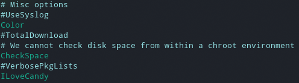

# Tutorat 9 <!--fit-->
### Wahlfreier Zugriff, Hardlinks und Softlinks, Terminal Multiplexer <!--fit-->

<!--_class: lead-->
<!--big-->


---

# Vorbereitungen

<!--_class: lead-->
<!--big-->

<!-- _backgroundColor: #90bc9b; -->

---

## Vorbereitungen
### Tmux
#### Schnelle Lösung
```
expoert TERM=xterm
echo $TERM
```

#### Langfristige Lösung
- **Informationen über das verwendete Terminal rüberschicken:**
  ```
  infocmp > alacritty.terminfo
  # Pool-Account
  scp alacritty.terminfo XY123@login.uni-freiburg.de:~/
  # oder Uni-Account
  # scp alacritty.terminfo <pool-login>@login.informatik.uni-freiburg.de:~/
  ```

<!--small-->


---

## Vorbereitungen
### Tmux

- **Informationen über das Terminal in Datenbank abspeichern:**
  ```
  tic -x alacritty.terminfo
  ```
- **oneliner:**
  - `infocmp | ssh "XY123.uni-freiburg.de" 'tic -x /dev/stdin'`
  - `infocmp | ssh "<pool-login>.informatik.uni-freiburg.de" 'tic -x /dev/stdin'`
- https://github.com/gpakosz/.tmux
  - `tmux new -As default`
  - `killall "tmux: server"`
  - `tmux source-file ~/.tmux.conf`

<!--small-->


---

## Vorbereitungen
### Tmux
#### Shh mit Tmux
```
Host uni-tmux
  HostName login.uni-freiburg.de
  # oder HostName login.informatik.uni-freiburg.de
  User XY123  # oder <pool-login>
  RequestTTY yes
  RemoteCommand tmux new -As default
```
- `ssh uni-tmux`

<!--small-->


---

# Ergänzungen

<!--_class: lead-->
<!--big-->

<!-- _backgroundColor: #8dbdaf; -->

---

## Ergänzungen
### Packages installieren mit `apt`
#### updating
- `sudo apt update`: update package lists
- `sudo apt update -y && sudo apt full-upgrade`:
#### ](_resources/_2021-11-11-00-32-09.png)
- `sudo apt update -y && sudo apt full-upgrade qutebrowser`: update a program
>- `full-upgrade` is the recommended way over `upgrade`

<!--small-->


---

## Ergänzungen
### Packages installieren mit `apt`
#### installing
- `sudo apt update -y && sudo apt install gcc -y`: install package from repo
- `sudo apt update -y && sudo apt install ./foo_1.0_all.deb -y`: install local package

#### removing
- `sudo apt update -y && sudo apt purge gcc -y`: uninstalls package, es werden alle Konfigurationsdateien gelöscht
- `sudo apt update -y && sudo apt autoremove -y` uninstalls all packages, that are not needed anymore and have no dependencies to other packages
>- `purge` is the recommended way over `remove`

<!--small-->


---

## Ergänzungen
### Packages installieren mit `apt`


#### searching
- autocomplete application name, e.g. `sudo apt install openjdk`, double tab
- `apt list gcc`: lists als packages with which fit the search term
- `apt list gcc --installed`: only list packages that are installed
- `apt show gcc`:  shows desciption of package matching the search term
- `apt search gcc`: lists alls packages which the search term in their discription or name
>- glob-pattern or regex as search pattern

<!--small-->


---

## Ergänzungen
### Packages installieren mit `apt`

#### other
- `sudo apt download emacs`: download `.deb`-package
- `sudo apt install alacritty -y`: no `y` each time
- `sudo do-release-upgrade`: upgrade **Distro** to a newer release
>- instead of confirming with y, once can also just spam enter
>- access packages over `/var/cache/apt/archives`

<!--small-->


---

## Ergänzungen
### Packages installieren mit `apt`

#### comparisson to apt-get


<!--small-->


---

## Ergänzungen
### Packages installieren mit `pacman`
#### Synchronising with the repositories
- `sudo pacman -Sy`: As new packages are added to the repositories you will need to regularly synchronise the package lists. This will only download the package lists if there has been a change (sudo apt update)
- `sudo pacman -Syy`: Occasionally you may want to force the package lists to be downloaded

#### Updating software
- `sudo pacman -Su`: perform an update of software already installed (sudo apt upgrade)
- `sudo pacman -Syu`: check whether the package lists are up-to-date at the same time

<!--small-->


---

## Ergänzungen
### Packages installieren mit `pacman`
#### Searching for software
- `pacman -Ss ^hunspell`: searching a package by name in repos. Supports Regex
- `pacman -Qs hunspell`: searching package locally
- `pacman -Q`: list all packages installed on computer
- `pacman -Qeq`: self installed programs (e), only the program names, not the version number (q)
- `pacman -Qen`: packages self installed from main repos (n)
- `pacman -Qem`: packages self installed from aur (m)
- `pacman -Qdt`: orphans, unneeded dependencies

#### Find out where package installed
- `pacman -Ql handbrake`: look up where application gets installed

<!--small-->


---

## Ergänzungen
### Packages installieren mit `pacman`
#### Installing software
- `sudo pacman -S gimagereader-gtk`: install package from repo
- `sudo pacman -U /var/cache/pacman/pkg/rofi-1.6.1-1-x86_64.pkg.tar.zst`: install local package

#### Removing software
- `sudo pacman -Rns dmenu`: remove a package (R), dependencies (s) and configuration files (n)
- `sudo pacman -Rns $(pacman -Qtdq)`: if at a later date you want to remove all orphan packages and configuration files for packages that you removed some time ago
- `sudo pacman -Sc`: remove unused packages and repos from cache

<!--small-->


---

## Ergänzungen
### Packages installieren mit `pacman`
#### Finding out version number of local and remote packages
- `pacman -Qi python`: for **local** packages
- `pacman -Si python`: for **remote** packages

<!--small-->


#### Misc
- If a package in the list is already installed on the system, it will be reinstalled even if it is already up to date. This behavior can be overridden with the `--needed` option.

---

## Ergänzungen
### Packages installieren mit `pacman`
#### Prinzip
- capital letter at beginning
- `S`: sync with repository in some way
- `Q`: search locally
- `R`: remove

#### Yay
- commands are the same as in `pacman`
- adds search in the **AUR (Arch User Repository)**: https://aur.archlinux.org/ (**Duckduckgo:** `!au`)
- `yay polybar` erlaubt auswahl an packages, die z.B. Discord im Namen haben

<!--small-->


---

## Ergänzungen
### Packages installieren mit `pacman`
#### Anmerkungen
- **PAC**kage **MAN**ager
- always make `sudo pacman -Syu` before installing new software

#### Edit configuration files
- `sudo nvim /etc/pacman.conf`

- `sudo nvim /etc/pacman.d/mirrorlist`

<!--small-->


---

# Quellen

<!--_class: lead-->
<!--big-->

<!-- _backgroundColor: #9db7b4; -->

---

## Quellen
### Wissenquellen
- https://wiki.archlinux.org/title/Alacritty#Terminal_functionality_unavailable_in_remote_shells
- https://stackoverflow.com/questions/21523815/tmux-open-terminal-failed-missing-or-unsuitable-terminal-xterm-256color
- https://github.com/alacritty/alacritty/issues/2487

<!--small-->


---

## Quellen
### Bildquellen

<!--small-->


---

# Vielen Dank für eure Aufmerksamkeit!
# :penguin:

<!--_class: lead-->
<!--big-->

<!-- _backgroundColor: #9db7b4; -->
