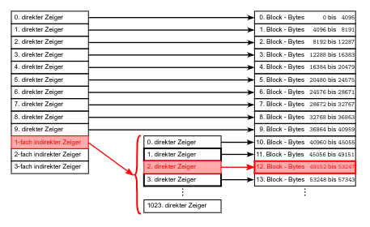
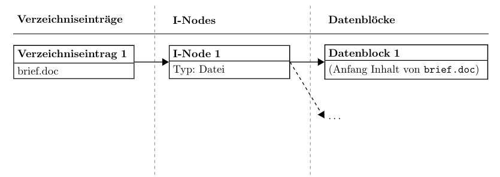
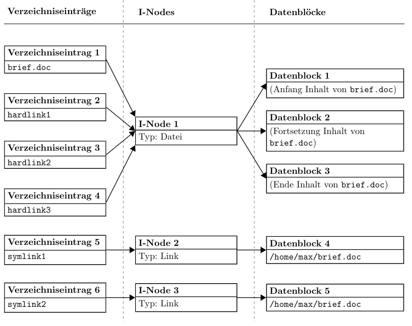
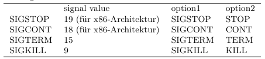
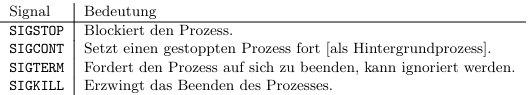

# Tutorat 9 <!--fit-->
### Wahlfreier Zugriff, Hardlinks und Softlinks, Terminal Multiplexer <!--fit-->

<!--_class: lead-->
<!--big-->


---

# Übungsblatt

<!--_class: lead-->
<!--big-->

<!-- _backgroundColor: #90bc9b; -->

---

## Übungsblatt
### Aufgabe 1 - Wahlfreier Zugriff bei I-Nodes und bei FAT
#### a) I-Node


- **Zeiger 0 bis 9:** 0 bis 10 · 4096 − 1 = 40959

<!--small-->


---

## Übungsblatt
### Aufgabe 1 - Wahlfreier Zugriff bei I-Nodes und bei FAT
#### a) I-Node
- **einfach indirekter Block:** 10 · 4096 = 40960 bis 10 · 4096 + 1024 · 4096 − 1 = 4235263 (1 indirekter Block mit 1024 Zeigern auf 4KB Blöcke) ✅
  - $\displaystyle\left\lfloor\frac{50000-40960}{4096}\right\rfloor= 2$ **🠒** **Zeiger Nr. 1 im einfach indirekten Block**, also der **12te Datenblock**
- **12ter Datenblock:** 12 · 4096 = 49152 bis 13 · 4096 − 1 = 53247
- **Byte Nr. 50000:** 50000 − 12 · 4096 = 84

<!--small-->


---

## Übungsblatt
### Aufgabe 1 - Wahlfreier Zugriff bei I-Nodes und bei FAT
#### b) FAT32
- einfach verkette Liste der Datenblöcke der Datei wird **sequentiell** gelesen
- **Anzahl N der verfolgten Verweis:** $N=\left\lceil\frac{n}{b}\right\rceil-1$
  - danach dem gefundenen Verweis auf den Plattenblock folgen
- Zugriffszeit in Abhängigkeit von n asymptotisch **linear**: $O(n)$


<!--small-->


---

## Übungsbaltt
### Aufgabe 2 - Hardlinks und symbolische Links
#### a)


<!--small-->


---
## Übungsbaltt
### Aufgabe 2 - Hardlinks und symbolische Links
#### a)


<!--small-->


---

## Übungsblatt
### Aufgabe 2 - Hardlinks und symbolische Links
#### a)
- Pfad in Datenblöcken 3/4 kann **relativ** oder **absolut** angegeben werde
- Datenblöcke 3 und 4 auch dürfen auch fehlen und der Pfad stattdessen in den I-Nodes 2 bzw. 3 angegeben sein

<!--small-->


---

## Übungsblatt
### Aufgabe 2 - Hardlinks und symbolische Links
#### b)
- **Datei selbst:** 1 I-Node, 3 Datenblöcke, 1 Verzeichniseintrag (⇒ 3 KB)
- **Symlinks:** jeweils 1 I-Node, 1 Datenblock für die Linkdatei und 1 Verzeichniseintrag (⇒ 2 · 1 KB)
- **Hardlinks:** jeweils 1 Verzeichniseintrag, 0 I-Nodes und 0 Datenblöcke
- **Insgesamt:** 5 Datenblöcke = 5 KB Speicherplatz, 3 I-Nodes, 6 Verzeichniseinträge

> Die Verzeichniseinträge benötigen zusätzlich Speicherplatz in den Verzeichnistabellen der Elternverzeichnisse, in denen die Dateien liegen. Dieser Speicherplatz und der Speicherplatz für die I-Nodes selbst wird hier
vernachlässigt.

<!--small-->


---

## Übungsblatt
### Aufgabe 2 - Hardlinks und symbolische Links
#### c)
- die Zugriffsrechte aller **Hardlinks** ändern sich mit, da die Rechte im I-Node gespeichert werden und die Datei und alle Hardlinks auf das selbe I-Node zeigen
- die Zugriffsrechte aller **symbolischen Links** bleiben bei `lrwxrwxrwx`, da sie eigene I-Nodes haben

<!--small-->


---

## Übungsblatt
### Aufgabe 2 - Hardlinks und symbolische Links
#### d)
- Die **Zugriffsrechte** des **symbolischen Links** konnen **nicht** geändert werden.
- Stattdessen wird der chmod-Befehl auf das **Linkziel** angewandt, insofern die entsprechenden Rechte bestehen
- Die angezeigten **Rechte der symbolischen Links** haben **keine Bedeutung** für den eigentlichen Zugriff auf die Zieldatei.
- Wäre das nicht der Fall, so könnte man einen **symbolischen Link** auf eine **fremde Datei** anlegen
  - Da man **selbst der Besitzer** des Links ist, konnte man die Rechte des Links nach Belieben andern und sich somit **Zugriffsrechte verschaffen**.
  - Aus diesem Grund werden **symbolische Links** bei Benutzung immer **erst dereferenziert** und dann werden die **Rechte des Linkziels** ausgewertet um die **Zugriffsrechte zu bestimmen**

<!--small-->


---

## Übungsblatt
### Aufgabe 3 - Prozesse und Signale
#### a)

- Mehrere Möglichkeiten, z.B.
  - `ps ax`
  - `ps aux`
  - `ps -ef`

<!--small-->


---

## Übungsblatt
### Aufgabe - Prozesse und Signale
#### b)
- Es existieren eine Reihe von möglichen Befehlen, z.B.
  - `kill -s <signal value> <pid>`
  - `kill -<signal value> <pid>`
  - `kill -<option1> <pid>`
  - `kill -<option2> <pid>`

#### 

<!--small-->


---

## Übungsblatt
### Aufgabe - Prozesse und Signale
#### b)
- `$(pidof -x counter.sh)` anstelle von `<signal value>`
- Um die Ermittlung der **PID** zu umgehen, kann statt `kill [...] <pid>` der Befehl `killall [...] counter.sh` mit der selben Syntax verwendet werden
  - If no signal name is specified, `SIGTERM` is sent

<!--small-->


---

## Übungsblatt
### Aufgabe - Prozesse und Signale
#### c)
#### 

<!--small-->


---

## Übungsblatt
### Aufgabe 3 - Prozesse und Signale
#### d) Tmux
- **Überblick:**
  - **Gute config file:** https://github.com/gpakosz/.tmux
  - **Tutorials:** https://github.com/rothgar/awesome-tmux
  - **Cheatsheet:** https://gist.github.com/MohamedAlaa/2961058
- **Schnelle Lösung:**
  ```
  export TERM=xterm
  echo $TERM
  ```

<!--small-->


---

## Übungsblatt
### Aufgabe 3 - Prozesse und Signale
- **Langfristige Lösung:**
  - **Informationen über das verwendete Terminal rüberschicken:**
    ```
    infocmp > alacritty.terminfo
    # Pool-Account
    scp alacritty.terminfo XY123@login.uni-freiburg.de:~/
    # oder Uni-Account
    # scp alacritty.terminfo <pool-login>@login.informatik.uni-freiburg.de:~/
    ```
  - **Informationen über das Terminal in Datenbank abspeichern:**
    ```
    tic -x alacritty.terminfo
    ```
  - **oneliner:**
    - `infocmp | ssh "XY123.uni-freiburg.de" 'tic -x /dev/stdin'`
    - `infocmp | ssh "<pool-login>.informatik.uni-freiburg.de" 'tic -x /dev/stdin'`

<!--small-->


---

## Übungsblatt
### Aufgabe 3 - Prozesse und Signale
#### Wichtige Commands
- `ctrl+a,?`
- `ctrl+a,e` zum öffnen von `~/.tmux.conf.local`
- `tmux new -As default`
- `tmux ls`
- `tmux kill-session -t default`
- `tmux kill-server` oder `killall "tmux: server"` oder `ctrl+a,:kill-server`

<!--small-->


---

## Übungsblatt
### Aufgabe 3 - Prozesse und Signale
#### Nützliche Einstellungen
- `tmux source-file ~/.tmux.conf`
  - `set-option -g status-position top`
  - `bind-key < swap-window -t -1`, executed with `ctrl+a,<`
  - `bind-key > swap-window -t +1`, executed with `ctrl+a,>`
  - `default theme` kommentieren und `default theme (ansi)` auskommentieren
  - `tmux_conf_copy_to_os_clipboard=true` auskommentieren
  - `set -g status-keys vi` und `set -g mode-keys vi` auskommentieren

<!--small-->


---

## Übungsblatt
### Aufgabe 3 - Prozesse und Signale
#### Plugin für Wiederherstellung über Neustart hinweg
- https://github.com/tmux-plugins/tmux-resurrect
- `set -g @plugin 'tmux-plugins/tmux-resurrect'` auskommentieren
```
# Prozesse wiederherstellen:
set -g @resurrect-processes '~mocp ~htop ~nvim ~emacs ~neomutt ~vifm ~man ~less'
# alle Prozesse: set -g @resurrect-processes ':all:'
# Zeichen in Panes speichern:
set -g @resurrect-capture-pane-contents 'on'
# Session.vim berücksichtigen:
set -g @resurrect-strategy-nvim 'session'
```

<!--small-->


---

## Übungsblatt
### Aufgabe 3 - Prozesse und Signale
#### Plugin für Wiederherstellung über Neustart hinweg
- `->` to specify a command to be used when restoring a program
- `~` to restore a program whose process contains target name
- gesichert mit Datum unter: `~/.tmux/resurrect/`, `ln -sf <file_name> last`


<!--small-->


---

## Übungsblatt
### Aufgabe 3 - Prozesse und Signale
#### Shh mit Tmux
```
Host uni-tmux
  HostName login.uni-freiburg.de
  # oder HostName login.informatik.uni-freiburg.de
  User XY123  # oder <pool-login>
  RequestTTY yes
  RemoteCommand tmux new -As default
```
- `ssh uni-tmux`

<!--small-->


---

# Ergänzungen

<!--_class: lead-->
<!--big-->

<!-- _backgroundColor: #90bc9b; -->

---

## Ergänzungen
### Packages installieren mit `apt`
#### updating
- `sudo apt update`: update package lists
- `sudo apt update -y && sudo apt full-upgrade`:
#### ](_resources/_2021-11-11-00-32-09.png)
- `sudo apt update -y && sudo apt full-upgrade qutebrowser`: update a program
>- `full-upgrade` is the recommended way over `upgrade`

<!--small-->


---

## Ergänzungen
### Packages installieren mit `apt`
#### installing
- `sudo apt update -y && sudo apt install gcc -y`: install package from repo
- `sudo apt update -y && sudo apt install ./foo_1.0_all.deb -y`: install local package

#### removing
- `sudo apt update -y && sudo apt purge gcc -y`: uninstalls package, es werden alle Konfigurationsdateien gelöscht
- `sudo apt update -y && sudo apt autoremove -y` uninstalls all packages, that are not needed anymore and have no dependencies to other packages
>- `purge` is the recommended way over `remove`

<!--small-->


---

## Ergänzungen
### Packages installieren mit `apt`


#### searching
- autocomplete application name, e.g. `sudo apt install openjdk`, double tab
- `apt list gcc`: lists als packages with which fit the search term
- `apt list gcc --installed`: only list packages that are installed
- `apt show gcc`:  shows desciption of package matching the search term
- `apt search gcc`: lists alls packages which the search term in their discription or name
>- glob-pattern or regex as search pattern

<!--small-->


---

## Ergänzungen
### Packages installieren mit `apt`

#### other
- `sudo apt download emacs`: download `.deb`-package
- `sudo apt install alacritty -y`: no `y` each time
- `sudo do-release-upgrade`: upgrade **Distro** to a newer release
>- instead of confirming with y, once can also just spam enter
>- access packages over `/var/cache/apt/archives`

<!--small-->


---

## Ergänzungen
### Packages installieren mit `apt`

#### comparisson to apt-get


<!--small-->


---

## Ergänzungen
### Packages installieren mit `pacman`
#### Synchronising with the repositories
- `sudo pacman -Sy`: As new packages are added to the repositories you will need to regularly synchronise the package lists. This will only download the package lists if there has been a change (sudo apt update)
- `sudo pacman -Syy`: Occasionally you may want to force the package lists to be downloaded

#### Updating software
- `sudo pacman -Su`: perform an update of software already installed (sudo apt upgrade)
- `sudo pacman -Syu`: check whether the package lists are up-to-date at the same time

<!--small-->


---

## Ergänzungen
### Packages installieren mit `pacman`
#### Searching for software
- `pacman -Ss ^hunspell`: searching a package by name in repos. Supports Regex
- `pacman -Qs hunspell`: searching package locally
- `pacman -Q`: list all packages installed on computer
- `pacman -Qeq`: self installed programs (e), only the program names, not the version number (q)
- `pacman -Qen`: packages self installed from main repos (n)
- `pacman -Qem`: packages self installed from aur (m)
- `pacman -Qdt`: orphans, unneeded dependencies

#### Find out where package installed
- `pacman -Ql handbrake`: look up where application gets installed

<!--small-->


---

## Ergänzungen
### Packages installieren mit `pacman`
#### Installing software
- `sudo pacman -S gimagereader-gtk`: install package from repo
- `sudo pacman -U /var/cache/pacman/pkg/rofi-1.6.1-1-x86_64.pkg.tar.zst`: install local package

#### Removing software
- `sudo pacman -Rns dmenu`: remove a package (R), dependencies (s) and configuration files (n)
- `sudo pacman -Rns $(pacman -Qtdq)`: if at a later date you want to remove all orphan packages and configuration files for packages that you removed some time ago
- `sudo pacman -Sc`: remove unused packages and repos from cache

<!--small-->


---

## Ergänzungen
### Packages installieren mit `pacman`
#### Finding out version number of local and remote packages
- `pacman -Qi python`: for **local** packages
- `pacman -Si python`: for **remote** packages

<!--small-->


#### Misc
- If a package in the list is already installed on the system, it will be reinstalled even if it is already up to date. This behavior can be overridden with the `--needed` option.

---

## Ergänzungen
### Packages installieren mit `pacman`
#### Prinzip
- capital letter at beginning
- `S`: sync with repository in some way
- `Q`: search locally
- `R`: remove

#### Yay
- commands are the same as in `pacman`
- adds search in the **AUR (Arch User Repository)**: https://aur.archlinux.org/ (**Duckduckgo:** `!au`)
- `yay polybar` erlaubt auswahl an packages, die z.B. Discord im Namen haben

<!--small-->


---

## Ergänzungen
### Packages installieren mit `pacman`
#### Anmerkungen
- **PAC**kage **MAN**ager
- always make `sudo pacman -Syu` before installing new software

#### Edit configuration files
- `sudo nvim /etc/pacman.conf`

- `sudo nvim /etc/pacman.d/mirrorlist`

<!--small-->


---

# Quellen

<!--_class: lead-->
<!--big-->

<!-- _backgroundColor: #90bc9b; -->

---

## Quellen
### Wissenquellen
- https://wiki.archlinux.org/title/Alacritty#Terminal_functionality_unavailable_in_remote_shells
- https://stackoverflow.com/questions/21523815/tmux-open-terminal-failed-missing-or-unsuitable-terminal-xterm-256color
- https://github.com/alacritty/alacritty/issues/2487
- https://linux.die.net/man/1/tic

<!--small-->


---

## Quellen
### Bildquellen
- :shrug:

<!--small-->


---

# Vielen Dank für eure Aufmerksamkeit!
# :penguin:

<!--_class: lead-->
<!--big-->

<!-- _backgroundColor: #90bc9b; -->
